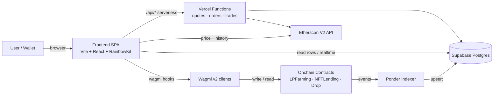

# DEVELOPING.md — Tegridy Farms Developer Deep Dive

A practical guide for contributors working on the Tegridy Farms codebase. For deployment specifics, see [DEPLOY_RUNBOOK.md](./DEPLOY_RUNBOOK.md).

---

## Repo Layout Overview

The repository is a monorepo with three primary workspaces:

```
tegriddy-farms/
├── frontend/          # Vite + React SPA (the dApp UI)
│   ├── src/
│   │   ├── components/   # React components (nftfinance/, ui/, etc.)
│   │   ├── hooks/        # Wagmi-based custom hooks (useFarmActions, useSwap, ...)
│   │   ├── pages/        # Route-level pages (HistoryPage, SecurityPage, ...)
│   │   ├── lib/          # Utilities, constants, chain config
│   │   └── assets/       # Images and static assets
│   ├── supabase/         # SQL migrations for the Supabase backing store
│   └── tests/            # Playwright e2e specs
├── contracts/         # Foundry project — Solidity 0.8.26
│   ├── src/              # Production contracts (TegridyLPFarming, TegridyNFTLending, TegridyDropV2, ...)
│   ├── script/           # Forge deploy / wire scripts
│   └── test/             # Forge unit + integration tests
├── indexer/           # Ponder indexer — onchain event sync to Supabase
│   ├── ponder.config.ts  # Network + contract registration
│   └── src/              # Event handlers
└── api/               # Vercel serverless functions (quotes, orders, trade feeds)
```

---

## Stack

| Layer          | Tech                                                    |
| -------------- | ------------------------------------------------------- |
| Frontend       | Vite + React + TypeScript + Wagmi v2 + RainbowKit       |
| Styling        | Tailwind CSS + shadcn/ui primitives                     |
| Smart contract | Foundry (forge / anvil / cast), Solidity 0.8.26         |
| Indexer        | Ponder — Supabase Postgres as the sink                  |
| Serverless     | Vercel `/api/*` routes (Node runtime)                   |
| DB / Realtime  | Supabase (Postgres + Realtime channels for order/trade) |
| Chain RPC      | Etherscan V2 multichain + Alchemy fallback              |

---

## Running Locally End-to-End

Prerequisites: Node 20+, pnpm, Foundry (`foundryup`), Docker (for local Supabase), Git.

1. **Install deps at each workspace**

   ```bash
   cd frontend && pnpm install
   cd ../contracts && forge install
   cd ../indexer && pnpm install
   ```

2. **Start a local chain** (optional, for contract development)

   ```bash
   cd contracts
   anvil --fork-url $MAINNET_RPC_URL
   ```

3. **Deploy contracts locally**

   ```bash
   forge script script/DeployV3Features.s.sol --rpc-url http://localhost:8545 --broadcast
   ```

4. **Start Supabase locally** (or point at a hosted project)

   ```bash
   cd frontend
   supabase start
   supabase db push       # applies migrations under frontend/supabase/migrations/
   ```

5. **Run the indexer**

   ```bash
   cd indexer
   pnpm dev
   ```

6. **Run the frontend**

   ```bash
   cd frontend
   pnpm dev
   ```

   The app will be served on `http://localhost:5173`. Wagmi auto-injects the wallet connector and RainbowKit handles chain switching.

---

## Env Var Reference

Every workspace ships a documented `.env.example`. Copy to `.env` (or `.env.local` for frontend) and fill in values.

- **Frontend** — [`frontend/.env.example`](./frontend/.env.example)
  - `VITE_WALLETCONNECT_PROJECT_ID`, `VITE_ALCHEMY_KEY`, `VITE_SUPABASE_URL`, `VITE_SUPABASE_ANON_KEY`, contract address bindings per chain.
- **Contracts** — [`contracts/.env.example`](./contracts/.env.example)
  - `PRIVATE_KEY`, per-network `*_RPC_URL`, `ETHERSCAN_API_KEY`, factory and router addresses for wiring scripts.
- **Indexer / API** — inherited from the frontend Supabase keys plus a service-role key for the `/api` functions (Vercel env).

Never commit filled `.env` files. The repo `.gitignore` excludes them by default.

---

## Testing

### Frontend

- **Unit / component**: `pnpm --filter frontend test` (Vitest + Testing Library).
- **End-to-end**: `pnpm --filter frontend e2e` (Playwright). Specs live in `frontend/tests/` and run against a `pnpm dev` server.
- Test artefacts are written to `frontend/test-results/` (gitignored).

### Contracts

```bash
cd contracts
forge test -vvv                # full suite
forge test --match-contract TegridyLPFarming
forge coverage                 # coverage with lcov output
```

Invariant and fuzz suites live alongside unit tests under `contracts/test/`.

### Indexer

```bash
cd indexer
pnpm test                      # ponder test harness
```

---

## Architecture



Data flow summary:

- Writes go directly from the UI through Wagmi to contracts.
- Reads split between direct contract calls (fresh state) and Supabase (indexed history).
- Ponder is the single source of truth for historical event state.
- `/api/*` wraps privileged Supabase writes and external HTTP calls so anon keys never touch them.

---

## Key Hooks

All hooks live under `frontend/src/hooks/`.

- **`useFarmActions`** — stake / unstake / harvest against `TegridyLPFarming`. Wraps `writeContract` with optimistic cache invalidation of `useFarmState`.
- **`useSwap`** (paired with `useSwapQuote`) — quote + execute on the AMM router. Pulls live quotes from the `/api/quote` endpoint with fallback to onchain `getAmountsOut`.
- **`useMyLoans`** — subscribes to Supabase realtime on the `loans` table, filtered by `borrower = address`. Returns a normalized list with health-factor derived from live oracle prices.

Supporting hooks that are worth knowing:

- `useLPFarming` — low-level read layer for pool APR + emission rate.
- `useNFTLending` — opens / repays loans against `TegridyNFTLending`.
- `useNFTDrop` — mint + refund flow for the V2 launchpad drops (reads via the V2 ABI, which is a strict superset of V1 at the read surface).

---

## Deployment Process

End-to-end deployment — contracts, wiring, frontend envs, and indexer cutover — is documented in [DEPLOY_RUNBOOK.md](./DEPLOY_RUNBOOK.md). That runbook is the canonical source; do not follow stale steps in this file.

High-level phases:

1. Foundry scripts under `contracts/script/` (`DeployV3Features`, `WireV2`, `DeployGaugeController`, `DeployTegridyLPFarming`, ...).
2. Etherscan verification via `forge verify-contract` or the scripts' built-in `--verify` flag.
3. Supabase migration push + indexer redeploy so event handlers match the new contract addresses.
4. Frontend env rollout and Vercel preview smoke test before promoting to production.

---

## Where to Find Help

- **Architecture questions** — start at this file's diagram, then read the target contract's NatSpec.
- **Contract specifics** — each file under `contracts/src/` has a header-block spec and unit tests under `contracts/test/` mirroring the name.
- **Frontend conventions** — `frontend/src/lib/constants.ts` for chain / address config; `frontend/src/components/ui/` for the shared primitives.
- **Audit / security** — [`AUDIT_FINDINGS.md`](./AUDIT_FINDINGS.md), [`FIX_STATUS.md`](./FIX_STATUS.md), [`SPARTAN_AUDIT.txt`](./SPARTAN_AUDIT.txt).
- **Deployment** — [`DEPLOY_RUNBOOK.md`](./DEPLOY_RUNBOOK.md).
- **Team** — open a GitHub issue and tag the CODEOWNERS for the touched path; urgent prod incidents go through the on-call channel referenced in the runbook.

---

Welcome aboard — keep changes small, tests green, and runbook honest.
