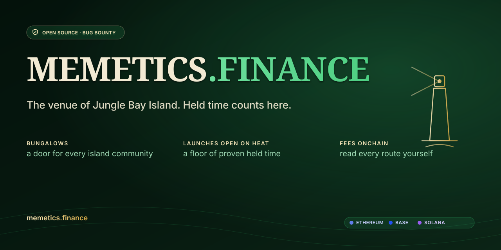
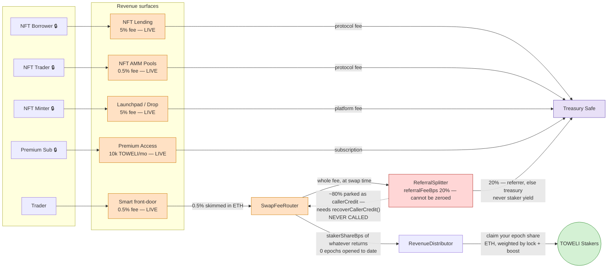
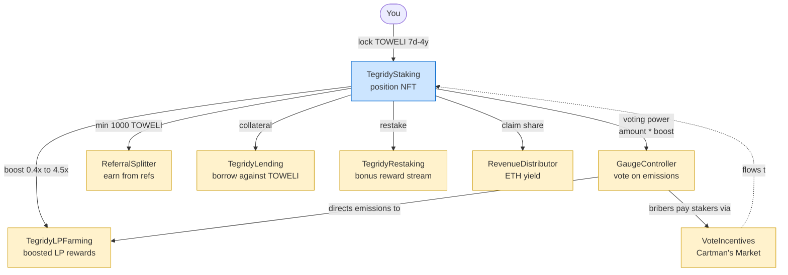
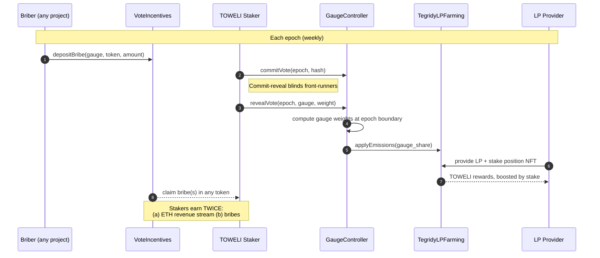

<p align="center">
  
</p>

# Tegridy Farms

[](../../actions/workflows/contracts-ci.yml)
[](../../actions/workflows/codeql.yml)
[](../../actions/workflows/slither.yml)
[](LICENSE)
[](contracts/foundry.toml)
[](.github/workflows/contracts-ci.yml)
[](https://etherscan.io/token/0x420698CFdEDdEa6bc78D59bC17798113ad278F9D)
[](https://basescan.org/)
[](https://rpc.mainnet.chain.robinhood.com)
[](https://memetics.finance/solana)
[](https://memetics.finance)

> **This repository is the code. `memetics.finance` is the venue.**
> Since **2026-08-31** the deployed app speaks as **memetics.finance, the venue of Jungle Bay Island** — a hall of thirteen bungalows, one per resident token, each with its own walls, its own market and (since 2026-08-30) its own staking lighthouse. The classic **Tegridy Farms** experience was not deleted: it lives whole behind its own door at [`/toweli`](https://memetics.finance/toweli). Four things keep the original name and always will — this repository, the Solidity contracts, the on-chain TOWELI token, and the legal/provenance documents. Read "Tegridy Farms" below as the name of the protocol and its code, and "the venue" as the thing users land on.

> **A DeFi protocol across four chains.** On **Ethereum**: swap fees are routed toward TOWELI stakers (the rail has collected and has **never paid out** — see [Live deployment status](#live-deployment-status)), votes are weighted by how long you have locked, and the whole thing runs on fixed-supply TOWELI. On **Base (8453)** and **Robinhood Chain (4663)**: the same DEX/fee stack, live since 2026-08-25, with fees landing in a **remittance Safe** — queued for the bridge, explicitly *not* staker yield. On **Solana**: a Jupiter-routed swap with DCA, and Streamflow staking lighthouses for the island's Solana residents — **TOWELI itself never ships there.** Real yield. No inflation tricks.

> **Live at [memetics.finance](https://memetics.finance) and [memetic.fun](https://memetic.fun)** — two co-equal production origins, neither redirecting to the other. The surfaces taking the most build effort today are the **island build-out** (thirteen bungalows, ten lighthouse staking pools across Ethereum/Base/Solana) and the **token launchers** — our own [`TegridyCurveLauncher`](https://etherscan.io/address/0xF4Dfa741aD63B3D95dC3Fc10D311caE507CE34dE) on three EVM chains, plus the Doppler rail at [/launch](https://memetics.finance/launch).

> ⚠️ **Status: live, hardening in progress, not yet decentralized.** The core protocol was **redeployed to Ethereum mainnet on 2026-06-06** (the "MVP" set), the audited **gated-feature batch — 11 contracts** — was deployed and Etherscan-verified on **2026-07-16**, the capital-free revenue surfaces went live in the app on **2026-07-21/22**, and the **Base + Robinhood legs** deployed on **2026-08-25**. Ownership still sits behind the deployer key on mainnet (Safe rebuild + 2-of-2 accept ceremony pending — [`docs/SAFE_REHOME_RUNBOOK.md`](docs/SAFE_REHOME_RUNBOOK.md)), the emission/spend-side features (governance, grants, bounties) stay **frontend-gated until a revenue line funds them**, and there is **no professional human-firm audit yet**. Size deposits accordingly.

### The 30-second version

1. TOWELI is fixed supply (1B, no mint function, no rebase). It exists on Ethereum only — no bridge, no wrapped version, ever.
2. The protocol runs a DEX, staking, revenue distribution, an oracle, LP farming, **NFT finance (P2P NFT lending + a bonding-curve NFT AMM), an NFT launchpad, a premium tier, two token launchers, and thirteen bungalow staking pools** live today; **governance and the community programs** are deployed on-chain + verified (2026-07-16) but stay app-gated until a revenue line funds their emissions. (Token lending is audited and staged, pending the oracle bootstrap.)
3. One live surface is aimed at TOWELI stakers in ETH — the front-door swap fee. The rest fund the treasury Safe, and the two L2 legs fund a **remittance** Safe. **Nothing has been distributed to a staker yet**; the front-door's take is still sitting in `ReferralSplitter.callerCredit`, awaiting the permissionless `recoverCallerCredit()`.
4. The longer you lock (7 days → 4 years, 0.4× → 4.0×), the more you earn and the louder you will vote once governance is live. That same ladder is now the shape of every EVM lighthouse pool on the island.
5. **Solana is fee-capture and staking, never TOWELI.** The Jupiter-routed swap (Instant / Limit / DCA) is live and takes a platform fee; four Streamflow lighthouses stake the island's Solana residents. The **Meteora DBC rail was deleted on 2026-08-23** — only launchers that graduate into our own venue survive — and our own two Solana programs were deployed on 2026-08-08 and **closed on 2026-08-13**, so their program ids are permanently spent. The restart is planned, not live.
6. The app ships **trust tooling** — a token scanner, wallet-exposure check, deployer-reputation graph, launch fact-sheets and afterlife tracking — that self-gates to "no data" instead of faking signal. That rule is the house doctrine: **a read that failed is never rendered as an answer.**

Yes, the name is from Randy Marsh's South Park weed farm. The bit ends there — the contracts are standard Synthetix / Curve / Aave / Uniswap / Gondi / Raydium primitives, copied from battle-tested sources on purpose. Since **2026-08-26** that is standing rule 0: *only battle-tested, billion-dollar, unhacked upstreams*, with minimal surface on top.

- **Website:** [memetics.finance](https://memetics.finance) · [memetic.fun](https://memetic.fun)
- **Token:** [`TOWELI`](https://etherscan.io/token/0x420698CFdEDdEa6bc78D59bC17798113ad278F9D) · 1,000,000,000 fixed supply · Ethereum Mainnet (unchanged across the relaunch — only the protocol contracts were redeployed)
- **Price / liquidity:** [GeckoTerminal](https://www.geckoterminal.com/eth/pools/0x6682Ac593513cc0A6c25D0F3588e8fA4FF81104D) (the deep TOWELI/WETH liquidity lives in the Uniswap V2 pool)

---

## Contents

- [What it is](#what-it-is) — feature surface
- [Live deployment status](#live-deployment-status) — what's on-chain vs gated
- [Jungle Bay Island](#jungle-bay-island) — the thirteen bungalows and their lighthouses
- [How it all fits together](#how-it-all-fits-together) — flywheel diagrams
- [How to use it (for users)](#how-to-use-it-for-users)
- [Token launcher](#token-launcher) — the rails, and the two fee phases
- [Trust tooling](#trust-tooling) — scanner, exposure, deployer graph, market integrity
- [Solana surface](#solana-surface)
- [Tokenomics in one minute](#tokenomics-in-one-minute)
- [For developers](#for-developers)
- [Repo layout](#repo-layout)
- [Security & audits](#security--audits)
- [Deployed contracts](#deployed-contracts)
- [Roadmap & status](#roadmap--status)
- [Community](#community)
- [License](#license)

---

## What it is

Tegridy Farms is a set of DeFi primitives that share one token and one revenue stream. Every surface either **generates revenue** for TOWELI stakers or **uses the staking position** as a primitive — nothing is decorative.

| Surface | What it does | Contract(s) | Status |
|---|---|---|---|
| **Staking** | Lock TOWELI for 7 days → 4 years. Get a 0.4×–4.0× boost on yield, plus +0.5× with a JBAC NFT. Your position is an ERC-721 and is the input to every other primitive. | `TegridyStaking` (+ `TegridyStakingAdmin`, `TegridyStakingJbacVault`) | 🟢 Live |
| **Native DEX** | Uniswap V2–style AMM for TOWELI/WETH. The pair charges the standard 0.3% (⅚ to LPs, ⅙ to the protocol's `feeTo`). | `TegridyFactory`, `TegridyRouter`, `TegridyPair` | 🟢 Live · Ethereum, Base, Robinhood |
| **Smart swap front-door** | The app's default swap route runs through `SwapFeeRouter`, which takes a **0.5% protocol fee** and converts it to ETH. That ETH is aimed at the RevenueDistributor, but every wei of it passes through `ReferralSplitter` first — and that is where all of it still sits. | `SwapFeeRouter` (+ `SwapFeeRouterAdmin`) | 🟢 Live · never paid out |
| **Revenue distribution** | Streams ETH to stakers pro-rata to boosted balance + historical lock, using epoch snapshots so a flash-staker can't amplify their share. | `RevenueDistributor` | 🟢 Live · 0 epochs opened |
| **Oracle** | Time-weighted average price for manipulation-resistant collateral pricing. Uniswap-V2 cumulative-price + V3-style observations. | `TegridyTWAP` | 🟢 Live · unbootstrapped |
| **LP Farming** | Synthetix-style boosted LP staking. Deposit TOWELI/WETH LP, earn TOWELI; your boost comes from your existing staking NFT. | `TegridyLPFarming` | 🟢 Live |
| **Protocol-owned liquidity** | Captures POL from a share of swap fees so liquidity isn't 100% mercenary. | `POLAccumulator` | 🟢 Live |
| **Referrals** | Stake-gated referral rewards — only stakers (≥1000 TOWELI power) can earn. A referrer below the threshold earns nothing and their referees' carve goes to the treasury in full; the referee pays the same fee either way, and the UI says so. | `ReferralSplitter` | 🟢 Live |
| **Bungalow lighthouses** | Per-resident staking for the island's thirteen bungalows. The six EVM pools are **TOWELI's own ladder** — 7d…4y, 0.4×…4.0×, the same linear interpolation — with an exit hatch. The four Solana pools run on **Streamflow**, which has no early exit, so the ceremony defaults to a 7-day ceiling and gates long locks. | `LighthouseLadder` (EVM) · Streamflow (Solana) | 🟢 Live — 13 of 13 bungalows stake |
| **Multichain legs** | Base 8453 and Robinhood Chain 4663 run the same factory/router/TWAP/fee stack. **No veTOWELI on either, ever**: the fee sink is a **remittance Safe**, so an L2 fee is "queued for the bridge", not staker yield, and every surface says so. Robinhood carries a deployed `AttestedSequencerUptimeFeed` because Chainlink publishes no uptime feed for 4663. | Full stack per chain + `AttestedSequencerUptimeFeed` | 🟢 Live 2026-08-25 |
| **NFT Finance** | Peer-to-peer NFT lending (Gondi pattern, lender-only liquidation, sequencer-aware grace) + Sudoswap-style bonding-curve NFT AMM, plus pooled lending and BNPL. ERC-20 lending against TOWELI positions is staged behind the oracle. | `TegridyNFTLending`(+Admin), `TegridyNFTPoolFactory`, `TegridyLending` | 🟢 Live † |
| **Governance** | Curve-style gauge voting with commit-reveal, plus a permissionless bribe market ("Cartman's Market"). | `GaugeController`, `VoteIncentives`(+Admin) | 🔵 On-chain |
| **NFT Launchpad** | Click-deploy ERC-721 collections (Merkle allowlist, Dutch auction, delayed reveal, ERC-2981/7572) via a single `createCollection` tx. | `TegridyLaunchpadV2`, `TegridyDropV2` | 🟢 Live |
| **Token launcher — our own curve** | `TegridyCurveLauncher`: a bonding curve the protocol owns, live on **Ethereum, Base and Robinhood**. Token identity (image, description, socials) is uploaded through Irys and bound by signature, with the immutable contract untouched. Every launch gets a permanent `/eth-curve/:token` page and the creator can claim their fees. | `TegridyCurveLauncher` | 🟢 Live (3 chains) |
| **Token launcher — Doppler rail** | Launch an ERC-20 through Doppler with vetted defaults, a published fee constitution, Fact Sheets, a permanent per-token record at `/launch/:token`, afterlife tracking, and an opt-in **TOWELI** base pair; the auction's integrator fee accrues to the protocol and is withdrawable from `/admin`. Full detail — including the **two** distinct fee phases — in [Token launcher](#token-launcher). | (Doppler periphery — no *deployed* Tegridy contract) | 🟢 Live (EVM) |
| **Solana swap** | Jupiter-routed swap with three modes — Instant, Limit order, and **DCA** via Jupiter Recurring — plus a price chart, a priority/speed control, USD-denominated input and real receipts. Takes a platform fee; custodies no liquidity. | — (aggregator integration) | 🟢 Live |
| **Airdrops & vesting** | Merkle airdrop factory (verbatim Uniswap merkle-distributor fork, upstream pinned in-tree) and vesting/lock rails, with client-side tree building and the leaf encoding derived from the Solidity rather than assumed. | `AirdropFactory`, `TegridyAirdropDistributor`, `VestingFactory`, `TegridyVestingWallet`, `TegridyLockVault` | 🟡 Built · deployed nowhere |
| **Yield & discovery surfaces** | Portfolio (states when a total is PARTIAL), alerts (four verdicts — "quiet" and "could not look" are different facts), the safety-scored trenches terminal, charting, copy-trading, competitions, a keyed public API with rate tiers, and `/yield` reading 27 registered mainnet protocol addresses live. | — (frontend + `api/`) | 🟢 Live 2026-09-03 |
| **Premium / community** | Subscription premium tier, staker-voted community grants, meme-bounty board. | `PremiumAccess`, `CommunityGrants`, `MemeBountyBoard` | 🟢 Premium live · 🔵 grants/bounties on-chain |
| **Restaking** | Restake the position NFT for a second reward stream (EigenLayer-operator pattern). The EIP-170 split landed 2026-08-19. | `TegridyRestaking` (+Admin) | 🟡 Split executed · not deployed |
| **Uniswap V4 module** | V4 hook (per-user premium fee discount + POL skim), trusted swap router, boosted LP staker, plus the **graduation leg**: an Airlock-callable migrator that graduates a launch into a Tegridy-hooked V4 pool, and its fee locker. | `v4/TegridyV4Hook`(+Admin), `TegridyV4SwapRouter`, `TegridyBoostedLPStaker`, `TegridyLiquidityMigrator`, `TegridyFeeLocker` | 🟡 Next-wave (unaudited, app-gated). The hook is **pre-deployed** to a mined address; the **migrator is not** — `TEGRIDY_V4_MIGRATOR_ADDRESS` is still `0x0`, and that zero is load-bearing: launches keep graduating via Doppler's own migrator until ours is whitelisted |

**🔵 On-chain** means the contract is **deployed to mainnet and Etherscan-verified** (the 2026-07-16 gated batch), but the frontend address is deliberately still zeroed — these are the emission/spend-side features, held back until a revenue line funds them, not a technical dependency. **🟡 Gated** means the source is in the repo and tested but **not yet deployed** — the on-chain address is intentionally zeroed in the frontend ([`isDeployed()`](frontend/src/lib/constants.ts) gate) until it clears its audit wave and deploys. Both auto-activate the moment the operator sets the real address — exactly how the 🟢 NFT-finance/launchpad/premium set went live on 2026-07-21/22. († `TegridyLending` is *not* yet deployed: it is pre-deploy-audited and hardened but **oracle-gated**, so it ships only after the pool deepen + TWAP bootstrap.)

**Why this over Curve / Aave / Yearn?** Fixed-supply token — what you earn is *revenue*, not inflation. The intended loop is self-contained: stake → earn ETH → (soon) vote → direct emissions → farm → bribes back to stakers. Be clear about how much of that is running: **one** fee mechanism is aimed at stakers (the front-door swap fee), the other live surfaces fund the treasury, the two L2 legs fund a remittance Safe, and **the staker leg has not made a payment yet**.

---

## Live deployment status

Honest snapshot as of the latest commit. **Each bullet is dated and describes what was
true on its date**; where a later bullet supersedes an earlier one, the earlier one is
annotated rather than deleted, because a status line that vanishes leaves no evidence it
was ever true. Two bullets below describe the Meteora Solana rail, which was **deleted on
2026-08-23** — read them as history.

- ✅ **Relaunch MVP is live on mainnet** (deployed 2026-06-06 via `DeployMVP`, block ~25,263,328). Staking, the native DEX, SwapFeeRouter, RevenueDistributor, TWAP, POLAccumulator, ReferralSplitter, TokenURIReader, and (since 2026-06-08) LP Farming are all deployed and wired.
- ✅ **Gated-feature batch deployed on-chain 2026-07-16** (11 contracts, all Etherscan-verified): GaugeController, VoteIncentives (+Admin), PremiumAccess, TegridyNFTPoolFactory, TegridyNFTLending (+Admin), MemeBountyBoard, CommunityGrants, and TegridyLaunchpadV2 (+ its DropV2 template). Each cleared a fresh pre-deploy adversarial audit wave.
- ✅ **Capital-free surfaces un-gated in the app 2026-07-21/22** (operator-authorized): P2P NFT lending, the NFT AMM, the launchpad, Premium, and the EVM token launcher are **live at [memetic.fun](https://memetic.fun)** — verified against the deployed bytecode (every frontend ABI selector checked on-chain) before the flip. Their fees accrue to the **treasury Safe** (`0x7D26…Bd7d`). GaugeController, VoteIncentives, CommunityGrants, and MemeBountyBoard stay app-gated: they *spend* (emissions/grants/bounties), so they wait for a revenue line to fund them.
- ✅ **Legacy exit surface (2026-07-22):** two retired pre-relaunch staking contracts still held user funds; the Farm page now shows an **exit-only card** (withdraw/early-withdraw, no deposit path) to any wallet with a legacy position, and the contracts are listed as *retired — withdraw only* on [/contracts](https://memetic.fun/contracts).
- ✅ **Trust tooling + limit orders live (2026-07-22):** token scanner, wallet exposure, deployer reputation, launch simulator/afterlife, and NFT market-integrity surfaces shipped (see [Trust tooling](#trust-tooling)), and **gasless limit orders via CoW Protocol** are live on the Trade page.
- ✅ **Launcher hardening wave (2026-07-24 → 07-30).** The EVM launcher went from "switched on" to actually working: the launch button had been refusing roughly six attempts in seven (it shared the swap path's 300s Chainlink staleness gate against a ~3600s ETH/USD heartbeat — now a separate `ethUsdForLaunch` window); the Explorer/Afterlife feed was a hardcoded empty array and now reads real provenance from `Airlock.getAssetData`; auction bands that could have gone on-chain ~10× wrong are refused before signing; Fact Sheet splits now attest the **real resolved** constitution rather than a template; and the protocol's 15% fee line was re-pointed from `RevenueDistributor` to the **Treasury Safe** before launch #1 (the Doppler locker pays `msg.sender` only, so the original beneficiary could never have claimed it). The honest cost: that line is **not** staker yield today.
- ✅ **Launcher revenue is now readable and withdrawable (2026-07-30).** `Airlock.collectIntegratorFees` had been live on-chain with zero callers anywhere in the repo. An **Integrator Fees panel** now ships on [/admin](https://memetic.fun/admin), gated to `LAUNCHER_INTEGRATOR_ADDRESS` — which is *not* the protocol owner, so that page is now two-role and asymmetric (the integrator sees the fees panel and nothing else). Balances distinguish "nothing owed" from "could not read": a failed balance read is never painted as a confident zero next to a withdraw button.
- ✅ **Exotic base pairs + Solana launcher preview un-gated (2026-07-27).** `EXOTIC_LAUNCHES_ENABLED = true` — creators may pair a launch against **TOWELI** instead of ETH (opt-in; ETH stays the default). `SOLANA_LAUNCHER_ENABLED = true` renders `/solana-launch` as a live config **preview** — it is **not** an in-app money path (the page has no signer; real Solana launches still go through the operator's out-of-band CLI). *(Superseded 2026-08-23: the Meteora rail and the `/solana-launch` route were both deleted.)*
- ✅ **Meteora DBC partner config live on Solana mainnet (2026-08-01).** The operator ran `create-config` against a verified Squads v4 fee vault, so the Solana rail is armed and can accept its first launch. **Zero tokens have launched through it** — the Fact-Sheet numbers on `/solana-launch` are builder defaults, not a track record. The same change closed the custody gate: `verifySquadsVault` now enforces the Squads `Multisig` discriminator **and a threshold ≥ 2**, so neither a 1-of-1 multisig nor a substituted Squads account type can be named as `feeClaimer`. ~~`/solana-launch` remains preview-only with no in-app submit path.~~ — **superseded 2026-08-04 by #259**, which shipped the in-app submit path; the preview state now means "no partner config published into this build", not "no submit path exists". *(The two bullets above this one are dated and describe what was true on their date; only this trailing claim outlived its truth.)* *(Superseded 2026-08-23: the Meteora rail and the `/solana-launch` route were both deleted.)*
- ✅ **Heat wave two shipped (2026-08-11).** The ruler, the launch gate and the birth-socket card, in the island directive's strict phase order, plus the chain-derived birth-record route at `/record/:chain/:ca.json`. One deviation from a prior operator decision was flagged rather than applied silently: the 180-day tenure floor is gone, replaced by a degrees floor of 80° (Resident), because held time is already priced inside a TWAB-based, zero-anchored number.
- ✅ **The full buildout landed (2026-08-12, [#300](https://github.com/fomotsar-commits/tegridy-farms/pull/300)) alongside two audit branches** — [#273](https://github.com/fomotsar-commits/tegridy-farms/pull/273) (a live signature leak, payments routed to the wrong wallet, a bricked `kick()`, an untimelocked sweep) and [#299](https://github.com/fomotsar-commits/tegridy-farms/pull/299), which found that **Row-Level Security was enabled on every Supabase table and enforcing nothing**: the owner policies were OR'd with `PERMISSIVE true` policies sitting beside them, which is not a weaker gate but *no* gate.
- ✅ **The build spree (2026-08-18 → 08-20).** The Ponder data spine wired up to its hosting boundary, the swap-fee layer built and shipped **charging nothing**, airdrop/vesting contracts and their deploy-gated front ends, an ERC-4626 auto-compounder, a staking-position market, rug-refund escrow, an anti-snipe decaying fee, alerts, portfolio, the trenches terminal, referral transparency, the API key platform, the Solana indexer leg, charting, PWA, pooled NFT lending and BNPL, copy-trading and competitions. **Everything shipped switched off**: enabling each is an operator config change, so nothing silently re-prices or arms.
- ✅ **Gates that measured nothing were closed (2026-08-20 → 08-22).** A vacuous `tsc --noEmit` that typechecked **zero files** had been hiding 27 real type errors; the EIP-170 size gate measured libraries and blamed `src/`; **15 contract test files were matched by no CI slice and had never run**; the npm-advisory gate had never executed once since being armed; and four required checks could be satisfied by a two-second echo (a real 4-minute Slither run **failed** while a shim **passed**, and only the pass surfaced). E2E went green for the first time on 2026-08-22 — **524 passed, 0 failed** — after the service worker was found answering stubbed fetches before Playwright could see them.
- ✅ **The Meteora DBC rail was deleted (2026-08-23).** Operator decision: only launchers that graduate into our own venue survive. Six lib modules and every user-facing surface removed, staged so the tree was never half-broken, with a `meteoraRetired` tripwire and rewritten (not deleted) registry entries so the retirement cannot quietly reverse. **Light mode was dropped the same day** rather than re-tune every surface for an app-wide contrast defect.
- ✅ **Multichain went live (2026-08-25, wired 2026-08-26).** Base 8453 and Robinhood Chain 4663 carry the full MVP + curve stack, every slot on-chain read-back verified. Both fee sinks are **remittance Safes, not distributors.** Robinhood's `AttestedSequencerUptimeFeed` deployed first, because `SequencerCheck` reverts off-mainnet on a zero feed.
- ✅ **Our own EVM bonding curve is live.** `TegridyCurveLauncher` at [`0xF4Dfa741…34dE`](https://etherscan.io/address/0xF4Dfa741aD63B3D95dC3Fc10D311caE507CE34dE) on Ethereum, plus Base and Robinhood deployments — a curve that graduates into a pool the protocol owns. Token identity (image/description/socials) rides Irys, bound by signature, with no contract change and no redeploy.
- ✅ **Thirteen of thirteen bungalows stake (2026-08-26 → 08-30).** The BAYLA lighthouse was lit on 2026-08-26 after the whole pool lifecycle was rehearsed on devnet with real transactions; four Solana, five Base and one Ethereum pool followed. The six EVM pools are **TOWELI's own ladder**, verified on-chain rather than trusted from receipts. See [Jungle Bay Island](#jungle-bay-island).
- ✅ **The venue took its own name (2026-08-31).** The app speaks as memetics.finance, the venue of Jungle Bay Island; the classic Tegridy Farms surface is relocated whole behind `/toweli`, not edited. 171 sites changed, four names deliberately unmoved (repo, contracts, token, legal docs).
- ✅ **Every SOON surface became a live product (2026-09-03, [#360](https://github.com/fomotsar-commits/tegridy-farms/pull/360)).** Eight nav entries had carried an amber pill — six keyed to an indexer that is complete, hosted nowhere and may never be hosted. All eight now render something real, built on rails that already exist. **Phantom and Trust joined both wallet modals** ([#359](https://github.com/fomotsar-commits/tegridy-farms/pull/359)) with the Solana swap surface gaining DCA, a chart, a speed control and USD input — and Trust deliberately **excluded** from the Solana side, because its adapter is legacy-only and would connect fine then throw on every swap.
- ✅ **A 20-finding field review was resolved (2026-09-03, [#367](https://github.com/fomotsar-commits/tegridy-farms/pull/367))** — nine of them misdiagnosed, and which nine is recorded, because two of the prescribed fixes would have changed nothing and one would have removed working code. Real defects closed: a **640–790px dead band** with no reachable Connect button and no nav (the header is `position: fixed`, so scrolling cannot recover), a pool card that dashed out ~85% of the time on a *healthy* oracle, and a "100% to stakers" fee claim that ignored the referral carve taken off the top.
- ⏳ **Ownership is not yet decentralized.** All live contracts are still owned by the deployer EOA. A 2-step Safe multisig handoff is in progress; the first attempt's 14-day window lapsed and is being re-initiated ([`docs/GOLIVE_HANDOFF.md`](docs/GOLIVE_HANDOFF.md)). **This single-key window is the biggest current risk — bigger than any specific code finding.**
- 🔴 **The protocol-owned TOWELI/WETH pool has been drained, and no longer holds meaningful liquidity.** Read on-chain 2026-08-02: the native pair [`0x55875…a481`](https://etherscan.io/address/0x55875887B43C2E23aE424AF0FC8606Fdb058a481) holds **146,258 TOWELI + 0.00383 WETH (~$14)**, ~83% of its LP was burned, and **LP Farming holds 0 staked LP** — so farming is not live on it. The Uniswap V2 pool is **~1,926× deeper in WETH**, and the smart front-door correctly routes swaps there. The TWAP oracle remains unbootstrapped: its floor is 10 WETH per side, which **neither** pool clears today (Uniswap holds 7.38). Deepen + bootstrap remain scripted ([`DeepenLP.s.sol`](contracts/script/DeepenLP.s.sol), [`BootstrapTWAP.s.sol`](contracts/script/BootstrapTWAP.s.sol)), but the original ~1.33-WETH sizing is undersized by roughly 6×; a realistic deepen is **8–11 WETH (~$30–41k both sides)**.
- 🔴 **The staker fee rail has collected and has never paid.** Read on-chain 2026-08-12. The front-door has earned: `SwapFeeRouter.totalETHFees()` is non-zero. None of it is staker yield yet, and the reason is structural rather than a matter of waiting. `_recordReferralFee` forwards the **whole** fee to [`ReferralSplitter`](https://etherscan.io/address/0x6B3442dAcB62d40BA39fCe9b3CDa350FEa6f7e4c) at swap time, which (a) keeps `referralFeeBps` — **20% today, and it cannot be set to zero**: `proposeReferralFee` rejects `0` and `applyReferralSplitter(address(0))` reverts `ReferralFeeNonZero()` while the share is above zero, so the splitter cannot be unwired either — and (b) parks the remaining ~80% as `callerCredit`, which only returns to the router when someone calls the **permissionless** `recoverCallerCredit()`. Nobody ever has. Downstream, `RevenueDistributor.totalDistributed()` and its balance are both `0`: **no ETH yield epoch has ever opened, and no staker has ever been paid.** Quote the mechanism, not a balance — the balance moves with the next swap, the mechanism does not.
- 🟡 **A few surfaces remain not-yet-deployed:** token lending (`TegridyLending` — pre-deploy-audited but oracle-gated), restaking (EIP-170 split / Phase 7), the Pro Pass (a launchpad operation), and the Uniswap V4 module (next-wave, unaudited).
- 🟡 **No professional firm audit yet.** Extensive internal adversarial multi-agent audits are ongoing; a paid human-firm review is the gate before scaling TVL.

---

## Jungle Bay Island

Since **2026-08-24** the venue is an island of **thirteen bungalows** — one per resident
token — and since **2026-08-31** the venue speaks as itself rather than as any one of them.
`memetics.finance/<bungalow>` is each bungalow's address; `/toweli` is the classic Tegridy
Farms surface, whole and untouched.

The roster is not ours to invent: it is read from **Jungle Bay Island's own published
canon** (the island's `SPOTS` and `SIGNSV2` registries), with every chain and address taken
verbatim. Two of the mints in the first dossier turned out to be **ticker collisions** —
impostor tokens carrying the identical name and symbol as the real resident, which no name
check can separate — caught by comparing market scale on-chain before a single pool was
funded.

| Bungalow | Chain | Lighthouse (staking) |
|---|---|---|
| **TOWELI** | Ethereum | `TegridyStaking` — the original ladder, 7d…4y, 0.4×…4.0× |
| **BAYLA** | Solana | Streamflow · lit 2026-08-26 (Token-2022) |
| **PEPE** | Ethereum | `LighthouseLadder` · 2026-08-30 |
| **QR · MFER · BNKR · DRB · JBM** | Base | `LighthouseLadder` ×5 · 2026-08-30 |
| **BOBO · SOY · BRAINLET · RIZZ** | Solana | Streamflow ×4 · 2026-08-30 |
| **(unmarked)** | — | Quiet. Someone is building there. |

**The two rails are not the same product, and the UI never pretends otherwise.**

- **EVM lighthouses run [`LighthouseLadder`](contracts/src/LighthouseLadder.sol)** — TOWELI's
  ladder exactly: `MIN_LOCK` 7 days at 0.4×, `MAX_LOCK` 4 years at 4.0×, the same linear
  interpolation, the same six named tiers, **and an exit hatch**. Each pool was verified
  on-chain before wiring rather than trusted from its broadcast receipt: real code present,
  `stakingToken == rewardsToken ==` that resident's verified token, the right Safe as the
  only privileged role, and `boostFor()` matching at both ends. The ladder is visible to
  **disconnected** visitors, because a ladder you must connect to see is a ladder nobody
  climbs.
- **Solana lighthouses run on Streamflow, which has no early exit.** Verified three ways:
  the program has only stake/unstake, unstake is refused before the duration elapses
  (`6013 LockedStake`), and the position cannot be sold (owner-derived entry PDA, frozen
  stake mint). So the ceremony defaults to a **7-day ceiling** and gates long locks behind an
  explicit acknowledgement, and the card warns about the lock **before** the wallet prompt.
  A liquid wrapper is designed but not built ([`docs/BAYLA_LIQUID_LIGHTHOUSE_DESIGN.md`](docs/BAYLA_LIQUID_LIGHTHOUSE_DESIGN.md)) —
  and the design's load-bearing finding is that a wrapper does **not** break the lock; it
  moves who holds the illiquidity.
- **A staking card cannot contradict itself.** A dust-funded vault once printed the full APR
  in green directly above its own banner saying it pays 0%. The card now derives "paying now"
  from the same threshold the banner, the stake gate and the positions note use, and it always
  prints the configured rate **and** the vault that has to back it — never one without the
  other.

Plans and ceremony records: [`docs/ISLAND_BUILDOUT_MASTER_PLAN_2026_08_30.md`](docs/ISLAND_BUILDOUT_MASTER_PLAN_2026_08_30.md) ·
[`docs/JUNGLE_BAY_ISLAND_PLAN.md`](docs/JUNGLE_BAY_ISLAND_PLAN.md) ·
[`docs/ISLAND_ROSTER_DOSSIER.md`](docs/ISLAND_ROSTER_DOSSIER.md) ·
[`docs/BAYLA_BUNGALOW.md`](docs/BAYLA_BUNGALOW.md)

---

## How it all fits together

The `contracts/src/` tree holds **77 Solidity files**: the root primitives and their EIP-170 admin/vault sisters, the Uniswap V4 next-wave module under `v4/`, `LighthouseLadder` and the curve launcher, the airdrop/vesting rails, verbatim upstream forks under `vendor/`, and the shared `base/` + `lib/` utilities. None are redundant — every revenue surface feeds the same staker reward stream; every governance lever points to TOWELI stakers; every NFT-collateral primitive uses the same staking position. It's **one flywheel** spread across many files.

### 1. The revenue flywheel (where the ETH actually comes from)

**In one sentence:** the protocol skims a small fee off trades routed through its smart front-door, turns that fee into ETH, and is wired to pay most of it out to people who've locked TOWELI — so the yield on offer is a share of *real trading fees*, not freshly-minted tokens. **It has not paid anyone yet**, and the two paragraphs after the table explain exactly where it stops.

There are two swap-fee rails, and **only the front-door is aimed at stakers — it has not reached them yet:**

| Rail | Fee | Who actually gets it |
|---|---|---|
| **Native pair** (`TegridyPair`) — a raw swap on the TOWELI/WETH pool | 0.3% | ~0.25% grows the pool for **LPs**; the ~0.05% protocol slice accrues to the **treasury as LP tokens** — *not* to stakers as ETH. |
| **Smart front-door** (`SwapFeeRouter`) — the app's default swap route | **0.5%** (hard-capped at 1%) | Collected in ETH, then handed **whole** to `ReferralSplitter`, which keeps a **20% referral share that cannot be set to zero** and parks the rest as `callerCredit` until someone calls `recoverCallerCredit()`. `stakerShareBps` (`10000`, floor `5000`) then applies to whatever comes back — so the staker ceiling is the **~80% remainder**, not the fee. **This is the staker-yield rail, and it has never paid out.** |

**How you would actually get paid — four steps. Step 2 is where the money is stuck today:**
1. **Fees pool up.** The front-door skims 0.5% off each swap into an ETH pot. (Fees taken in a token — e.g. a token→token swap — are held as that token and swept to ETH by a keeper, price-guarded by the TWAP, before they count.)
2. **The whole fee detours through `ReferralSplitter`.** At swap time the router forwards 100% of it. The splitter keeps `referralFeeBps` (20%) for the swapper's referrer, or for the treasury if there isn't a qualified one — **either way that slice never becomes staker yield** — and credits the remaining ~80% back to the router as `callerCredit`. That credit only moves when someone calls the permissionless `recoverCallerCredit()`. **Nobody has, so every wei collected so far is still sitting in the splitter.**
3. **The recovered pot is split and pushed.** Anyone can call `distributeFeesToStakers()`; by default the whole staker slice goes to `RevenueDistributor` (a configurable cut — never more than 25% — can instead deepen protocol-owned liquidity).
4. **You claim — anytime.** `RevenueDistributor` snapshots an *epoch* (the fresh ETH + everyone's locked stake at that instant). Call `claim()` whenever; your cut is `epoch ETH × your boosted power ÷ total boosted power`. Unclaimed ETH never expires, and **longer locks + a JBAC boost raise your share.**

> ⏱ **It's epoch-based, not a live drip.** An epoch only opens once **≥ 1 ETH** of fees has pooled *and* it's been **≥ 4 hours** since the last one — so low volume accumulates before it reaches stakers. Each epoch measures your stake at the *previous second*; that snapshot is what stops anyone flash-staking to skim a payout.

**Worked example.** Swap **1 ETH** through the front-door → it takes **0.005 ETH** (0.5%) and swaps the other 0.995 ETH. All 0.005 goes to `ReferralSplitter`: **0.001 ETH** (20%) is the referral share and is never staker yield, and **0.004 ETH** waits as `callerCredit` for a `recoverCallerCredit()` call that has never happened. Only after that recovery does the staker share apply — so the honest ceiling on this swap is **0.004 ETH**, and the amount delivered so far is **0**. Once recovered fees pool to ≥ 1 ETH and an epoch opens, a staker holding **5%** of the boosted stake would claim **0.05 ETH** from a 1-ETH epoch. Trade that same 1 ETH *directly on the native pair* and stakers get **nothing in ETH** — the fee just grows the pool for LPs.



> The dashed edge is the whole story: it is the only way value gets from the splitter back
> to the staker rail, it is permissionless, and it has never been traversed.

**Where the new fees land (honest version):** the NFT-lending, NFT-pool, launchpad, and premium surfaces went live 2026-07-21/22, and their fees accrue to the **treasury Safe** today — *not* to the staker stream yet. Routing them into `RevenueDistributor` is a deliberate later step (the treasury needs to cover operating costs first — see [`REVENUE_ANALYSIS.md`](REVENUE_ANALYSIS.md)). The front-door swap fee remains the one rail *aimed* at stakers directly — and per the fee-rail bullet in [Live deployment status](#live-deployment-status), it has collected without delivering. Volume on the new surfaces starts from zero — no revenue is implied until the chain shows it.

### 2. The staking position as universal collateral

Your `TegridyStaking` lock is an **ERC-721 NFT**. That NFT is the input to every other primitive — boosting LP farming, voting on gauges, qualifying for referrals, serving as lending collateral, restaking for extra yield. **You stake once; everything else compounds on top.**



### 3. The governance cycle (where Curve's playbook lives)

Once governance is live, TOWELI emissions for LP farming won't flow on a fixed schedule — stakers vote epoch-by-epoch on which pools get them, and bribers pay stakers in any token to direct that voting power. **The emissions schedule is governed; the bribe market is permissionless.**



---

## How to use it (for users)

You don't need to read the contracts. Four steps from cold wallet to earning yield.

### 1. Get a wallet
MetaMask, Rabby, Coinbase Wallet, **Phantom** or **Trust** — or anything RainbowKit supports.
Fund it with ETH for gas. For the Solana surfaces (the swap and the four Solana bungalow
lighthouses) use Phantom or another Solana wallet; **Trust is deliberately absent from the
Solana modal**, because its adapter is legacy-only and would connect and then fail on every
swap. TOWELI itself is Ethereum-only.

### 2. Get TOWELI
- **App swap:** [memetic.fun/swap](https://memetic.fun/swap) — the smart front-door; the protocol fee is routed toward stakers (nothing has arrived yet — see the fee-rail bullet above).
- **Uniswap V2:** [app.uniswap.org](https://app.uniswap.org/swap?outputCurrency=0x420698CFdEDdEa6bc78D59bC17798113ad278F9D&chain=ethereum) — works, but Uniswap keeps the fees.

Price & liquidity: [GeckoTerminal](https://www.geckoterminal.com/eth/pools/0x6682Ac593513cc0A6c25D0F3588e8fA4FF81104D).

### 3. Stake & lock
Go to [memetic.fun/farm](https://memetic.fun/farm) and pick a lock:

| Lock | Boost | Flavor |
|---|---|---|
| 7 days | 0.4× | The Taste Test |
| 30 days | ~1.0× | One Month of Integrity |
| 90 days | ~1.5× | The Harvest Season |
| 6 months | ~1.7× | Half a Year of Honesty |
| 1 year | ~2.0× | The Long Haul |
| 2 years | ~3.0× | In It For The Kids |
| 4 years | 4.0× | Till Death Do Us Farm |

Hold a [JBAC NFT](https://etherscan.io/address/0xd37264c71e9af940e49795F0d3a8336afAaFDdA9) for a **+0.5× bonus** (ceiling 4.5×). **Early exit costs 25%** (the "DEA Raid Tax") — the penalty goes to the **protocol treasury**, *not* to other stakers.

### 4. Earn, farm, (soon) vote
- **ETH rewards are paid per epoch, and no epoch has ever opened.** An epoch needs ≥ 1 ETH
  pooled in `RevenueDistributor` and ≥ 4h since the last one — it is discrete, not a
  continuous drip — and the front door's take is still parked in `ReferralSplitter`
  awaiting a permissionless `recoverCallerCredit()` that nobody has called. **Stake for the
  lock, the boost and the position NFT; do not stake expecting ETH yield today.**
- **Farm LP** under the LP tab on the Farm page — your staking lock auto-boosts LP rewards.
- **Stake a bungalow token** at its own door — `memetics.finance/<bungalow>` — on any of
  the thirteen lighthouses. The six EVM pools use this same ladder; the four Solana pools
  have **no early exit at all**, so read the lock warning before you sign.
- **Vote on gauges** — the governance contracts (`GaugeController` + `VoteIncentives`) are **deployed on-chain**; voting un-gates in the app once ownership hands off to the Safe.

New to DeFi? See [QUICKSTART.md](QUICKSTART.md) or [FAQ.md](FAQ.md).

---

## Token launcher

Launch an ERC-20 without writing a contract. There are **three rails on trunk** and they are
at very different stages — the difference matters more than the shared branding does. Since
**2026-08-23** the standing rule is that *only launchers which graduate into a venue we own
survive*, which is why one of the four that existed in August is gone.

| Rail | Where | Venue it graduates into | Status |
|---|---|---|---|
| **Our own EVM curve** | [/eth-curve](https://memetics.finance/eth-curve) | `TegridyCurveLauncher` → a pool the protocol owns | 🟢 **Live on three chains** — Ethereum (`0xF4Dfa741…34dE`), Base 8453 and Robinhood 4663. Token identity (image/description/socials) uploads through Irys and is bound by **signature**, so the immutable contract is untouched; every launch gets a permanent `/eth-curve/:token` page and the creator can claim their fees |
| **Doppler EVM launcher** | [/launch](https://memetics.finance/launch) | Doppler V4 dynamic auction, then (eventually) a Tegridy-hooked V4 pool | 🟢 **Live** — a real in-app signing path (`LAUNCHER_ENABLED = true`, [`launcher/config.ts`](frontend/src/lib/launcher/config.ts)). Graduation still runs through Doppler's own migrator: `TEGRIDY_V4_MIGRATOR_ADDRESS` is `0x0` and that zero is load-bearing |
| **Own Solana curve** | — | `tegridy-launch` bonding curve → our own CP-AMM pool PDA | 🔴 **Deployed 2026-08-08, closed 2026-08-13.** Both program ids are permanently spent and cannot be reused. The instruction builders, decoders, offset tables and guards all survive; the restart is planned and not live. See [Solana surface](#solana-surface) |
| ~~Meteora DBC rail~~ | ~~/solana-launch~~ | ~~Meteora DAMM v2~~ | 🪦 **Deleted 2026-08-23.** It graduated into a pool the protocol does not own and could not own without deploying a different program — that asymmetry, not the fee split, is what retired it. Six lib modules and every user-facing surface removed; a `meteoraRetired` tripwire and rewritten (not deleted) registry entries keep it from quietly returning |

**Two tiers on the Doppler rail** (`LAUNCH_TIERS`): *Flagship* — full dynamic Dutch auction,
strictest structural config (renounced or timelocked admin, 12-month LP lock, capped insider
float), eligible for the Afterlife fast-track — and *Community* — an automated hygiene bar
(audited template, no mint/tax/blacklist/upgrade, LP locked, on-chain vesting). ETH is the
default base pair; **TOWELI** is the one opt-in alternative
(`EXOTIC_LAUNCHES_ENABLED = true`, 2026-07-27). *There is no launch-creation fee — you pay
gas.*

### The two fee phases (this is the part people get wrong)

A launch does **not** have one fee. It has two, in sequence, and only the second one is what
the fee constitution divides:

| Phase | Pool | Fee | Who takes it |
|---|---|---|---|
| **1 — the auction** | The Doppler dynamic-auction pool | `LAUNCH_FEE_TIER = 10,000` hundredths of a bip = **1%** | Collected by Doppler as a third-party **integrator fee** to `LAUNCHER_INTEGRATOR_ADDRESS`, an address the protocol controls off-chain and can re-point by redeploying the frontend. **No split of this fee is enforced on-chain**, and none is promised. It is read + withdrawn from the Integrator Fees panel on [/admin](https://memetic.fun/admin). |
| **2 — after graduation** | The Uniswap **V4** pool the liquidity migrates into — `MIGRATION_POOL.fee = 3000`, `tickSpacing 60` ([`airlock.ts`](frontend/src/lib/launcher/airlock.ts), verified on-chain 2026-07-26) | **0.3%** | **This** is what the launch's fee constitution divides, streamed by the on-chain locker: **Creator 70% · attention beneficiaries 10% · Tegridy 15% · Doppler 5%** (`DEFAULT_FEE_CONSTITUTION`, bps summing to 10,000). Fixed at creation and published in the Fact Sheet. Where the Tegridy 15% *lands* depends on the pair — see below. |

Where that 15% lands depends on the pair, and the reason is worth stating because it drove a
real fix. The Doppler locker is pull-based and pays `msg.sender` only, while
`RevenueDistributor` has no arbitrary-call function — so naming the distributor as a
beneficiary directly would have stranded the entire line permanently, credited and
unclaimable. For a while the line therefore pointed at the Treasury Safe, which *can*
originate the claim, and this README said plainly that it was treasury revenue rather than
staker yield.

That gap is now closed. [`LockerClaimer`](contracts/src/LockerClaimer.sol) is **deployed and
Etherscan-verified** at
[`0xD2Ac3dC13c6fd09855F0e4a077826983Aa66E6C7`](https://etherscan.io/address/0xd2ac3dc13c6fd09855f0e4a077826983aa66e6c7#code)
— 1,181 bytes, no owner, no setter, no upgrade path, three immutable destinations read back
on-chain before it was wired. Its permissionless `claim(tokenId)` pulls from the locker and
pushes the ETH leg to `RevenueDistributor`, where veTOWELI stakers claim it.

So: an **ETH-paired** launch streams that 15% to stakers, and the Fact Sheet says
*"Tegridy stakers"*. A **TOWELI-paired** launch has two ERC-20 legs, which
`RevenueDistributor` cannot turn into yield — they sweep to the Treasury instead, and the
Fact Sheet says *"Tegridy treasury"*. Same contract, honest label per pair; `protocolFeeSink()`
in [`launchService.ts`](frontend/src/lib/launcher/launchService.ts) is the single source of
truth for both, and the published Terms render from it rather than hardcoding either string.

And the Doppler 5% is a protocol floor, not a number we chose — our own
`TegridyLiquidityMigrator` now [enforces the same floor on-chain](contracts/src/v4/TegridyLiquidityMigrator.sol)
with byte-identical revert selectors, so a custom migrator cannot quietly delete Doppler's
revenue.

### The per-token record

Every launch gets a permanent page at **`/launch/:token`** — provenance read from
`Airlock.getAssetData`, the resolved Fact Sheet, its EAS attestation, and the migration
stream. Everything on it is a read, and it keeps three states apart: proven true, proven
false, and *not readable* — a failed read is never painted as a confident zero.

---

## Trust tooling

Shipped 2026-07-22: a set of app-side analysis surfaces built on one shared detection core ([`frontend/src/lib/detection/`](frontend/src/lib/detection)) — holder-distribution math (effective holder count, clustered supply, bundled supply, sniper share) behind a weakest-link risk gate (mint/freeze authority, LP lock, dominant clusters). The design rule everywhere: **unmeasured signals drop out of the score instead of flattering it, and every surface self-gates to "no data" rather than fabricating a track record.**

**Coverage caveat.** The Ethereum holder read is the **top ~100 holders** through the `erc20scan` route ([`frontend/api/v1/index.js`](frontend/api/v1/index.js), Ethplorer upstream) — a partial, largest-first read, *not* a full holder enumeration. For a token like USDC that is 100 of ~8.1M holders, so concentration is reported as an **upper bound** and each read carries `top-n` coverage plus a separate data-confidence flag rather than being presented as exhaustive. When that source is unavailable, rate-limited, or unconfigured, the affected surface reports **not measured** — it is never retried behind your back and never degraded into a flattering zero.

**Hardened 2026-08-01 — a failed read is never a finding.** Every read the scanner makes has three outcomes and only two of them are answers: *read it, the answer is no*; *read it, the answer is yes*; and *could not read it*. The adapters used to collapse the third into the first. An unparsable payload produced the same "No holder data for this token — double-check the address is a token" as a token genuinely nobody holds; an unreadable `totalSupply` became a *different* number instead of an error, and a supply of `"1e+21"` — what `String(n)` yields for any JSON number ≥ 1e21, the size a meme-coin supply actually is — parsed to `121n` and published **100% concentration with the single-holder-majority flag lit**, on a fixture whose real top holder held 3%. The same coercion one field down turned a whale's balance into nine base units and handed a wallet owning 99% of the float a *well-distributed* verdict. Unreadable now renders "Couldn't complete the scan" with a retry — a statement about the read, never about the token — on both the Solana and Ethereum adapters and in the holder route behind them.

The Ethereum route also publishes the explorer's **exact base-unit integer** rather than rebuilding each balance from `share`, a percentage rounded to two decimals. That rebuild was a fixed ±0.005pp error whose relative size grows as holdings shrink: measured against the live route on TOWELI, one holder was published **6.01% light** (44,733 TOWELI), and any holder under 0.005% rounded to a zero balance and dropped out of the set entirely.

And it now reads **which holders are contracts**, via `eth_getCode`. The exclusion pass that removes LP pairs, CEX wallets, bridges, lockers and vaults from the *person-held* distribution has exactly one generic input — `isContract` — and Ethplorer never sends it, so on Ethereum it was always `false`: the pass ran and matched nothing. Measured live, that reported the largest holder as **27.47%** of TOWELI (the Uniswap V2 pair itself) where the largest *person* holds 3.71%, and **27.87%** of WBTC where the largest person holds **1.47%** — 40 of its top 100 holders are contracts. A field nobody read is not a `false`.

| Surface | Where | What it tells you |
|---|---|---|
| **Trust hub** | [/trust](https://memetic.fun/trust) | The index for the suite — a deliberately thin page that owns no detection logic, so the tools below are discoverable instead of buried in a submenu. |
| **Token scanner** | [/scan](https://memetic.fun/scan) | Paste any ETH or Solana token → holder-distribution report with a three-band risk verdict and a separate data-confidence flag. |
| **Wallet exposure** | [/exposure](https://memetic.fun/exposure) | The scanner pointed inward — how concentrated the tokens you hold are. Reads a curated token set plus any address you paste; it does not enumerate every token in your wallet. Position sizes are exact on-chain reads; a token whose holder distribution can't be read is marked *not measured*, never scored. |
| **Deployer reputation** | [/deployer](https://memetic.fun/deployer) | A deployer address's launch track record, shareable via `?address=` links. Shows "unobserved" when there is no history — it never invents one. |
| **Launch simulator** | [/launch-simulator](https://memetic.fun/launch-simulator) | Preview the distribution band + fact-sheet tier your token would earn *before* you launch it. |
| **Launch afterlife** | [/launch](https://memetic.fun/launch) | What actually happened to tokens launched through the launcher — outcome tracking above the launch explorer. |
| **Token record** | `/launch/:token` | The permanent per-launch dossier: provenance from `Airlock.getAssetData`, resolved Fact Sheet, EAS attestation, migration stream. See [Token launcher](#token-launcher). |
| **NFT market integrity** | Tradermigos → Integrity tab | Wash-trade, coordinated-cluster, and fake-floor detection over OpenSea + on-chain data (recent-window scoped; gaps disclosed). |

The same 2026-07-22 wave made **limit orders** live on the Trade page ([/swap](https://memetic.fun/swap)): gasless, MEV-protected orders placed through **CoW Protocol** solvers — no keeper infrastructure, orders fill at your price or better.

---

## Solana surface

The venue runs a Solana surface — but **TOWELI never touches Solana** (no bridge, no wrapped
token, ever). Solana is fee-capture, staking, and a venue we intend to own.

- **Swap (live).** Solana swaps route through the Jupiter aggregator with a small platform
  fee that accrues to a Solana fee account. Three modes since 2026-09-03: **Instant**, **Limit
  order**, and **DCA** through Jupiter Recurring — deposit once, keepers buy on a cadence,
  cancel returns unspent — plus a price chart, a priority/speed control, USD-denominated
  input, remembered pairs and real receipts. Pure fee-capture; we custody no liquidity.
  Frontend: [`SolanaSwapPage.tsx`](frontend/src/pages/SolanaSwapPage.tsx).
- **Wallets.** Phantom is in both the EVM and Solana modals (vendored, because importing
  RainbowKit's `/wallets` barrel fails the **production** build against wagmi 3.7.6 —
  `portoWallet` and `geminiWallet` import named exports that no longer exist). **Trust is on
  the EVM side only, deliberately:** its Solana adapter declares
  `supportedTransactionVersions = null`, i.e. legacy-only, so it would connect happily and
  then throw on every versioned swap. Phantom's EVM entry cannot work in mobile Safari at
  all; the app states that rather than papering over it.
- **Bungalow lighthouses (live).** Five Streamflow staking pools — BAYLA (2026-08-26, the
  first, and Token-2022 rather than legacy SPL), then BOBO, SOY, BRAINLET and RIZZ
  (2026-08-30). The whole pool lifecycle was rehearsed on **devnet with real transactions**
  before a mainnet lamport was spent. This rail has **no early exit** — verified three ways —
  so the ceremony defaults to a 7-day ceiling and gates long locks. See
  [Jungle Bay Island](#jungle-bay-island).
- 🪦 **The Meteora DBC launch rail was deleted (2026-08-23).** It graduated into a pool the
  protocol does not own. The partner config that went live on mainnet 2026-08-01 launched
  **zero tokens**; its registry entries are kept (rewritten, not deleted) as evidence that
  the rail really did exist, because a retired rail that leaves no trace is how a future
  session re-adds it.
- 🔴 **Our own two programs were deployed on 2026-08-08 and closed on 2026-08-13.**
  `tegridy_launch` went live at `CpFnacr…hzED` with its on-chain bytecode sha256 **matching
  the CI artifact it was built from** (dumped back off mainnet and compared, not assumed),
  and the vendored `raydium-cp-swap` fork alongside it. Both were then closed: **ProgramData
  deleted, program ids permanently spent and not reusable.** Note the trap that cost a day —
  `solana program close` leaves the 36-byte program stub in place, **still
  executable-flagged**, so `getAccountInfo` alone reports "a program is here" for a program
  that is gone. Read ProgramData, never the executable flag.
- **What survives the closure, and is what a restart is built on:** every instruction builder
  (including `create_amm_config` and `set_curve_segments`, which had never existed), the
  layout decoders pinned against **bytes taken off a live mainnet PDA**, the offset tables the
  decoders read *through* so a table and its decode cannot drift apart, the Squads custody
  gate (discriminator-guarded, threshold ≥ 2), the CI diff-guard that sha256-pins the fork's
  86-line delta from upstream, and the runbook correction that `admin::ID` must be a
  **system-owned, funded key** — the Squads *multisig account* can neither sign nor pay, and
  naming it there bricked graduation outright.
- **The cp-swap fork itself** remains a **verbatim fork of Raydium's audited CPMM**
  ([`raydium-cp-swap`](https://github.com/raydium-io/raydium-cp-swap), Apache-2.0) so the
  protocol can earn a config-set fee on pools it hosts. The entire code delta from upstream is
  authority/identity constants and comments, CI-enforced. A fund-holding mainnet deploy stays
  gated behind a professional diff-audit. See
  [`solana/tegridy-amm/TEGRIDY_FORK.md`](solana/tegridy-amm/TEGRIDY_FORK.md) and
  [`MAINNET_RUNBOOK.md`](solana/tegridy-amm/MAINNET_RUNBOOK.md).

---

## Tokenomics in one minute

- **Total supply:** 1,000,000,000 TOWELI. **Fixed** — `mint(address,uint256)` is not in the live bytecode. `burn(uint256)` and `burnFrom(address,uint256)` **are**: any holder can destroy their own TOWELI, so supply is a ceiling, not a constant. The protocol itself burns nothing. See [TOKENOMICS.md](TOKENOMICS.md) for the on-chain capability read.
- **Engagement season:** Season 3 (2026-06-07 → 2026-09-05) — an engagement/leaderboard window. LP-farm reward rate, total funded, and period-end are read **live from the contract**; nothing here renders a number the chain can't back.
- **Revenue flow (wiring, not history):** the 0.5% smart-front-door fee → `SwapFeeRouter` (collected in ETH) → `ReferralSplitter` (**20% off the top, unremovable**; the rest parked as `callerCredit` awaiting a permissionless `recoverCallerCredit()`) → back to `SwapFeeRouter` → `RevenueDistributor` → stakers claim their share **per epoch** (each epoch needs ≥ 1 ETH pooled and ≥ 4h since the last — it's discrete, not a continuous drip). **Zero epochs have opened.** The native pair's separate 0.3% grows the pool for LPs.
- **Penalty flow:** 25% early-exit penalty → the **treasury** (`safeTransfer(treasury, penalty)`, emitting `PenaltySentToTreasury`). The penalty-recycle split was removed for EIP-170 size; it does *not* redistribute to stakers.
- **Treasury take:** the native pair's ⅙ slice of its 0.3% accrues to `feeTo` as **LP tokens** (a treasury asset — *not* staker ETH); the front-door's 0.5% is the leg pointed at stakers, and `stakerShareBps` (default `10000`, floor `5000`) governs the share of what survives the referral split, not of the fee. Lending / launchpad / NFT-pool / premium fees join the same staker stream once those surfaces un-gate — none of them do today.

Full detail: **[TOKENOMICS.md](TOKENOMICS.md)** · **[REVENUE_ANALYSIS.md](REVENUE_ANALYSIS.md)** (honest fee-lever benchmarks).

---

## For developers

### Prerequisites
- **Node.js 20+** and `pnpm` (or `npm`)
- **Foundry** for contracts: [getfoundry.sh](https://getfoundry.sh/)
- **An RPC URL** for local dev/tests · **A WalletConnect project ID** for the wallet modal
- **Anchor + Solana CLI** only if you're touching `solana/tegridy-amm/`

### Quick start — frontend
```bash
cd frontend
cp .env.example .env    # add VITE_WALLETCONNECT_PROJECT_ID, VITE_RPC_URL, etc.
pnpm install
pnpm dev                # Vite dev server (usually http://localhost:5173)
```

### Quick start — contracts
```bash
cd contracts
cp .env.example .env    # add RPC_URL, ETHERSCAN_API_KEY (deploy keys stay out of the repo)
forge install
forge build
forge test
```

The Foundry suite (**151 test files**, most of them audit-derived regressions) is gated in CI — **Contracts CI + Slither + CodeQL run on every PR**, with the toolchain pinned to **forge 1.7.1** across all seven workflow sites after `stable` floated to 1.8.0 mid-day on 2026-08-27 and made two runs of identical code disagree. CI is the compile/test source of truth. ⚠️ Contracts CI is **manifest-driven**: a new `test/` subdirectory needs its own slice, or it never runs.

Go-live scripts (operator-run, dry-run first, submit via a private RPC):
`SeedLP.s.sol` (seed the TOWELI/WETH pool) · `BootstrapTWAP.s.sol` (warm the oracle) · `VerifyMVP.s.sol` (post-deploy invariant check) · `TransferOwnershipToMultisig.s.sol` (Safe handoff).

### Quick start — indexer
```bash
cd indexer
pnpm install
pnpm dev                # Ponder against the RPC in .env — repointed to the relaunch addresses
```

### Running tests
- **Solidity:** `cd contracts && forge test`
- **Frontend typecheck / unit / build:** `cd frontend && pnpm exec tsc -b --noEmit` · `pnpm exec vitest run` · `pnpm build`

> ⚠️ **`tsc --noEmit` without `-b` checks zero files.** `frontend/tsconfig.json` is a
> solution file (`{"files": [], "references": [...]}`) — plain `tsc` finds an empty
> `files`, no `include`, and does not follow project references (that is build mode
> only). It exits 0 in under a second having read nothing, which makes it the most
> convincing meaningless green tick in the repo: on 2026-08-20 it was found to have hidden
> **27 real type errors** for a day, one of them a checkout calling an ERC-20 with the wrong
> argument shape. CI and `package.json`'s `precommit` use the `-b` form, and a guard now
> asserts **coverage** rather than command spelling.
>
> **The same hole existed a second time.** `tsconfig.test.json` was referenced by nothing, so
> `tsc -b` typechecked **no test file** — compiling the orphan produced 53 errors across 24
> files (2026-08-21). It is wired into the solution now. If you add a `tsconfig.*.json`,
> reference it, or it is decoration.

> ⚠️ **Verify a gate by trying to make it fail.** This repo has now found, in one month: a
> typecheck that read nothing, an EIP-170 size gate that measured libraries and blamed
> `src/`, **15 contract test files matched by no CI slice** (never run on any push — dark,
> not latent), an npm-advisory gate that had **never executed once** because `bash -e` killed
> the audit step before it, and four required checks a two-second echo could satisfy — on one
> PR a real 4-minute Slither run **failed** while a shim **passed**, and only the pass
> appeared in the check list. Green is not checked.

**The E2E suite is a real gate now, and it covers the money paths.** As of 2026-08-22 the
browser suite runs **524 passed / 0 failed** across all four projects (including both WebKit
ones) — the first time it had ever been green — and a separate **`e2e-anvil`** job in
[`ci.yml`](.github/workflows/ci.yml) forks mainnet and exercises stake, swap, liquidity,
borrow/repay and claim against it, with a count gate that refuses to pass if fewer than the
expected number of money-path tests actually ran. Getting there took four distinct bugs and
none of them was the one everybody assumed:

- the **service worker was answering stubbed fetches** before Playwright could see them
  (`vite preview` serves a production build, and the SW enables itself on `import.meta.env.PROD`);
- `playwright.config.ts` declared **no `timeout`**, so the default 30,000 ms raced the
  identical 30,000 ms inside `expectTxReceipt` — the assertion could never reach its own limit
  or print its own reason, so every receipt failure in the suite's history was reported
  without one;
- the liquidity spec was clicking an **approval** and reading its receipt as an add, and the
  stake spec was clicking the first half of a two-step cascade;
- the fork was never seeded with TOWELI (`anvil_setBalance` covers ETH only).

### Contributing
See [CONTRIBUTING.md](CONTRIBUTING.md). Branch off **`mvp-launch`** — it is the real
trunk and the repo's default branch; `main` has diverged substantially and a merge is a
63-file conflict. Run `git log HEAD..mvp-launch` **before your first edit**. Keep changes
focused, and run `forge test` + `pnpm exec tsc -b --noEmit` before opening a PR.

---

## Repo layout

```
tegriddy-farms/
├── contracts/           Foundry project — Solidity 0.8.26, toolchain PINNED to forge 1.7.1
│   ├── src/             77 .sol: root primitives + their EIP-170 admin/vault sisters,
│   │   │                LighthouseLadder, the curve launcher, airdrop/vesting rails
│   │   ├── v4/          Uniswap V4 next-wave module (gated, unaudited)
│   │   ├── base/        OwnableNoRenounce, PauseGuardian, TimelockAdmin
│   │   ├── vendor/      Verbatim upstream forks, each with a VENDOR.md pin + diff command
│   │   └── lib/         Shared libraries (SequencerCheck, StakingViewLib, VotePowerOracle, …)
│   ├── script/          Deploy + go-live scripts (DeployMVP, DeployBaseMVP,
│   │                    DeployRobinhoodMVP, DeployCurveLauncher, DeployLighthouse*, SeedLP, …)
│   ├── broadcast/       Deploy receipts, tracked — they are the provenance record
│   └── test/            151 .t.sol — most are audit-derived regressions. Every file must
│                        match a CI slice or an explicit exclusion, or it never runs
├── frontend/            Vite + React 19 + TypeScript (+ Solana surface)
│   ├── src/pages/       Routed pages (Launch, Swap, Farm, SolanaSwap, NFT surfaces, …)
│   ├── src/lib/         constants.ts (canonical addresses), ABIs, arrival.ts, bungalows.ts
│   │   ├── chains/      registry.ts — Ethereum 1, Base 8453, Robinhood 4663, with each
│   │   │                chain's capabilities and its fee-sink KIND (distributor vs remittance)
│   │   ├── launcher/    Doppler config + airlock, Fact Sheet/gate, locker stream, curve
│   │   └── detection/   Shared holder-distribution core behind the trust surfaces
│   ├── api/             Vercel serverless — 11 of a 12-function cap, so new surfaces
│   │                    branch on ?resource= rather than adding a file
│   ├── scripts/         Build/operator CLIs — incl. addresses.json + verify-addresses.mjs
│   │                    (the registry every live address must appear in), the lighthouse
│   │                    ceremony scripts, and render-bungalow-doors.mjs
│   ├── e2e/             20 Playwright specs; the money-path ones run against an Anvil fork
│   └── supabase/        SQL migrations (orderbook, chat, profiles) + 000_base_schema.sql
├── indexer/             Ponder — event indexer & GraphQL API (built, hosted nowhere)
├── indexer-solana/      The Solana leg, beside Ponder against the same Postgres
├── solana/tegridy-amm/  Raydium CPMM fork + tegridy-launch curve — deployed 2026-08-08,
│                        CLOSED 2026-08-13; program ids permanently spent. See TEGRIDY_FORK.md
├── docs/                Architecture, deploy runbooks, island plans, audit ledgers
└── *.md                 AUDITS, FIX_STATUS, TOKENOMICS, ROADMAP, SECURITY, CHANGELOG, …
```

### Deeper docs
| Doc | For |
|---|---|
| [docs/GOLIVE_HANDOFF.md](docs/GOLIVE_HANDOFF.md) | **Current** ownership-handoff state + tx data |
| [RELAUNCH_RUNBOOK.md](RELAUNCH_RUNBOOK.md) | Relaunch deploy sequence |
| [docs/ARCHITECTURE.md](docs/ARCHITECTURE.md) | How the contracts fit together |
| [docs/DEPLOYMENT.md](docs/DEPLOYMENT.md) | Mainnet deploy runbook + rollback |
| [docs/GOVERNANCE.md](docs/GOVERNANCE.md) | Admin keys, timelock, multisig plan |
| [docs/MULTISIG_MIGRATION.md](docs/MULTISIG_MIGRATION.md) | Safe migration procedure |
| [docs/MIGRATION_HISTORY.md](docs/MIGRATION_HISTORY.md) | Canonical vs deprecated addresses |
| [docs/SWAP_REVENUE_ARCHITECTURE.md](docs/SWAP_REVENUE_ARCHITECTURE.md) | Swap/liquidity revenue design |
| [docs/SOLANA_FEE_CAPTURE_PLAN.md](docs/SOLANA_FEE_CAPTURE_PLAN.md) | Solana fee-capture strategy |
| [docs/LAUNCHPAD_GUIDE.md](docs/LAUNCHPAD_GUIDE.md) | Creator walkthrough for the NFT launchpad |
| [docs/TODO_OPERATOR.md](docs/TODO_OPERATOR.md) | **Start here.** The single operator entry point — every remaining item with its commands, expected results, and what a mismatch means |
| [docs/ISLAND_BUILDOUT_MASTER_PLAN_2026_08_30.md](docs/ISLAND_BUILDOUT_MASTER_PLAN_2026_08_30.md) | The island build-out: thirteen bungalows, staking on every chain |
| [docs/ISLAND_ROSTER_DOSSIER.md](docs/ISLAND_ROSTER_DOSSIER.md) | Per-bungalow market reads, including the honest dark ones |
| [docs/BAYLA_LIQUID_LIGHTHOUSE_DESIGN.md](docs/BAYLA_LIQUID_LIGHTHOUSE_DESIGN.md) | The liquid-wrapper design, and the gate for building it |
| [docs/CONSOLIDATION_2026_08_28.md](docs/CONSOLIDATION_2026_08_28.md) | What merged on 08-28, and what deliberately did not |

---

## Security & audits

Tegridy Farms treats its own custom code as a known-risk attack surface: the standing mandate is **minimal surface, copy verbatim from battle-tested protocols** (OpenZeppelin, Uniswap V2/V4, Curve, Aave V3, Synthetix, Gondi, Solady, Raydium), and only conservative tweaks on top.

- **Internal adversarial audits are continuous**, and every wave runs find → *independent refute-by-default* verify, because a finder grading its own findings is not a second opinion. Recent waves, all on the record:
  - **2026-08-15** — the launch program, six lanes over `tegridy-launch` and the cp-swap fork diff: **43 findings, 0 critical**, 16 confirmed / 3 refuted on verify. It also established that both Solana program ids are closed.
  - **2026-08-22 → 08-25** — the Slither triage. A first pass cleared 54 of 56 findings as false positives and recommended eighteen suppressions; **the adversarial pass rejected twelve of those verdicts**, including all three fee-router HIGH reentrancy findings it had argued down hardest. Those twelve were fixed, not suppressed.
  - **2026-08-28** — a frontend audit ([#340](https://github.com/fomotsar-commits/tegridy-farms/pull/340)): 53 verified, 46 fixed.
  - **2026-08-30** — a 45-agent island gap scan, which caught a shipped EIP-55 defect within the hour of it landing.
  - **2026-09-03** — a four-lane review sweep (53 findings survived verification; 50 fixed, 3 declined with reasons) and an external field review of the live site (**20 findings, 9 of them misdiagnosed**).
  Findings that can be expressed as a regression test have one, and a test only counts once it has been shown to **fail on the pre-fix code**. Historical artifacts are indexed in [`AUDITS.md`](AUDITS.md) and [`FIX_STATUS.md`](FIX_STATUS.md).
- **One external review** (Spartan, [`SPARTAN_AUDIT.txt`](SPARTAN_AUDIT.txt)) has been done.
- **No professional-firm audit yet.** A paid review (OpenZeppelin / Trail of Bits / Spearbit / Cyfrin / Code4rena) is on the roadmap and **not yet scheduled**. Gated surfaces each get a dedicated audit wave before they deploy.
- **Responsible disclosure:** see [`SECURITY.md`](SECURITY.md). Please don't file security reports as public issues.

**What to be careful about:**
- **Single-key ownership window.** Live contracts are still owned by the deployer EOA while the Safe multisig handoff completes ([`docs/GOLIVE_HANDOFF.md`](docs/GOLIVE_HANDOFF.md)). This is the biggest unresolved risk.
- **Smart contract risk exists.** No software is bug-free, and this hasn't had a paid human-firm audit. Size deposits accordingly.
- **Market risk.** TOWELI is a thin-liquidity token; impermanent loss in the LP is real.

---

## Deployed contracts

Four chains. Every address below is mirrored in
[`frontend/scripts/addresses.json`](frontend/scripts/addresses.json), which CI decodes on
every push — see the note at the end of this section.

### Ethereum Mainnet

**Relaunch MVP — deployed 2026-06-06 (fresh deployer wallet). Canonical live addresses:**

#### Core token & staking
| Contract | Address |
|---|---|
| TOWELI Token (vanity `0x42069`) | [`0x42069…78F9D`](https://etherscan.io/address/0x420698CFdEDdEa6bc78D59bC17798113ad278F9D) |
| TegridyStaking | [`0xcaDc9…046D`](https://etherscan.io/address/0xcaDc93E96De58EA554c71ca609974625615E046D) |
| TegridyStakingAdmin | [`0x4B134…806f3`](https://etherscan.io/address/0x4B134C08aAF86B6e2A8E097D1039C4e7638806f3) |
| TegridyStakingJbacVault | [`0x2831…3f14`](https://etherscan.io/address/0x28317bf362d43b40fcecebf2390c43db558c3f14) |
| StakingMonitorView (read-only) | [`0xbE1E7…0fcfC`](https://etherscan.io/address/0xbE1E75124C7F07d5B681839C42d8e751f0d0fcfC) |

#### Native DEX
| Contract | Address |
|---|---|
| TegridyFactory | [`0xa24C7…67a52`](https://etherscan.io/address/0xa24C7287eC56A7DEFDc70033803451240e267a52) |
| TegridyRouter | [`0xE9F83…98Db8`](https://etherscan.io/address/0xE9F83A07b071748E795d2489651d5310fA098Db8) |
| TOWELI/WETH pair (native — **drained, ~$14, farm LP 0** as of 2026-08-02) | [`0x55875…a481`](https://etherscan.io/address/0x55875887B43C2E23aE424AF0FC8606Fdb058a481) |

#### Revenue, fees & farming
| Contract | Address |
|---|---|
| SwapFeeRouter | [`0x6d579…5956E`](https://etherscan.io/address/0x6d5791A660e79175F74C6D639584C98422d5956E) |
| SwapFeeRouterAdmin | [`0xa517A…0D060`](https://etherscan.io/address/0xa517A1cEfd961c0DDE8155a0Fa870aEE5bb0D060) |
| RevenueDistributor | [`0xF9933…3E17`](https://etherscan.io/address/0xF993316E2fC079de4358c489A935E01e03E23E17) |
| POLAccumulator | [`0x2A5f6…D11D2`](https://etherscan.io/address/0x2A5f65f4C74b1e49e77aE9A57e20fBDb0cED11D2) |
| TegridyLPFarming (deployed 2026-06-08) | [`0x11712…e149`](https://etherscan.io/address/0x1171268AE5B69791c47Fd589b7825932c957e149) |
| ReferralSplitter | [`0x6B344…7e4c`](https://etherscan.io/address/0x6B3442dAcB62d40BA39fCe9b3CDa350FEa6f7e4c) |

#### Oracle & NFT rendering
| Contract | Address |
|---|---|
| TegridyTWAP (bootstrap pending) | [`0xdFdd6…98c9`](https://etherscan.io/address/0xdFdd6D72539A425dC917F49FB834901105cA98c9) |
| TegridyTokenURIReader | [`0x5cfEe…d326`](https://etherscan.io/address/0x5cfEe751eAf274F68b05267012b85a867dfCd326) |

#### Treasury & external references
| Contract | Address |
|---|---|
| Treasury (2-of-2 Safe) | [`0x7D262…Bd7d`](https://etherscan.io/address/0x7D2620243EdAd69Ec81A53c4A063B07995A4Bd7d) |
| JBAC (Jungle Bay Apes) — 3rd-party | [`0xd3726…fDdA9`](https://etherscan.io/address/0xd37264c71e9af940e49795F0d3a8336afAaFDdA9) |
| JBAY Gold — 3rd-party | [`0x6Aa03…92F3`](https://etherscan.io/address/0x6Aa03F42c5366E2664c887eb2e90844CA00B92F3) |
| Uniswap V2 TOWELI/WETH LP (price/liquidity) | [`0x6682A…104D`](https://etherscan.io/address/0x6682Ac593513cc0A6c25D0F3588e8fA4FF81104D) |

#### Gated-feature batch — deployed 2026-07-16 (Etherscan-verified; NFT lending, NFT AMM, launchpad + Premium live in the app since 2026-07-21/22)
| Contract | Address |
|---|---|
| GaugeController | [`0x6c79…1054`](https://etherscan.io/address/0x6c79522D47Cf6d1051Cb474E81d9b6f3996c1054) |
| VoteIncentives | [`0x6e1d…21AF`](https://etherscan.io/address/0x6e1dCB7EBD16E09edb574F414aDc664B2A5E21AF) |
| VoteIncentivesAdmin | [`0xf87E…B300`](https://etherscan.io/address/0xf87Ec231BA7FA3975619309bc16C698B2ea3B300) |
| PremiumAccess | [`0x9DC2…A3f5`](https://etherscan.io/address/0x9DC2675B2017687dD9768C63D15f0aD5194Fa3f5) |
| TegridyNFTPoolFactory | [`0xbB8E…6F5B`](https://etherscan.io/address/0xbB8E49Ba4e3A85E2B8B70e00208770F429B56F5B) |
| TegridyNFTLending | [`0x89Be…f14F`](https://etherscan.io/address/0x89BeB6cc0255B7465c01aA38a6f937efd345f14F) |
| TegridyNFTLendingAdmin | [`0x6937…0a9C`](https://etherscan.io/address/0x693787831e9C36A98aFEDAd39f8728491F580a9C) |
| MemeBountyBoard | [`0x6D2C…d890`](https://etherscan.io/address/0x6D2C6EC29D97fe8b6D1471091DEEE36baf69d890) |
| CommunityGrants | [`0xeBC3…D471`](https://etherscan.io/address/0xeBC3aaf48297b8ccFa8272D9E68c1545eb9CD471) |
| TegridyLaunchpadV2 | [`0xa614…0dF7`](https://etherscan.io/address/0xa6149B4d05138A4073902A0Ca0345c2d0E470dF7) |
| TegridyDropV2 (launchpad template) | [`0xA35e…e872`](https://etherscan.io/address/0xA35ec3e20C4361144b0D99573DEa00B67873e872) |

**Still gated (not live in the app):** the emission/spend-side of the batch — `GaugeController`, `VoteIncentives`(+Admin), `CommunityGrants`, `MemeBountyBoard` (deployed + verified, held until a revenue line funds them) — plus `TegridyLending` (pre-deploy-audited; oracle-gated — deploys after the pool deepen + TWAP bootstrap), `TegridyRestaking` (not deployed — EIP-170 split / Phase 7), the Pro Pass (a `TegridyLaunchpadV2.createCollection` operation, not a standalone contract), and the Uniswap V4 module — whose fee hook is **pre-deployed** to a mined address ([`0xB6cf…0044`](https://etherscan.io/address/0xB6cfeaCf243E218B0ef32B26E1dA1e13a2670044)) but whose swap surface stays gated pending its audit wave. The frontend un-gates each automatically once the address is set. The Wave-0 (April 2026) contracts are superseded and retained only for provenance in [`docs/MIGRATION_HISTORY.md`](docs/MIGRATION_HISTORY.md).

#### Our own curve launcher — `TegridyCurveLauncher`
| Chain | Address |
|---|---|
| Ethereum Mainnet | [`0xF4Dfa741…34dE`](https://etherscan.io/address/0xF4Dfa741aD63B3D95dC3Fc10D311caE507CE34dE) |
| Base 8453 | [`0xa517A1cE…D060`](https://basescan.org/address/0xa517A1cEfd961c0DDE8155a0Fa870aEE5bb0D060) |
| Robinhood Chain 4663 | `0xA2e7E7Fae91846E4c92af7f4b43b24CDd9aBF4F5` |

#### Base 8453 — deployed 2026-08-25, every slot on-chain read-back verified
| Contract | Address |
|---|---|
| TegridyFactory | `0x12a249A027AA7DdF184E824b4bb63ba031A39fEC` |
| TegridyRouter | `0x4B134C08aAF86B6e2A8E097D1039C4e7638806f3` |
| TegridyTWAP | `0xB021651dACaD5dabf83ef587297E093DfA0c95Ec` |
| SwapFeeRouter | `0xa24C7287eC56A7DEFDc70033803451240e267a52` |
| SwapFeeRouterAdmin | `0xcb03207ae13076F520b8c81Ea4FE6F08F8bC63b2` |
| Fee sink — **FEE_REMITTANCE Safe** (not a distributor) | `0xfc5D5018E557941A3BB7Ff057d1B0c2eCC09fbf1` |
| Treasury Safe | `0x796c22ff58F24e4a5d07683d8A5c03Ec54dB38C0` |

#### Robinhood Chain 4663 — deployed 2026-08-25 (Arbitrum Orbit L2, Blockscout explorer)
| Contract | Address |
|---|---|
| AttestedSequencerUptimeFeed *(deployed first — `SequencerCheck` reverts off-mainnet on a zero feed)* | `0x12a249A027AA7DdF184E824b4bb63ba031A39fEC` |
| TegridyFactory | `0x4B134C08aAF86B6e2A8E097D1039C4e7638806f3` |
| TegridyRouter | `0xB021651dACaD5dabf83ef587297E093DfA0c95Ec` |
| TegridyTWAP | `0xa24C7287eC56A7DEFDc70033803451240e267a52` |
| SwapFeeRouter | `0xE9F83A07b071748E795d2489651d5310fA098Db8` |
| SwapFeeRouterAdmin | `0xdFdd6D72539A425dC917F49FB834901105cA98c9` |
| Fee sink / Treasury | same FEE_REMITTANCE and TREASURY Safes as Base (CREATE2, both chains) |

> **No veTOWELI on either L2, ever.** Both fee sinks are remittance Safes: an L2 fee is
> *queued for the bridge*, not staker yield, and every surface that renders one says so.
> Ownership handoffs to the multisig await the **2-of-2 accept ceremony**; the curve
> launchers are multisig-owned from birth.

#### Bungalow lighthouses — `LighthouseLadder` (EVM), deployed 2026-08-30
| Bungalow | Chain | Pool |
|---|---|---|
| PEPE | Ethereum | `0xdC0B34cE782029f30382F42097f6b33F0544329c` |
| QR | Base | `0xdcc3a95A0921b83326157132B17770f02094c8E3` |
| MFER | Base | `0x7288DbF43D3BDBfC439B6E8a47Aef225D4816273` |
| BNKR | Base | `0xe0A152EBC21891FD47a7Dcd6018cfE3a64363178` |
| DRB | Base | `0xB62BaD165997E95C503044787b2Dcc85DC6D83F1` |
| JBM | Base | `0xA0D43eF39C4940e68b2f81d51E6316a45C136D93` |

#### Bungalow lighthouses — Streamflow (Solana)
| Bungalow | Stake pool |
|---|---|
| BAYLA *(2026-08-26, Token-2022)* | `EFWpSpH9rU6jGqpMPpo9VavMdBd64CdodakaJtCXEZ9f` |
| BOBO | `PkwDYVNxyesAukE9STqRQL9H1pBpXbt1tVbiYVMX96w` |
| SOY | `5hgUVCWW4fwM7oq3SQyaj5ucVQFa2dQ4YqQc4JqrGXHj` |
| BRAINLET | `2qSZBzjpxKzhJWmyaoN5kP3XQxUikH3SQR5suXuQjkZR` |
| RIZZ | `BZ1rGCD8G5kXyKkXxmNh2Xf92QLz4PUZitzauMEdxd5c` |

> **[`frontend/scripts/addresses.json`](frontend/scripts/addresses.json) is the single source
> of truth for every address above** — **130 entries** across Ethereum (75), Base (20),
> Robinhood (11) and Solana (24), each in **full**, with its
> role, who holds the key, and its live status. `verify-addresses.mjs` runs in CI and
> enforces six rules: structural decode (EIP-55 for EVM, base58 to *exactly* 32 bytes for
> Solana), **no truncation**, no duplicates, a denylist, drift against `constants.ts`, and an
> optional live on-chain read. It exists because on 2026-08-08 an operator wallet was nearly
> lost to a truncated `5hNA2MXk…927v`, and a session then *invented* a plausible-looking
> replacement that decoded to 33 bytes. Retired addresses stay in the file marked `retired`
> rather than being deleted — the PEPE lighthouse above has both its original Synthetix pool
> and the ladder that replaced it the same day.

Live directory in the app: [memetics.finance/contracts](https://memetics.finance/contracts).

---

## Roadmap & status

Full roadmap in [`ROADMAP.md`](ROADMAP.md) · shipping cadence in [`CHANGELOG.md`](CHANGELOG.md) ·
the single operator entry point is [`docs/TODO_OPERATOR.md`](docs/TODO_OPERATOR.md).

**Near-term go-live gates:**
1. **Decentralize ownership.** The mainnet contracts are still owned by the deployer EOA;
   the L2 legs are deployed and awaiting the **2-of-2 accept ceremony** on each chain. Two
   Safes sit at `nonce() == 0`, which is the honest way of saying no ceremony has executed
   yet — an N-of-M is unproven until something has actually executed at the new threshold.
   The single biggest item. ([`docs/SAFE_REHOME_RUNBOOK.md`](docs/SAFE_REHOME_RUNBOOK.md))
2. **Deepen the native pool + bootstrap the TWAP** (`DeepenLP.s.sol` → `BootstrapTWAP.s.sol`),
   then run `VerifyMVP` — this also unblocks the oracle-gated `TegridyLending` deploy. Quote
   the ask in **tokens, not dollars**, and derive the dollars at quote time: re-multiplying a
   stale dollar figure over-asked by $233 the last time somebody tried.
3. **Recover the stranded fee line.** ~80% of everything the front door has earned sits in
   `ReferralSplitter.callerCredit` awaiting the **permissionless** `recoverCallerCredit()`,
   which nobody has ever called. Wire it **before** deepening, or the deepen changes the
   denominator on a line that still has not been claimed.
4. ✅ ~~Un-gate the revenue-side batch in the app~~ **done 2026-07-21/22.** Remaining
   app-gated: governance + community programs (revenue-funded emissions first, per gate 2)
   — then a **professional firm audit** before scaling TVL.

**Medium-term:**
- **Host the indexer.** The Ponder app and its Solana leg are complete, tested and **hosted
  nowhere** — it is the chokepoint under the largest revenue cluster, and it needs an account,
  not code. Every surface that would consume it now ships a real product without it (see the
  2026-09-03 changelog entry), so this buys depth rather than unblocking a dead page.
- **Restart the Solana venue.** Both own-venue program ids were closed on 2026-08-13 and are
  permanently spent; a restart needs fresh keypairs, a signable **and funded** `admin::ID`,
  a WSOL ATA for the pool-fee receiver, `create_amm_config`, and a published
  `VITE_SOLANA_CPSWAP_PROGRAM`. The five-step path is written out in the operator to-do.
- **The V4 graduation leg.** `TegridyLiquidityMigrator` + `TegridyFeeLocker` are written and
  tested but undeployed; adoption needs a Whetstone module whitelist plus a timelocked hook
  allowance. Until then `TEGRIDY_V4_MIGRATOR_ADDRESS` stays `0x0` and launches graduate
  through Doppler's own migrator.
- **`LockerClaimer` adoption** — the small contract that would let the launcher's fee line
  reach TOWELI stakers instead of resting in the treasury. Deployed, wired to nothing.
- **Deploy what is built and dormant:** the airdrop/vesting rails, the ERC-4626
  auto-compounder, the staking-position market, the rug-refund escrow, the anti-snipe fee,
  and `TegridyRestaking` (its EIP-170 split executed 2026-08-19).
- **A liquid wrapper for the Solana lighthouses** — designed, gated, not built.
- **A professional firm audit**, still not scheduled, and still the gate before scaling TVL.

**Known-red, and known why.** This repo's standing position is that a red check with a
stated reason beats a green one nobody has tested. Currently: **Slither has been red on
`mvp-launch` itself since 2026-08-28**, so a red Slither on a PR is not necessarily that
PR's diff — compare against trunk's findings before believing it.

## Community

We're early and small, and we're not going to fake momentum.

- **Issues / discussions:** this repo's [Issues](../../issues) and [Discussions](../../discussions) tabs
- **Security disclosures:** [SECURITY.md](SECURITY.md) — not as public issues
- **Contributions:** [CONTRIBUTING.md](CONTRIBUTING.md) · [CODE_OF_CONDUCT.md](CODE_OF_CONDUCT.md)

---

## License

MIT — see [LICENSE](LICENSE).

---

*Not financial advice. DeFi is risky. Read [SECURITY.md](SECURITY.md), read the contracts, decide for yourself. Farm with tegridy.*
