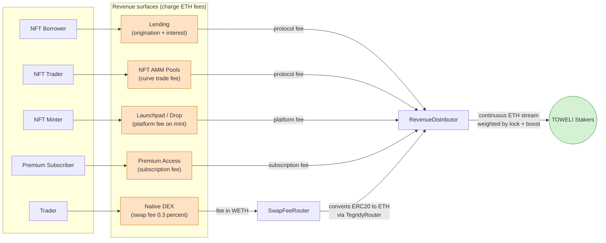
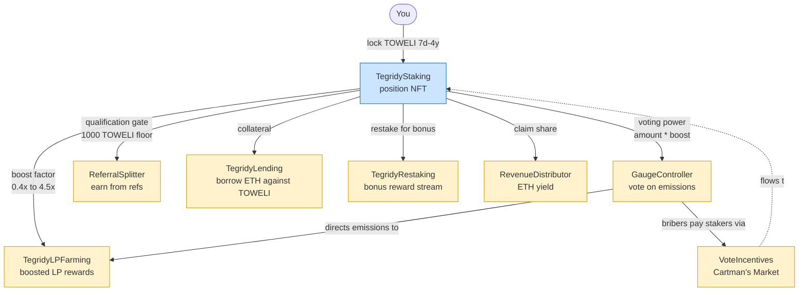
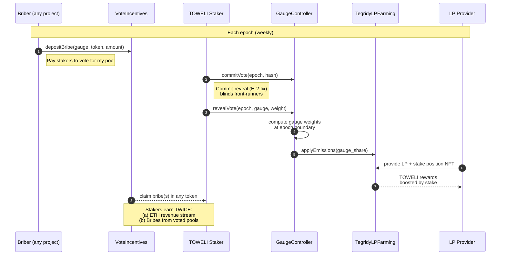

<p align="center">
  
</p>

# Tegridy Farms

[](../../actions/workflows/contracts-ci.yml)
[](../../actions/workflows/codeql.yml)
[](../../actions/workflows/slither.yml)
[](LICENSE)
[](contracts/foundry.toml)
[](https://etherscan.io/token/0x420698CFdEDdEa6bc78D59bC17798113ad278F9D)

> **A DeFi yield protocol on Ethereum where every dollar of swap fees flows to stakers, every vote is weighted by how long you've locked, and the whole thing runs on fixed-supply TOWELI. Real yield. No inflation tricks. Farm with tegridy.**

Tegridy Farms lets you stake a fixed-supply ERC-20 (TOWELI) and earn **100% of protocol revenue** as real ETH yield — no emissions subsidies, no rebase games. On top of staking, the protocol ships a native DEX, LP farming with vote-escrow boosts, ERC-20 and NFT lending, and a Curve-style gauge-voted emissions system that lets TOWELI holders direct where rewards go.

The name and voice are a satirical nod to South Park's "Tegridy Farms" — weed-farm integrity, Randy Marsh energy, kids' college fund. The protocol itself is standard Synthetix/Curve DeFi primitives wrapped in a brand with a point of view.

- **Website:** [tegridyfarms.xyz](https://tegridyfarms.xyz)
- **Token:** [`TOWELI`](https://etherscan.io/token/0x420698CFdEDdEa6bc78D59bC17798113ad278F9D) · 1,000,000,000 fixed supply · Ethereum Mainnet
- **Chart:** [GeckoTerminal](https://www.geckoterminal.com/eth/pools/0x6682Ac593513cc0A6c25D0F3588e8fA4FF81104D)

---

## Contents

- [What it is](#what-it-is)
- [How it all fits together](#how-it-all-fits-together)
- [How to use it (for users)](#how-to-use-it-for-users)
- [Tokenomics in one minute](#tokenomics-in-one-minute)
- [For developers](#for-developers)
- [Repo layout](#repo-layout)
- [Security & audits](#security--audits)
- [Deployed contracts](#deployed-contracts-ethereum-mainnet)
- [Roadmap & status](#roadmap--status)
- [Community](#community)
- [License](#license)

---

## What it is

Tegridy Farms is six DeFi primitives that share one token and one revenue stream:

| Surface | What it does | Contract |
|---|---|---|
| **Staking** | Lock TOWELI for 7 days → 4 years. Get a 0.4×–4.0× boost on yield, plus +0.5× if you hold a JBAC NFT. Your position is an ERC-721 and can be used as collateral. Your share of the pool grows the longer you lock. | `TegridyStaking` |
| **Native DEX** | Uniswap V2–style AMM for TOWELI/WETH. Every basis point of swap fees routes to the RevenueDistributor and, from there, to stakers — not to the protocol treasury. | `TegridyFactory`, `TegridyRouter`, `SwapFeeRouter` |
| **LP Farming** | Synthetix-style boosted LP staking. Deposit LP tokens, earn TOWELI rewards. Your boost comes from your existing TegridyStaking NFT — lock longer, farm harder. | `TegridyLPFarming` |
| **NFT Finance** | ERC-20 lending against TOWELI, peer-to-peer NFT lending using JBAC / Nakamigos / GNSS as collateral (1-hour grace period, no liquidation auctions), and a Sudoswap-style NFT AMM. | `TegridyLending`, `TegridyNFTLending`, `TegridyNFTPoolFactory` |
| **Governance** | Curve-style gauge voting. TOWELI stakers vote on where LP farming emissions flow; bribers ("Cartman's Market") pay stakers to direct voting power to their pools. Commit-reveal voting (H-2 fix) is live on-chain. | `GaugeController`, `VoteIncentives` |
| **NFT Launchpad** | Click-deploy ERC-721 collections with built-in allowlists (Merkle), public mint, Dutch auction, delayed reveal, ERC-2981 royalties, ERC-7572 `contractURI`, and one-shot `createCollection(CollectionConfig)`. Artists upload art + traits CSV; the wizard handles Arweave via Irys (~$10–15, artist pays in ETH) and the on-chain deploy. | `TegridyLaunchpadV2`, `TegridyDropV2` |

**Why this over Curve / Aave / Yearn?**

- Fixed-supply token. No emissions dilution. What you earn is *revenue*, not inflation.
- Every fee mechanism routes to stakers by default — treasury only takes a parameterized cut on select pools (see [REVENUE_ANALYSIS.md](REVENUE_ANALYSIS.md) for honest breakdowns).
- Self-contained economic loop: stake → vote → direct LP emissions → earn LP → bribes flow back to stakers. All on-chain, all audit-trailed.

---

## How it all fits together

Tegridy Farms's `contracts/src/` directory holds **30 root `.sol` files** (25 user-facing primitives + 5 EIP-170 admin/vault sisters) plus **6 utility files** in `src/base/` and `src/lib/`. None of them are redundant — every revenue surface feeds the same staker reward stream; every governance lever points to TOWELI stakers; every NFT-collateral primitive uses the same staking position. It's **one flywheel** spread across many files. The diagrams below show the actual on-chain flow.

### 1. The revenue flywheel (where ETH actually comes from)

Every user action on every surface routes ETH through `SwapFeeRouter` or directly into `RevenueDistributor`. From there it streams to stakers proportionally to their boosted balance and historical lock duration. **No revenue surface keeps its fees — they all flow back through one address.**



### 2. The staking position as universal collateral

Your TegridyStaking lock is an **ERC-721 NFT**. That NFT is the input to every other primitive in the protocol — boosting LP farming, voting on gauges, qualifying for referral rewards, serving as collateral in ERC-20 lending, restaking for additional yield. **You stake once; everything else compounds on top.**



### 3. The governance cycle (where Curve's playbook lives)

TOWELI emissions for LP farming don't flow on a fixed schedule — TOWELI stakers vote epoch-by-epoch on which pools get them. Bribers ("Cartman's Market") pay stakers in any token to direct that voting power to their pool. **The emissions schedule is governed; the bribe market is permissionless.**



### Why each surface exists

Every contract earns its place in the protocol because it either *generates revenue* for stakers or *uses the staking position* as a primitive. Nothing is decorative.

| Surface | What it does | Why it exists |
|---|---|---|
| **TegridyStaking** | Lock TOWELI for 7d–4y, get a boosted position NFT | The center of the flywheel. Holding the NFT is what entitles you to ETH revenue + LP boost + voting power. |
| **TegridyRestaking** | Stake the position NFT for bonus token rewards | Lets stakers earn a 2nd reward stream without giving up voting power. Pattern: EigenLayer operator delegation. |
| **TegridyLPFarming** | Provide TOWELI/WETH liquidity, earn boosted TOWELI emissions | Funds LP depth so the DEX has tight spreads → swap volume → ETH revenue to stakers. The boost links LP yield to staking, so LPs have skin in governance too. |
| **Native DEX** (Factory + Router + Pair) | Uniswap V2-style AMM for TOWELI/WETH | Without a native DEX, swap fees would leak to Uniswap. By routing trades through `tegridyfarms.xyz/swap`, every basis point flows to stakers, not third parties. |
| **TegridyFeeHook** (V4) | Uniswap V4 hook routing V4-pool fees to RevenueDistributor | Catches the next wave of liquidity (V4 pools) into the same revenue stream. Future-proofs the flywheel against the V2→V4 migration. |
| **TegridyTWAP** | Time-weighted average price oracle | Provides manipulation-resistant pricing for lending collateral valuation. Pattern: Uniswap V2 cumulative-price + V3-style observations. |
| **SwapFeeRouter** | Converts non-ETH fee revenue to ETH, distributes to RevenueDistributor + treasury + caller credit | The funnel that aggregates fees from every surface and converts them into a single ETH stream. Caller-credit incentivizes anyone to call `distribute()`. |
| **RevenueDistributor** | Streams ETH to stakers proportional to historical voting power | The single source of truth for "what you earned." Uses epoch snapshots so a flash-staker can never amplify their share. |
| **POLAccumulator** | Captures protocol-owned liquidity (POL) from a portion of swap fees | Ensures the protocol holds its own LP, so liquidity isn't 100% mercenary. Long-term insurance against LP migration. |
| **GaugeController** | Curve-style gauge weight voting via commit-reveal | Decentralizes emissions: stakers, not the team, decide which LP pools get TOWELI rewards each epoch. Commit-reveal blinds front-runners. |
| **VoteIncentives** ("Cartman's Market") | Permissionless bribe market — pay stakers to vote for your gauge | Lets external projects rent voting power instead of begging the team. Turns governance into a yield surface for stakers. Pattern: Aerodrome / Velodrome BribeVotingReward. |
| **TegridyLending** | ERC-20 lending against TOWELI staking positions as collateral | Lets stakers borrow liquidity without unstaking. Origination + interest fees flow to stakers. Pattern: Gondi P2P offer-creation. |
| **TegridyNFTLending** | Peer-to-peer NFT lending against whitelisted ERC-721s (JBAC / Nakamigos / GNSS) | Brings NFT-fi volume + fees into the flywheel. Lender-only liquidation, no public keepers, 1h sequencer-aware grace. Pattern: Gondi. |
| **TegridyNFTPool / Factory** | Sudoswap-style bonding-curve NFT AMM | Provides instant NFT liquidity; trade fees flow to LPs + RevenueDistributor. |
| **TegridyDropV2** | Click-deploy ERC-721 collection contract (Manifold/Zora pattern) | Lets artists deploy a mint on Tegridy without writing Solidity. Platform fee on each mint flows to stakers. |
| **TegridyLaunchpadV2** | Factory for TegridyDropV2 clones via CREATE2 | The deploy surface for the launchpad wizard. Bundles allowlist + Dutch auction + reveal + royalties + contractURI in one tx. |
| **PremiumAccess** | Subscription-based premium tier (escrow + shortfall queue) | Monetizes power-user features (advanced charts, alerts, priority indexer). Subscription fees flow to stakers. |
| **ReferralSplitter** | Stake-gated referral rewards | Aligns acquisition incentives with the staker base — only stakers (≥1000 TOWELI power) can earn referral fees. |
| **CommunityGrants** | TOWELI-staker-voted grant proposals + payouts | Decentralizes community spend. Stakers vote on who gets ecosystem grants. |
| **MemeBountyBoard** | ETH bounties for community-submitted memes/content, staker-voted | Channels marketing spend through the same governance lens. |
| **Toweli (ERC-20)** | The TOWELI token — fixed 1B supply, EIP-2612 permit, ERC-1271 SCW-compatible | The asset that ties everything together. No mint function. Audited 9 times. |

### Contract count — what's in `contracts/src/` and what isn't

The directory holds **30 root `.sol` files** at HEAD, broken down as:

- **25 user-facing primitives** — covered by the table above (some rows group multiple cooperating contracts: "Native DEX" is `TegridyFactory` + `TegridyRouter` + `TegridyPair`; "TegridyNFTPool / Factory" is `TegridyNFTPool` + `TegridyNFTPoolFactory`; "TegridyStaking" pairs with `TegridyTokenURIReader` for SVG/JSON rendering)
- **5 admin / vault sister contracts** — *not duplicates*; intentional EIP-170 splits so each main contract fits under the 24,576-byte mainnet bytecode limit:
  - `TegridyLending` ↔ `TegridyLendingAdmin` (parameter timelocks)
  - `TegridyStaking` ↔ `TegridyStakingAdmin` + `TegridyStakingJbacVault` (parameter timelocks + JBAC custody isolation for the CCR-01 reentrancy defense)
  - `SwapFeeRouter` ↔ `SwapFeeRouterAdmin`
  - `VoteIncentives` ↔ `VoteIncentivesAdmin`

Plus **6 utility files** outside `src/` root:
- `contracts/src/base/` (2 files) — `OwnableNoRenounce`, `TimelockAdmin`
- `contracts/src/lib/` (4 files) — `SafeERC721Call`, `SequencerCheck`, `VotePowerOracle`, `WETHFallbackLib`

Math: **25 primitives + 5 sisters = 30 root files**, + 6 utility files = **36 `.sol` files total** under `contracts/src/**`.

**No V1 duplicates remain.** `TegridyDrop.sol` (V1) and `TegridyLaunchpad.sol` (V1) source files were **deleted 2026-04-19** per the scope decision in `memory/project_scope_decision.md` — only the V2 contracts ship. The deployed V1 clones still live on-chain at their original addresses, but the source is gone and no new V1 deploys are possible. See the "Governance & launchpad" section in [Deployed contracts](#deployed-contracts-ethereum-mainnet) for the legacy address reference.

If you're a reviewer auditing the surface: the user-facing ABI is **25 contracts** (compressed to ~20 logical clusters in the table for readability). Each admin/vault sister is a thin staging layer for `propose/execute/cancel` flows or asset custody isolation; users never call them directly.

---

## How to use it (for users)

You don't need to read the contracts. You do need to understand the flow. Four steps from cold wallet to earning yield.

### 1. Get a wallet on Ethereum Mainnet

MetaMask, Rabby, Coinbase Wallet, or anything RainbowKit supports. Fund it with ETH for gas.

### 2. Get TOWELI

Two paths:

- **Native DEX (recommended):** [tegridyfarms.xyz/swap](https://tegridyfarms.xyz/swap) — fees flow to stakers, so buying here supports the yield flywheel.
- **Uniswap V2:** [app.uniswap.org](https://app.uniswap.org/swap?outputCurrency=0x420698CFdEDdEa6bc78D59bC17798113ad278F9D&chain=ethereum) — works, but Uniswap keeps the fees.

Price and liquidity: [GeckoTerminal](https://www.geckoterminal.com/eth/pools/0x6682Ac593513cc0A6c25D0F3588e8fA4FF81104D).

### 3. Stake & lock

Go to [tegridyfarms.xyz/farm](https://tegridyfarms.xyz/farm). Choose a lock duration:

| Lock | Boost | Flavor |
|---|---|---|
| 7 days | 0.4× | The Taste Test |
| 30 days | ~1.0× | One Month of Integrity |
| 90 days | ~1.5× | The Harvest Season |
| 1 year | ~2.0× | The Long Haul |
| 2 years | ~3.0× | In It For The Kids |
| 4 years | 4.0× | Till Death Do Us Farm |

Hold a [JBAC NFT](https://etherscan.io/address/0xd37264c71e9af940e49795F0d3a8336afAaFDdA9) in your wallet for a **+0.5× bonus** on top (ceiling: 4.5×).

**Early exit is allowed but costs 25%** (the "DEA Raid Tax") — the penalty redistributes to stakers still locked. Designed to hurt, designed to be fair.

### 4. Earn, vote, compound

- **Yield accrues continuously.** Claim ETH rewards anytime from the Dashboard; no minimum.
- **Vote on gauges** at [tegridyfarms.xyz/community](https://tegridyfarms.xyz/community). Your staking NFT is your voting power. Direct LP emissions to the pool you hold (or the one paying the biggest bribe).
- **Farm LP tokens** on [tegridyfarms.xyz/farm](https://tegridyfarms.xyz/farm) under the LP tab. Your staking lock auto-boosts your LP rewards.
- **Borrow or trade NFTs** at [tegridyfarms.xyz/lending](https://tegridyfarms.xyz/lending) (the "NFT Finance" tab in the top nav). Borrow against TOWELI / LP, take peer-to-peer NFT loans, or trade on bonding-curve NFT AMM pools.

### 5. Launch your own NFT collection (optional)

Artists can deploy a gas-efficient ERC-721 drop on [tegridyfarms.xyz/lending → Launchpad](https://tegridyfarms.xyz/lending). The 5-step wizard handles everything:

1. Connect wallet
2. Upload a folder of images + a traits CSV ([sample template](frontend/public/sample-collection.csv))
3. Preview each token's metadata; edit name / description / attributes inline
4. Fund Arweave via Irys (one ETH tx, ~$10–15 for 5555 images) — permanent storage
5. Deploy — one `createCollection(CollectionConfig)` tx wires placeholderURI + contractURI + merkleRoot + Dutch auction in a single clone

Art is permanently stored on Arweave. Metadata follows the OpenSea standard (ERC-7572 `contractURI` for collection-level banner/description, standard per-token JSON). The collection is a minimal-proxy clone of `TegridyDropV2` (~97k gas to deploy). Full creator walkthrough: [docs/LAUNCHPAD_GUIDE.md](docs/LAUNCHPAD_GUIDE.md).

New to DeFi? Read [QUICKSTART.md](QUICKSTART.md) for a walkthrough with screenshots, or [FAQ.md](FAQ.md) for the questions everyone asks first.

---

## Tokenomics in one minute

- **Total supply:** 1,000,000,000 TOWELI. **Fixed.** No mint function. No burn entrypoint.
- **Current season:** Season 2 (2026-01-01 → 2026-06-01). **26,000,000 TOWELI** in LP farming rewards, directed by gauge vote.
- **Revenue flow:** DEX swap fees → `SwapFeeRouter` → `RevenueDistributor` → stakers (in ETH, continuous stream).
- **Penalty flow:** 25% early-exit penalty → stakers still locked (pro-rata).
- **Treasury take:** Lending/launchpad protocol fees only. Swap fees go 100% to stakers today — see [REVENUE_ANALYSIS.md](REVENUE_ANALYSIS.md) for active calibration discussions.

Allocation table and emissions schedule: **[TOKENOMICS.md](TOKENOMICS.md)**. Note: allocation specifics are being finalized for on-chain publication — treat TOKENOMICS.md as the source of truth when the team posts final numbers.

---

## For developers

### Prerequisites

- **Node.js 20+** and `pnpm` (or `npm`)
- **Foundry** for contracts: [getfoundry.sh](https://getfoundry.sh/)
- **An RPC URL** (Alchemy / Infura / your own node) for local dev and tests
- **A WalletConnect project ID** if you want the frontend to show the WalletConnect modal

### Quick start — frontend

```bash
cd frontend
cp .env.example .env
# edit .env to add VITE_WALLETCONNECT_PROJECT_ID, VITE_RPC_URL, etc.
pnpm install
pnpm dev
```

Open the URL Vite prints (usually `http://localhost:5173`).

### Quick start — contracts

```bash
cd contracts
cp .env.example .env
# edit .env to add RPC_URL, PRIVATE_KEY (for deploys), ETHERSCAN_API_KEY
forge install
forge build
forge test
```

To redeploy contracts with working-tree patches (see `FIX_STATUS.md` and `DEPLOY_CHEAT_SHEET.md`), run the per-contract `forge script` calls in order. The previous one-shot helper `scripts/redeploy-patched-3.sh` was deleted on 2026-04-19 along with the V1 `TegridyDrop` source. Use, for example:

```bash
# C-01 fixed LP farming (see DEPLOY_CHEAT_SHEET.md §2 Step 8)
export TEGRIDY_LP=0x...        # TOWELI/WETH pair
export TEGRIDY_STAKING=0x...   # current staking
forge script script/DeployTegridyLPFarming.s.sol \
  --rpc-url "$ETH_RPC_URL" --broadcast --verify \
  --etherscan-api-key "$ETHERSCAN_API_KEY" --slow

npx tsx scripts/diff-addresses.ts   # prints the constants.ts patch
```

See `DEPLOY_CHEAT_SHEET.md` and `DEPLOY_RUNBOOK.md` for the full ordered deploy sequence.

### Quick start — indexer

```bash
cd indexer
pnpm install
pnpm dev   # starts Ponder against the RPC in .env
```

### Running tests

- **Solidity:** `cd contracts && forge test` — **149 test suites, 2,593 tests passing** (non-invariant), audit-regression coverage included
- **Frontend typecheck:** `cd frontend && pnpm exec tsc --noEmit`
- **Frontend unit tests:** `cd frontend && pnpm exec vitest run` — **70+ Vitest cases** (CSV parser, metadata builders, wizard reducer)
- **Frontend build:** `cd frontend && pnpm build`

### Contributing

See [CONTRIBUTING.md](CONTRIBUTING.md). TL;DR: branch off `main`, keep changes focused, run `forge test` and frontend typecheck before opening a PR.

---

## Repo layout

```
tegriddy-farms/
├── contracts/           Foundry project — Solidity 0.8.26
│   ├── src/             25 user-facing primitives + 5 EIP-170 admin/vault sisters = 30 root .sol files
│   │                    plus 2 base/ + 4 lib/ utility files = 36 total. V1 launchpad/drop deleted 2026-04-19.
│   ├── script/          Deploy + wiring scripts (incl. DeployLaunchpadV2, DeployTegridyFeeHook)
│   └── test/            67 test suites, 1,933 tests incl. audit regression + launchpad V2 fuzz
├── frontend/            Vite + React 19 + TypeScript
│   ├── src/pages/       Routed pages (tabbed LearnPage / ActivityPage hosts)
│   ├── src/components/  UI components
│   │   └── launchpad/wizard/   5-step click-deploy wizard (Connect → Upload → Preview → Fund → Deploy)
│   ├── src/hooks/       wagmi-based hooks — useIrysUpload, useNFTDropV2, useWizardPersist, etc.
│   ├── src/lib/         Constants, ABIs (v1 + v2), nftMetadata (CSV + OpenSea builders), Irys client
│   └── supabase/        SQL migrations for off-chain data (orderbook, push, profiles)
├── indexer/             Ponder — event indexer & GraphQL API
├── scripts/             Operations helpers (redeploy, address diff, etc.)
├── docs/                Architecture, deployment runbooks, developer docs, launchpad guides
├── AUDITS.md            🟢 Audit index — every review, canonical vs archived, honest methodology labels
├── SECURITY_AUDIT_300_AGENT.md   Canonical 300-agent internal review (Apr 16, 2026)
├── AUDIT_FINDINGS.md    Current main-branch blocker list (35 detectives, Apr 17, 2026)
├── SPARTAN_AUDIT.txt    External Spartan audit (Apr 16, 2026)
├── API_INDEXER_AUDIT.md          Serverless + Ponder domain audit (Apr 17, 2026)
├── docs/audits/archive/          Historical reviews (Mar 25 – Apr 4) — 9 files preserved for provenance
├── FIX_STATUS.md        Rolling remediation tracker
├── CHANGELOG.md         Release notes (Keep a Changelog)
├── ROADMAP.md           What's next
├── TOKENOMICS.md        Supply, emissions, revenue distribution
├── FAQ.md               User-facing questions
├── QUICKSTART.md        Non-technical onboarding
├── SECURITY.md          Disclosure process, bug bounty
├── HALL_OF_FAME.md      Security researchers we've thanked
├── LICENSE              MIT
├── NOTICE.md            Third-party attributions (OZ, Synthetix, Curve, Uniswap V2) + fair-use
└── REVENUE_ANALYSIS.md  Fee-lever calibration (honest peer benchmarks)
```

### Deeper docs (in `docs/`)

| Doc | For |
|---|---|
| [ARCHITECTURE.md](docs/ARCHITECTURE.md) | How the 25 contracts fit together |
| [DEVELOPING.md](docs/DEVELOPING.md) | Local-dev setup for contracts, frontend, indexer |
| [DEPLOYMENT.md](docs/DEPLOYMENT.md) | Mainnet deploy runbook + rollback |
| [API.md](docs/API.md) | Serverless endpoint reference |
| [GOVERNANCE.md](docs/GOVERNANCE.md) | Admin keys, timelock, multisig roadmap |
| [TOKEN_DEPLOY.md](docs/TOKEN_DEPLOY.md) | How the TOWELI ERC-20 was deployed + vanity-prefix notes |
| [MIGRATION_HISTORY.md](docs/MIGRATION_HISTORY.md) | Canonical vs deprecated addresses across all contracts |
| [DEPRECATED_CONTRACTS.md](docs/DEPRECATED_CONTRACTS.md) | Orphans & abandoned deployments |
| [LAUNCHPAD_GUIDE.md](docs/LAUNCHPAD_GUIDE.md) | Creator walkthrough: CSV format, image rules, wizard steps, FAQ |
| [LAUNCHPAD_V2_ARCHITECTURE.md](docs/LAUNCHPAD_V2_ARCHITECTURE.md) | V2 design: contracts, wizard state machine, Irys flow |
| [LAUNCHPAD_V2_NOTES.md](docs/LAUNCHPAD_V2_NOTES.md) | Post-deploy address-flip checklist |

---

## Security & audits

Tegridy Farms has undergone **2 external reviews** (Spartan + a pre-release third-party review) plus **9+ internal AI-agent sweeps** (100→200→300→40-agent passes, microscope, DEEP, pass-5 through pass-8, scan2–scan8, and the May-9 *Monster Audit* lineage closing 16 additional findings with 4 new Foundry PoC tests). Every artifact is tracked in this repo under [`AUDITS.md`](AUDITS.md); historical reviews have been archived under [`docs/audits/archive/`](docs/audits/archive/). Nothing is buried. The protocol is running on-chain with real TVL; treat it seriously.

- **Complete audit index:** [AUDITS.md](AUDITS.md) — every file, every methodology, every chronological pass, plus a cross-reference table showing which blockers have patches and which need on-chain redeploys.
- **Current fix status:** [FIX_STATUS.md](FIX_STATUS.md) — rolling tracker of what's landed on `main` and what's deferred. **Read this before depositing significant capital.** Items are open; we don't hide them.
- **Bug bounty is active.** Report process: see [SECURITY.md](SECURITY.md). We pay.

### Audit artifact summary

Methodology is labelled honestly. **Internal AI agents** are parallel Claude/GPT sweeps — a breadth tool, not a substitute for a human audit firm. **External** means a third-party conducted the review.

| Audit | Date | Type | Headline severity | Role |
|---|---|---|---|---|
| [.audit_101/POST_REMEDIATION_LEDGER.md](.audit_101/POST_REMEDIATION_LEDGER.md) | 2026-04-26 | Internal AI + multi-pass verification, 27 commits landed | 3 Crit + 7 High + 5 Med fixed; 2 EIP-170 splits; 31 false positives cleared | **🟢 Post-fix source of truth** |
| [SECURITY_AUDIT_300_AGENT.md](SECURITY_AUDIT_300_AGENT.md) | 2026-04-16 | Internal AI, 300 agents + Spartan ingest | 5 C / 12 H / many M+L | Canonical severity (pre-Apr-26) |
| [AUDIT_FINDINGS.md](AUDIT_FINDINGS.md) | 2026-04-17 | Internal AI, 35 detectives vs `main` | 4 ship-blockers (B1–B4) + H/M/L | Pre-Apr-26 working-tree state |
| [SPARTAN_AUDIT.txt](SPARTAN_AUDIT.txt) | 2026-04-16 | **External** (Spartan) | 1 C / 1 H / 7 M / 9 L | Ingested into 300-agent |
| [API_INDEXER_AUDIT.md](API_INDEXER_AUDIT.md) | 2026-04-17 | Internal AI, domain-specific | H + M triage | `frontend/api/**` + `indexer/` |
| *9 earlier reviews, Mar 25 – Apr 4* | — | Archived | — | See [docs/audits/archive/](docs/audits/archive/) |

A paid human audit by a recognised firm (OpenZeppelin / Trail of Bits / Spearbit / Cyfrin / Code4rena) is on the roadmap and **not yet scheduled**. Size deposits accordingly.

Plus **40+ audit-derived Foundry test files** under [`contracts/test/`](contracts/test/) — every finding that could be expressed as a regression test has one (including 4 new `FRESH2026_*` PoC files locking in the monster-audit closures). Current pass rate: **2,593 / 2,593**.

### What's true as of the latest commit on `main`

- **Wave 0 audit-fix redeploys are live on mainnet** (2026-04-18): TegridyLPFarming C-01 fix, TegridyNFTLending C-02 grace period, GaugeController H-2 commit-reveal, TokenURIReader pointing at v2 staking, TegridyTWAP oracle, TegridyFeeHook at `…0044`. See [docs/MIGRATION_HISTORY.md](docs/MIGRATION_HISTORY.md) for the deprecated→canonical pairs.
- **Still pending broadcast**: VoteIncentives redeploy; TegridyLending + NFTPool template + NFTPoolFactory redeploy; TegridyFeeHook redeploy with patched `_owner` constructor (source ready, first deploy's ownership was stranded on the Arachnid CREATE2 proxy); TegridyLaunchpadV2 (click-deploy factory, tests passing). V1 TegridyLaunchpad + TegridyDrop source was deleted 2026-04-19 — V1 clones on mainnet remain live. See [FIX_STATUS.md](FIX_STATUS.md) + [AUDITS.md § blocker table](AUDITS.md#cross-reference-known-blockers-on-main).
- The contracts use `OpenZeppelin` primitives (SafeERC20, ReentrancyGuard, Pausable), a custom `TimelockAdmin` (24–48 hour delays on parameter changes), and `OwnableNoRenounce` (prevents accidental brick).
- The frontend has **403+ passing unit tests** (wagmi hooks, formatting, CSV parsing, wizard reducer) + **20+ Playwright E2E specs** covering trust surfaces, wallet integration, and the major flows.

### What to still be careful about

- Smart contract risk exists. No software is bug-free.
- Market risk — TOWELI is a thin-liquidity token; IL in the LP is real.
- Admin keys are timelocked but not (yet) multisig. See [ROADMAP.md](ROADMAP.md) + [docs/GOVERNANCE.md](docs/GOVERNANCE.md) for the multisig migration plan and honest threat model.

---

## Deployed contracts (Ethereum Mainnet)

All contracts are verified on Etherscan; click any address to view source.

> **2026-04-26 architectural note:** TegridyStaking and SwapFeeRouter were each split into a user-facing contract + a sister `*Admin` contract to fit under the EIP-170 24,576-byte mainnet limit (see [CHANGELOG](CHANGELOG.md#2026-04-26--post-remediation-audit-campaign-3-crit--7-high--5-med--2-eip-170-splits) and [POST_REMEDIATION_LEDGER](.audit_101/POST_REMEDIATION_LEDGER.md)). The currently-deployed addresses below run the pre-split bytecode and continue to function. Once the new admin sister contracts deploy, they'll be added to this table; until then `propose/execute/cancel` admin calls go to the existing addresses.

<details>
<summary><b>Core token & staking</b></summary>

| Contract | Address |
|---|---|
| TOWELI Token | [`0x42069…78F9D`](https://etherscan.io/address/0x420698CFdEDdEa6bc78D59bC17798113ad278F9D#code) |
| TegridyStaking | [`0x62664…C4819`](https://etherscan.io/address/0x626644523d34B84818df602c991B4a06789C4819#code) |
| TegridyRestaking | [`0xfba4D…CaEe4`](https://etherscan.io/address/0xfba4D340759Ae4c36DfFC6C773D171bf7BDCaEe4#code) |
| TegridyStakingAdmin (post-split sister) | _to be deployed — see [CHANGELOG](CHANGELOG.md)_ |

</details>

<details>
<summary><b>Native DEX</b></summary>

| Contract | Address |
|---|---|
| TegridyFactory | [`0x8B786…bdCB6`](https://etherscan.io/address/0x8B786163aA3beb97822d480a0c306DfD6dEbdCB6#code) |
| TegridyRouter | [`0xCBCF6…9863F`](https://etherscan.io/address/0xCBCF6AcC4697cA3a7D7658Cd2051606a09c9863F#code) |
| TegridyLP (TOWELI/WETH) | [`0xeD01d…f26f6`](https://etherscan.io/address/0xeD01d5f52EBE97360133bdeF77305ee24d5f26f6#code) |

</details>

<details>
<summary><b>Revenue, fees & farming</b></summary>

| Contract | Address |
|---|---|
| RevenueDistributor | [`0x332aa…264D8`](https://etherscan.io/address/0x332aaE555b1164eA45c2291fD7eDfa97aAA264D8#code) |
| SwapFeeRouter | [`0xea13C…937A0`](https://etherscan.io/address/0xea13Cd47a37cC5B59675bfd52BFc8ff8691937A0#code) |
| SwapFeeRouterAdmin (post-split sister) | _to be deployed — see [CHANGELOG](CHANGELOG.md)_ |
| POLAccumulator | [`0x17215…B7Ca`](https://etherscan.io/address/0x17215f0dfA5E97c33c025E0560eeddffaD87B7Ca#code) |
| TegridyLPFarming (C-01 fixed) | [`0xa7EF7…9ec1`](https://etherscan.io/address/0xa7EF711Be3662B9557634502032F98944eC69ec1#code) |
| TegridyFeeHook (V4 hook, ends `0x0044`) | [`0xB6cfe…0044`](https://etherscan.io/address/0xB6cfeaCf243E218B0ef32B26E1dA1e13a2670044#code) |

</details>

<details>
<summary><b>Governance & launchpad</b></summary>

| Contract | Address |
|---|---|
| GaugeController (H-2 commit-reveal) | [`0xb9326…0Fdb`](https://etherscan.io/address/0xb93264aB0AF377F7C0485E64406bE9a9b1df0Fdb#code) |
| VoteIncentives | [`0x417F4…Cf1A`](https://etherscan.io/address/0x417F44aee21Cc709262e71A7fdF6028cc17eCf1A#code) |
| TegridyLaunchpad (v1, deprecated 2026-04-19) | [`0x5d597…FF3C2`](https://etherscan.io/address/0x5d597647D5f57aEFba727C160C4C67eEcC0FF3C2#code) |
| TegridyLaunchpadV2 (click-deploy w/ ERC-7572 contractURI) | _pending broadcast — placeholder `0x0…0` until deploy_ |
| TegridyNFTPoolFactory | [`0x1C0e1…04f0`](https://etherscan.io/address/0x1C0e1771943fbB299f4E19daD0fAA4Fa4e6c04f0#code) |

</details>

<details>
<summary><b>Lending</b></summary>

| Contract | Address |
|---|---|
| TegridyLending | [`0xd471e…3367f`](https://etherscan.io/address/0xd471e5675EaDbD8C192A5dA2fF44372D5713367f#code) |
| TegridyNFTLending (C-02 grace period) | [`0x05409…B139`](https://etherscan.io/address/0x05409880aDFEa888F2c93568B8D88c7b4aAdB139#code) |
| TegridyTokenURIReader | [`0xfec9a…1eb2`](https://etherscan.io/address/0xfec9aea42ea966c9382eeb03f63a784579841eb2#code) |
| TegridyTWAP | [`0xddbe4…4995`](https://etherscan.io/address/0xddbe4cd58faf4b0b93e4e03a2493327ee3bb4995#code) |

</details>

<details>
<summary><b>Community & premium</b></summary>

| Contract | Address |
|---|---|
| CommunityGrants | [`0x8f1Ba…3032`](https://etherscan.io/address/0x8f1Ba1eC97a932EE1332BA0f366BC6aDf60B3032#code) |
| MemeBountyBoard | [`0x3457C…F0C9`](https://etherscan.io/address/0x3457C2210be35bA7AF6F382a76247Ecd782BF0C9#code) |
| ReferralSplitter | [`0xd3d46…2c16`](https://etherscan.io/address/0xd3d46C0d25Ef1F4EAdb58b9218AA23Ed4c2f2c16#code) |
| PremiumAccess | [`0xaA16d…22Ad`](https://etherscan.io/address/0xaA16dF3dC66c7A6aD7db153711329955519422Ad#code) |
| Treasury | [`0xE9B7a…f53e`](https://etherscan.io/address/0xE9B7aB8e367bE5AC0e0c865136f1907bd73df53e#code) |

</details>

<details>
<summary><b>NFT collections</b></summary>

| Contract | Address |
|---|---|
| JBAC (Jungle Bay Apes) | [`0xd3726…fDdA9`](https://etherscan.io/address/0xd37264c71e9af940e49795F0d3a8336afAaFDdA9#code) |
| JBAY Gold | [`0x6Aa03…92F3`](https://etherscan.io/address/0x6Aa03F42c5366E2664c887eb2e90844CA00B92F3#code) |

</details>

For a full browsable directory inside the app, see [tegridyfarms.xyz/contracts](https://tegridyfarms.xyz/contracts).

---

## Roadmap & status

See [ROADMAP.md](ROADMAP.md) for the full roadmap and [CHANGELOG.md](CHANGELOG.md) for what shipped.

Near-term priorities (abridged):

- ~~Redeploy three patched contracts (LP farming `exit()`, NFT lending grace period, Drop refund/cancel)~~ — ✅ **LPFarming + NFTLending live on mainnet 2026-04-18**. The V1 Drop H-10 refund surface is now carried by `TegridyDropV2` (V1 source deleted 2026-04-19).
- ~~Commit-reveal gauge voting at the contract layer~~ — ✅ **live on mainnet** at `0xb93264aB…0Fdb`.
- Broadcast `TegridyLaunchpadV2` + redeploy `TegridyFeeHook` with patched `_owner` constructor
- Broadcast `VoteIncentives` + redeploy `TegridyLending` / `TegridyNFTPool template` / `TegridyNFTPoolFactory` (per-contract scripts; V1 V3Features bundle retired 2026-04-19)
- Multisig `acceptOwnership()` on all transferred Wave 0 contracts; fund LPFarming reward epoch
- Keeper infrastructure for DCA / limit orders (today these require the user's tab to stay open)
- Wire Leaderboard & History pages to the indexer instead of Etherscan proxy
- Multisig + guardian role for admin keys

---

## Community

We're early and small, and we're not going to fake momentum. If you want to participate:

- **Issues / discussions:** use this repo's [Issues](../../issues) and [Discussions](../../discussions) tabs
- **Security disclosures:** see [SECURITY.md](SECURITY.md) — please do not file security reports as public issues
- **Contributions:** see [CONTRIBUTING.md](CONTRIBUTING.md) and [CODE_OF_CONDUCT.md](CODE_OF_CONDUCT.md)

> A public Discord / Twitter / Telegram presence is on the roadmap. Until those exist, this GitHub is the canonical channel.

---

## License

MIT — see [LICENSE](LICENSE).

---

*Not financial advice. DeFi is risky. Read [SECURITY.md](SECURITY.md), read [FIX_STATUS.md](FIX_STATUS.md), read the contracts, decide for yourself. Farm with tegridy.*
