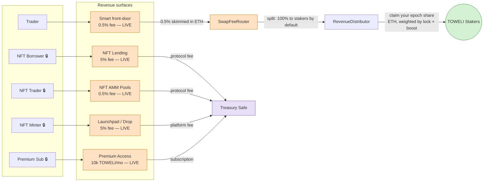
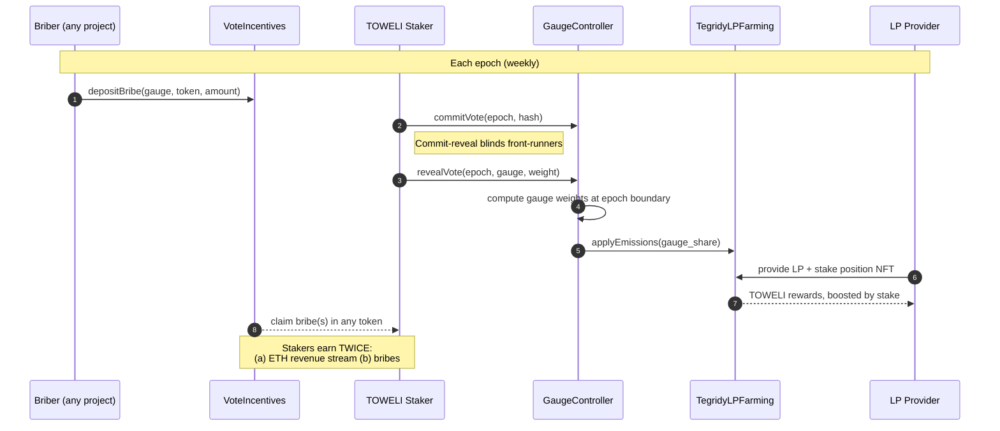

<p align="center">
  
</p>

# Tegridy Farms

[](../../actions/workflows/contracts-ci.yml)
[](../../actions/workflows/codeql.yml)
[](../../actions/workflows/slither.yml)
[](LICENSE)
[](contracts/foundry.toml)
[](https://etherscan.io/token/0x420698CFdEDdEa6bc78D59bC17798113ad278F9D)

> **A DeFi yield protocol on Ethereum where swap fees flow to stakers, votes are weighted by how long you've locked, and the whole thing runs on fixed-supply TOWELI. Real yield. No inflation tricks. Farm with tegridy.**

> ⚠️ **Status: relaunch live, hardening in progress.** The core protocol was **redeployed to Ethereum mainnet on 2026-06-06** from a fresh deployer wallet (the "MVP" set — ~14 contracts), and on **2026-07-16** the audited **gated-feature batch — 11 contracts spanning governance, NFT-finance, the launchpad, and the premium/community tier — was deployed on-chain and Etherscan-verified.** On **2026-07-21/22** the capital-free revenue surfaces — **P2P NFT lending, the NFT AMM, the launchpad, Premium, and the EVM token launcher — went live in the app** (operator-authorized). It is **live but not yet decentralized**: ownership still sits behind the deployer key (Safe rebuild + handoff planned — [`docs/SAFE_REHOME_RUNBOOK.md`](docs/SAFE_REHOME_RUNBOOK.md)), the emission/spend-side features (governance, grants, bounties) stay **frontend-gated until a revenue line funds them**, and there is **no professional human-firm audit yet**. Size deposits accordingly.

### The 30-second version

1. TOWELI is fixed supply (1B, no mint function, no rebase).
2. The protocol runs a DEX, staking, revenue distribution, an oracle, LP farming, **NFT finance (P2P NFT lending + a bonding-curve NFT AMM), an NFT launchpad, a premium tier, and an EVM token launcher** live today; **governance and the community programs** are deployed on-chain + verified (2026-07-16) but stay app-gated until a revenue line funds their emissions. (Token lending is audited and staged, pending the oracle bootstrap.)
3. Fees from live surfaces route to TOWELI stakers, in ETH.
4. The longer you lock (up to 4y), the more ETH you earn and the louder you'll vote once governance is live.
5. A Solana surface earns fees too (swap fee-capture live; a Tegridy-owned Solana AMM is in devnet groundwork).

Yes, the name is from Randy Marsh's South Park weed farm. The bit ends there — the contracts are standard Synthetix / Curve / Aave / Uniswap / Gondi primitives, copied from battle-tested sources on purpose.

- **Website:** [tegridyfarms.vercel.app](https://tegridyfarms.vercel.app)
- **Token:** [`TOWELI`](https://etherscan.io/token/0x420698CFdEDdEa6bc78D59bC17798113ad278F9D) · 1,000,000,000 fixed supply · Ethereum Mainnet (unchanged across the relaunch — only the protocol contracts were redeployed)
- **Price / liquidity:** [GeckoTerminal](https://www.geckoterminal.com/eth/pools/0x6682Ac593513cc0A6c25D0F3588e8fA4FF81104D) (the deep TOWELI/WETH liquidity lives in the Uniswap V2 pool)

---

## Contents

- [What it is](#what-it-is) — feature surface
- [Live deployment status](#live-deployment-status) — what's on-chain vs gated
- [How it all fits together](#how-it-all-fits-together) — flywheel diagrams
- [How to use it (for users)](#how-to-use-it-for-users)
- [Solana surface](#solana-surface)
- [Tokenomics in one minute](#tokenomics-in-one-minute)
- [For developers](#for-developers)
- [Repo layout](#repo-layout)
- [Security & audits](#security--audits)
- [Deployed contracts](#deployed-contracts-ethereum-mainnet)
- [Roadmap & status](#roadmap--status)
- [Community](#community)
- [License](#license)

---

## What it is

Tegridy Farms is a set of DeFi primitives that share one token and one revenue stream. Every surface either **generates revenue** for TOWELI stakers or **uses the staking position** as a primitive — nothing is decorative.

| Surface | What it does | Contract(s) | Status |
|---|---|---|---|
| **Staking** | Lock TOWELI for 7 days → 4 years. Get a 0.4×–4.0× boost on yield, plus +0.5× with a JBAC NFT. Your position is an ERC-721 and is the input to every other primitive. | `TegridyStaking` (+ `TegridyStakingAdmin`, `TegridyStakingJbacVault`) | 🟢 Live |
| **Native DEX** | Uniswap V2–style AMM for TOWELI/WETH. The pair charges the standard 0.3% (⅚ to LPs, ⅙ to the protocol's `feeTo`). | `TegridyFactory`, `TegridyRouter`, `TegridyPair` | 🟢 Live |
| **Smart swap front-door** | The app's default swap route runs through `SwapFeeRouter`, which takes a **0.5% protocol fee**, converts it to ETH, and streams it to stakers via the RevenueDistributor. | `SwapFeeRouter` (+ `SwapFeeRouterAdmin`) | 🟢 Live |
| **Revenue distribution** | Streams ETH to stakers pro-rata to boosted balance + historical lock, using epoch snapshots so a flash-staker can't amplify their share. | `RevenueDistributor` | 🟢 Live |
| **Oracle** | Time-weighted average price for manipulation-resistant collateral pricing. Uniswap-V2 cumulative-price + V3-style observations. | `TegridyTWAP` | 🟢 Live |
| **LP Farming** | Synthetix-style boosted LP staking. Deposit TOWELI/WETH LP, earn TOWELI; your boost comes from your existing staking NFT. | `TegridyLPFarming` | 🟢 Live |
| **Protocol-owned liquidity** | Captures POL from a share of swap fees so liquidity isn't 100% mercenary. | `POLAccumulator` | 🟢 Live |
| **Referrals** | Stake-gated referral rewards — only stakers (≥1000 TOWELI power) can earn. | `ReferralSplitter` | 🟢 Live |
| **NFT Finance** | Peer-to-peer NFT lending (Gondi pattern, lender-only liquidation, sequencer-aware grace) + Sudoswap-style bonding-curve NFT AMM. ERC-20 lending against TOWELI positions is staged behind the oracle. | `TegridyNFTLending`(+Admin), `TegridyNFTPoolFactory`, `TegridyLending` | 🟢 Live † |
| **Governance** | Curve-style gauge voting with commit-reveal, plus a permissionless bribe market ("Cartman's Market"). | `GaugeController`, `VoteIncentives`(+Admin) | 🔵 On-chain |
| **NFT Launchpad** | Click-deploy ERC-721 collections (Merkle allowlist, Dutch auction, delayed reveal, ERC-2981/7572) via a single `createCollection` tx. | `TegridyLaunchpadV2`, `TegridyDropV2` | 🟢 Live |
| **Token Launcher** | Launch an ERC-20 through Doppler with vetted defaults, launch fact-sheets, and afterlife tracking; the integrator fee accrues to the protocol. | (Doppler periphery — no custom Tegridy contract) | 🟢 Live (EVM; Solana gated) |
| **Premium / community** | Subscription premium tier, staker-voted community grants, meme-bounty board. | `PremiumAccess`, `CommunityGrants`, `MemeBountyBoard` | 🟢 Premium live · 🔵 grants/bounties on-chain |
| **Restaking** | Restake the position NFT for a second reward stream (EigenLayer-operator pattern). | `TegridyRestaking` | 🟡 Deferred (Phase 7 / EIP-170) |
| **Uniswap V4 module** | V4 hook (per-user premium fee discount + POL skim) + trusted swap router + boosted LP staker. | `v4/TegridyV4Hook`, `TegridyV4SwapRouter`, `TegridyBoostedLPStaker` | 🟡 Next-wave (unaudited, gated) |

**🔵 On-chain** means the contract is **deployed to mainnet and Etherscan-verified** (the 2026-07-16 gated batch), but the frontend address is deliberately still zeroed — these are the emission/spend-side features, held back until a revenue line funds them, not a technical dependency. **🟡 Gated** means the source is in the repo and tested but **not yet deployed** — the on-chain address is intentionally zeroed in the frontend ([`isDeployed()`](frontend/src/lib/constants.ts) gate) until it clears its audit wave and deploys. Both auto-activate the moment the operator sets the real address — exactly how the 🟢 NFT-finance/launchpad/premium set went live on 2026-07-21/22. († `TegridyLending` is *not* yet deployed: it is pre-deploy-audited and hardened but **oracle-gated**, so it ships only after the pool deepen + TWAP bootstrap.)

**Why this over Curve / Aave / Yearn?** Fixed-supply token — what you earn is *revenue*, not inflation. Every live fee mechanism routes to stakers by default. The whole thing is one self-contained economic loop: stake → earn ETH → (soon) vote → direct emissions → farm → bribes flow back to stakers.

---

## Live deployment status

Honest snapshot as of the latest commit:

- ✅ **Relaunch MVP is live on mainnet** (deployed 2026-06-06 via `DeployMVP`, block ~25,263,328). Staking, the native DEX, SwapFeeRouter, RevenueDistributor, TWAP, POLAccumulator, ReferralSplitter, TokenURIReader, and (since 2026-06-08) LP Farming are all deployed and wired.
- ✅ **Gated-feature batch deployed on-chain 2026-07-16** (11 contracts, all Etherscan-verified): GaugeController, VoteIncentives (+Admin), PremiumAccess, TegridyNFTPoolFactory, TegridyNFTLending (+Admin), MemeBountyBoard, CommunityGrants, and TegridyLaunchpadV2 (+ its DropV2 template). Each cleared a fresh pre-deploy adversarial audit wave.
- ✅ **Capital-free surfaces un-gated in the app 2026-07-21/22** (operator-authorized): P2P NFT lending, the NFT AMM, the launchpad, Premium, and the EVM token launcher are **live at [tegridyfarms.vercel.app](https://tegridyfarms.vercel.app)** — verified against the deployed bytecode (every frontend ABI selector checked on-chain) before the flip. Their fees accrue to the **treasury Safe** (`0x7D26…Bd7d`). GaugeController, VoteIncentives, CommunityGrants, and MemeBountyBoard stay app-gated: they *spend* (emissions/grants/bounties), so they wait for a revenue line to fund them.
- ✅ **Legacy exit surface (2026-07-22):** two retired pre-relaunch staking contracts still held user funds; the Farm page now shows an **exit-only card** (withdraw/early-withdraw, no deposit path) to any wallet with a legacy position, and the contracts are listed as *retired — withdraw only* on [/contracts](https://tegridyfarms.vercel.app/contracts).
- ⏳ **Ownership is not yet decentralized.** All live contracts are still owned by the deployer EOA. A 2-step Safe multisig handoff is in progress; the first attempt's 14-day window lapsed and is being re-initiated ([`docs/GOLIVE_HANDOFF.md`](docs/GOLIVE_HANDOFF.md)). **This single-key window is the biggest current risk — bigger than any specific code finding.**
- ⏳ **The protocol-owned TOWELI/WETH pool is seeded but shallow.** It holds live liquidity at market price, but the TWAP oracle bootstrap is still gated on deepening it past the oracle's reserve floor; until then the smart front-door routes swaps to the deepest venue (the Uniswap V2 pool). Deepen + bootstrap are scripted go-live steps ([`DeepenLP.s.sol`](contracts/script/DeepenLP.s.sol), [`BootstrapTWAP.s.sol`](contracts/script/BootstrapTWAP.s.sol)).
- 🟡 **A few surfaces remain not-yet-deployed:** token lending (`TegridyLending` — pre-deploy-audited but oracle-gated), restaking (EIP-170 split / Phase 7), the Pro Pass (a launchpad operation), and the Uniswap V4 module (next-wave, unaudited).
- 🟡 **No professional firm audit yet.** Extensive internal adversarial multi-agent audits are ongoing; a paid human-firm review is the gate before scaling TVL.

---

## How it all fits together

The `contracts/src/` tree holds **50 Solidity files**: ~34 at the root (primitives + their EIP-170 admin/vault sisters), a 4-file Uniswap V4 next-wave module under `v4/`, and 12 shared `base/` + `lib/` utilities. None are redundant — every revenue surface feeds the same staker reward stream; every governance lever points to TOWELI stakers; every NFT-collateral primitive uses the same staking position. It's **one flywheel** spread across many files.

### 1. The revenue flywheel (where the ETH actually comes from)

**In one sentence:** the protocol skims a small fee off trades routed through its smart front-door, turns that fee into ETH, and pays it out to people who've locked TOWELI — so your yield is a share of *real trading fees*, not freshly-minted tokens.

There are two swap-fee rails, and **only the front-door pays stakers today:**

| Rail | Fee | Who actually gets it |
|---|---|---|
| **Native pair** (`TegridyPair`) — a raw swap on the TOWELI/WETH pool | 0.3% | ~0.25% grows the pool for **LPs**; the ~0.05% protocol slice accrues to the **treasury as LP tokens** — *not* to stakers as ETH. |
| **Smart front-door** (`SwapFeeRouter`) — the app's default swap route | **0.5%** (hard-capped at 1%) | Collected in ETH, then **100% to stakers** by default (governance can never set it below 50%). **This is the staker-yield rail.** |

**How you actually get paid — three steps:**
1. **Fees pool up.** The front-door skims 0.5% off each swap into an ETH pot. (Fees taken in a token — e.g. a token→token swap — are held as that token and swept to ETH by a keeper, price-guarded by the TWAP, before they count.)
2. **The pot is split and pushed.** Anyone can call `distributeFeesToStakers()`; by default the whole staker slice goes to `RevenueDistributor` (a configurable cut — never more than 25% — can instead deepen protocol-owned liquidity).
3. **You claim — anytime.** `RevenueDistributor` snapshots an *epoch* (the fresh ETH + everyone's locked stake at that instant). Call `claim()` whenever; your cut is `epoch ETH × your boosted power ÷ total boosted power`. Unclaimed ETH never expires, and **longer locks + a JBAC boost raise your share.**

> ⏱ **It's epoch-based, not a live drip.** An epoch only opens once **≥ 1 ETH** of fees has pooled *and* it's been **≥ 4 hours** since the last one — so low volume accumulates before it reaches stakers. Each epoch measures your stake at the *previous second*; that snapshot is what stops anyone flash-staking to skim a payout.

**Worked example.** Swap **1 ETH** through the front-door → it takes **0.005 ETH** (0.5%) and swaps the other 0.995 ETH; that 0.005 ETH is earmarked 100% for stakers. Once enough swaps have pooled ≥ 1 ETH and an epoch opens, a staker holding **5%** of the boosted stake claims **0.05 ETH** from a 1-ETH epoch. Trade that same 1 ETH *directly on the native pair* and stakers get **nothing in ETH** — the fee just grows the pool for LPs.



**Where the new fees land (honest version):** the NFT-lending, NFT-pool, launchpad, and premium surfaces went live 2026-07-21/22, and their fees accrue to the **treasury Safe** today — *not* to the staker stream yet. Routing them into `RevenueDistributor` is a deliberate later step (the treasury needs to cover operating costs first — see [`REVENUE_ANALYSIS.md`](REVENUE_ANALYSIS.md)). The front-door swap fee remains the one rail that pays stakers directly, and volume on the new surfaces starts from zero — no revenue is implied until the chain shows it.

### 2. The staking position as universal collateral

Your `TegridyStaking` lock is an **ERC-721 NFT**. That NFT is the input to every other primitive — boosting LP farming, voting on gauges, qualifying for referrals, serving as lending collateral, restaking for extra yield. **You stake once; everything else compounds on top.**


### 3. The governance cycle (where Curve's playbook lives)

Once governance is live, TOWELI emissions for LP farming won't flow on a fixed schedule — stakers vote epoch-by-epoch on which pools get them, and bribers pay stakers in any token to direct that voting power. **The emissions schedule is governed; the bribe market is permissionless.**



---

## How to use it (for users)

You don't need to read the contracts. Four steps from cold wallet to earning yield.

### 1. Get a wallet on Ethereum Mainnet
MetaMask, Rabby, Coinbase Wallet, or anything RainbowKit supports. Fund it with ETH for gas.

### 2. Get TOWELI
- **App swap:** [tegridyfarms.vercel.app/swap](https://tegridyfarms.vercel.app/swap) — the smart front-door; the protocol fee flows to stakers.
- **Uniswap V2:** [app.uniswap.org](https://app.uniswap.org/swap?outputCurrency=0x420698CFdEDdEa6bc78D59bC17798113ad278F9D&chain=ethereum) — works, but Uniswap keeps the fees.

Price & liquidity: [GeckoTerminal](https://www.geckoterminal.com/eth/pools/0x6682Ac593513cc0A6c25D0F3588e8fA4FF81104D).

### 3. Stake & lock
Go to [tegridyfarms.vercel.app/farm](https://tegridyfarms.vercel.app/farm) and pick a lock:

| Lock | Boost | Flavor |
|---|---|---|
| 7 days | 0.4× | The Taste Test |
| 30 days | ~1.0× | One Month of Integrity |
| 90 days | ~1.5× | The Harvest Season |
| 6 months | ~1.7× | Half a Year of Honesty |
| 1 year | ~2.0× | The Long Haul |
| 2 years | ~3.0× | In It For The Kids |
| 4 years | 4.0× | Till Death Do Us Farm |

Hold a [JBAC NFT](https://etherscan.io/address/0xd37264c71e9af940e49795F0d3a8336afAaFDdA9) for a **+0.5× bonus** (ceiling 4.5×). **Early exit costs 25%** (the "DEA Raid Tax") — the penalty redistributes to stakers still locked.

### 4. Earn, farm, (soon) vote
- **Yield accrues continuously.** Claim ETH rewards anytime; no minimum.
- **Farm LP** under the LP tab on the Farm page — your staking lock auto-boosts LP rewards.
- **Vote on gauges** — the governance contracts (`GaugeController` + `VoteIncentives`) are **deployed on-chain**; voting un-gates in the app once ownership hands off to the Safe.

New to DeFi? See [QUICKSTART.md](QUICKSTART.md) or [FAQ.md](FAQ.md).

---

## Solana surface

Tegridy runs a Solana surface too — but **TOWELI never touches Solana** (no bridge, no wrapped token, ever).

- **Swap fee-capture (live in the app):** [tegridyfarms.vercel.app](https://tegridyfarms.vercel.app) routes Solana swaps through the Jupiter aggregator with a small platform fee that accrues to a Tegridy Solana fee account. Pure fee-capture — we don't custody liquidity here. Frontend: [`SolanaSwapPage.tsx`](frontend/src/pages/SolanaSwapPage.tsx).
- **Tegridy CP-AMM (Phase 0, devnet groundwork — NOT audited, NOT on mainnet, holds no real funds):** a **verbatim fork of Raydium's audited CPMM** ([`raydium-cp-swap`](https://github.com/raydium-io/raydium-cp-swap), Apache-2.0) so the protocol can earn a config-set protocol fee on pools it hosts — the "own the venue" model. The **entire code delta from upstream is four authority/identity constants** across two files, CI-enforced by a diff-guard so the re-audit surface stays tiny. See [`solana/tegridy-amm/TEGRIDY_FORK.md`](solana/tegridy-amm/TEGRIDY_FORK.md), [`AUDIT_RFQ.md`](solana/tegridy-amm/AUDIT_RFQ.md), and [`MAINNET_RUNBOOK.md`](solana/tegridy-amm/MAINNET_RUNBOOK.md). A fund-holding mainnet deploy is gated behind a professional diff-audit.

---

## Tokenomics in one minute

- **Total supply:** 1,000,000,000 TOWELI. **Fixed.** No mint function. No burn entrypoint.
- **Engagement season:** Season 3 (2026-06-07 → 2026-09-05) — an engagement/leaderboard window. LP-farm reward rate, total funded, and period-end are read **live from the contract**; nothing here renders a number the chain can't back.
- **Revenue flow (live):** the 0.5% smart-front-door fee → `SwapFeeRouter` (collected in ETH) → `RevenueDistributor` → stakers claim their share **per epoch** (each epoch needs ≥ 1 ETH pooled and ≥ 4h since the last — it's discrete, not a continuous drip). The native pair's separate 0.3% grows the pool for LPs.
- **Penalty flow:** 25% early-exit penalty → stakers still locked (pro-rata).
- **Treasury take:** the native pair's ⅙ slice of its 0.3% accrues to `feeTo` as **LP tokens** (a treasury asset — *not* staker ETH); the front-door's 0.5% is what actually streams to stakers (default 100%, floor 50%). Lending / launchpad / NFT-pool / premium fees join the same staker stream once those surfaces un-gate.

Full detail: **[TOKENOMICS.md](TOKENOMICS.md)** · **[REVENUE_ANALYSIS.md](REVENUE_ANALYSIS.md)** (honest fee-lever benchmarks).

---

## For developers

### Prerequisites
- **Node.js 20+** and `pnpm` (or `npm`)
- **Foundry** for contracts: [getfoundry.sh](https://getfoundry.sh/)
- **An RPC URL** for local dev/tests · **A WalletConnect project ID** for the wallet modal
- **Anchor + Solana CLI** only if you're touching `solana/tegridy-amm/`

### Quick start — frontend
```bash
cd frontend
cp .env.example .env    # add VITE_WALLETCONNECT_PROJECT_ID, VITE_RPC_URL, etc.
pnpm install
pnpm dev                # Vite dev server (usually http://localhost:5173)
```

### Quick start — contracts
```bash
cd contracts
cp .env.example .env    # add RPC_URL, ETHERSCAN_API_KEY (deploy keys stay out of the repo)
forge install
forge build
forge test
```

The Foundry suite (**100+ test files**, most of them audit-derived regressions) is gated in CI — **Contracts CI + Slither + CodeQL run on every PR**. CI is the compile/test source of truth.

Go-live scripts (operator-run, dry-run first, submit via a private RPC):
`SeedLP.s.sol` (seed the TOWELI/WETH pool) · `BootstrapTWAP.s.sol` (warm the oracle) · `VerifyMVP.s.sol` (post-deploy invariant check) · `TransferOwnershipToMultisig.s.sol` (Safe handoff).

### Quick start — indexer
```bash
cd indexer
pnpm install
pnpm dev                # Ponder against the RPC in .env — repointed to the relaunch addresses
```

### Running tests
- **Solidity:** `cd contracts && forge test`
- **Frontend typecheck / unit / build:** `cd frontend && pnpm exec tsc --noEmit` · `pnpm exec vitest run` · `pnpm build`

### Contributing
See [CONTRIBUTING.md](CONTRIBUTING.md). Branch off `main`, keep changes focused, run `forge test` + frontend typecheck before opening a PR.

---

## Repo layout

```
tegriddy-farms/
├── contracts/           Foundry project — Solidity 0.8.26
│   ├── src/             50 .sol: ~34 root primitives + EIP-170 admin/vault sisters,
│   │   ├── v4/          4-file Uniswap V4 next-wave module (gated, unaudited)
│   │   ├── base/        OwnableNoRenounce, PauseGuardian, TimelockAdmin
│   │   └── lib/         9 shared libraries (SequencerCheck, StakingViewLib, VotePowerOracle, …)
│   ├── script/          Deploy + go-live scripts (DeployMVP, SeedLP, BootstrapTWAP, VerifyMVP, …)
│   └── test/            100+ test files — most are audit-derived regressions
├── frontend/            Vite + React 19 + TypeScript (+ Solana swap surface)
│   ├── src/pages/       Routed pages (Swap, Farm, SolanaSwap, NFT surfaces, …)
│   ├── src/lib/         constants.ts (canonical addresses), ABIs, solana.ts, Irys client
│   ├── api/             Vercel serverless (aggregator proxy, orderbook, price, …)
│   └── supabase/        SQL migrations (orderbook, chat, profiles)
├── indexer/             Ponder — event indexer & GraphQL API (repointed to relaunch addrs)
├── solana/tegridy-amm/  Raydium CPMM fork (Phase 0, devnet) — see TEGRIDY_FORK.md
├── docs/                Architecture, deploy runbooks, go-live handoff, Solana plans
└── *.md                 AUDITS, FIX_STATUS, TOKENOMICS, ROADMAP, SECURITY, RELAUNCH_RUNBOOK, …
```

### Deeper docs
| Doc | For |
|---|---|
| [docs/GOLIVE_HANDOFF.md](docs/GOLIVE_HANDOFF.md) | **Current** ownership-handoff state + tx data |
| [RELAUNCH_RUNBOOK.md](RELAUNCH_RUNBOOK.md) | Relaunch deploy sequence |
| [docs/ARCHITECTURE.md](docs/ARCHITECTURE.md) | How the contracts fit together |
| [docs/DEPLOYMENT.md](docs/DEPLOYMENT.md) | Mainnet deploy runbook + rollback |
| [docs/GOVERNANCE.md](docs/GOVERNANCE.md) | Admin keys, timelock, multisig plan |
| [docs/MULTISIG_MIGRATION.md](docs/MULTISIG_MIGRATION.md) | Safe migration procedure |
| [docs/MIGRATION_HISTORY.md](docs/MIGRATION_HISTORY.md) | Canonical vs deprecated addresses |
| [docs/SWAP_REVENUE_ARCHITECTURE.md](docs/SWAP_REVENUE_ARCHITECTURE.md) | Swap/liquidity revenue design |
| [docs/SOLANA_FEE_CAPTURE_PLAN.md](docs/SOLANA_FEE_CAPTURE_PLAN.md) | Solana fee-capture strategy |
| [docs/LAUNCHPAD_GUIDE.md](docs/LAUNCHPAD_GUIDE.md) | Creator walkthrough for the NFT launchpad |

---

## Security & audits

Tegridy Farms treats its own custom code as a known-risk attack surface: the standing mandate is **minimal surface, copy verbatim from battle-tested protocols** (OpenZeppelin, Uniswap V2/V4, Curve, Aave V3, Synthetix, Gondi, Solady, Raydium), and only conservative tweaks on top.

- **Internal adversarial audits are continuous.** The protocol has been through many waves of multi-agent adversarial review (find → independent refute-by-default verify), most recently the **2026-07-16 gated-batch pre-deploy waves** — each deployed contract cleared a fresh audit — plus a dedicated **TegridyLending pre-deploy re-audit** (0 Critical/High/Medium/Low). Findings that could be expressed as a regression test have one. Historical artifacts are indexed in [`AUDITS.md`](AUDITS.md) and [`FIX_STATUS.md`](FIX_STATUS.md).
- **One external review** (Spartan, [`SPARTAN_AUDIT.txt`](SPARTAN_AUDIT.txt)) has been done.
- **No professional-firm audit yet.** A paid review (OpenZeppelin / Trail of Bits / Spearbit / Cyfrin / Code4rena) is on the roadmap and **not yet scheduled**. Gated surfaces each get a dedicated audit wave before they deploy.
- **Responsible disclosure:** see [`SECURITY.md`](SECURITY.md). Please don't file security reports as public issues.

**What to be careful about:**
- **Single-key ownership window.** Live contracts are still owned by the deployer EOA while the Safe multisig handoff completes ([`docs/GOLIVE_HANDOFF.md`](docs/GOLIVE_HANDOFF.md)). This is the biggest unresolved risk.
- **Smart contract risk exists.** No software is bug-free, and this hasn't had a paid human-firm audit. Size deposits accordingly.
- **Market risk.** TOWELI is a thin-liquidity token; impermanent loss in the LP is real.

---

## Deployed contracts (Ethereum Mainnet)

**Relaunch MVP — deployed 2026-06-06 (fresh deployer wallet). Canonical live addresses:**

#### Core token & staking
| Contract | Address |
|---|---|
| TOWELI Token (vanity `0x42069`) | [`0x42069…78F9D`](https://etherscan.io/address/0x420698CFdEDdEa6bc78D59bC17798113ad278F9D) |
| TegridyStaking | [`0xcaDc9…046D`](https://etherscan.io/address/0xcaDc93E96De58EA554c71ca609974625615E046D) |
| TegridyStakingAdmin | [`0x4B134…806f3`](https://etherscan.io/address/0x4B134C08aAF86B6e2A8E097D1039C4e7638806f3) |
| TegridyStakingJbacVault | [`0x2831…3f14`](https://etherscan.io/address/0x28317bf362d43b40fcecebf2390c43db558c3f14) |
| StakingMonitorView (read-only) | [`0xbE1E7…0fcfC`](https://etherscan.io/address/0xbE1E75124C7F07d5B681839C42d8e751f0d0fcfC) |

#### Native DEX
| Contract | Address |
|---|---|
| TegridyFactory | [`0xa24C7…67a52`](https://etherscan.io/address/0xa24C7287eC56A7DEFDc70033803451240e267a52) |
| TegridyRouter | [`0xE9F83…98Db8`](https://etherscan.io/address/0xE9F83A07b071748E795d2489651d5310fA098Db8) |
| TOWELI/WETH pair (native — seeded, shallow) | [`0x55875…a481`](https://etherscan.io/address/0x55875887B43C2E23aE424AF0FC8606Fdb058a481) |

#### Revenue, fees & farming
| Contract | Address |
|---|---|
| SwapFeeRouter | [`0x6d579…5956E`](https://etherscan.io/address/0x6d5791A660e79175F74C6D639584C98422d5956E) |
| SwapFeeRouterAdmin | [`0xa517A…0D060`](https://etherscan.io/address/0xa517A1cEfd961c0DDE8155a0Fa870aEE5bb0D060) |
| RevenueDistributor | [`0xF9933…3E17`](https://etherscan.io/address/0xF993316E2fC079de4358c489A935E01e03E23E17) |
| POLAccumulator | [`0x2A5f6…D11D2`](https://etherscan.io/address/0x2A5f65f4C74b1e49e77aE9A57e20fBDb0cED11D2) |
| TegridyLPFarming (deployed 2026-06-08) | [`0x11712…e149`](https://etherscan.io/address/0x1171268AE5B69791c47Fd589b7825932c957e149) |
| ReferralSplitter | [`0x6B344…7e4c`](https://etherscan.io/address/0x6B3442dAcB62d40BA39fCe9b3CDa350FEa6f7e4c) |

#### Oracle & NFT rendering
| Contract | Address |
|---|---|
| TegridyTWAP (bootstrap pending) | [`0xdFdd6…98c9`](https://etherscan.io/address/0xdFdd6D72539A425dC917F49FB834901105cA98c9) |
| TegridyTokenURIReader | [`0x5cfEe…d326`](https://etherscan.io/address/0x5cfEe751eAf274F68b05267012b85a867dfCd326) |

#### Treasury & external references
| Contract | Address |
|---|---|
| Treasury (2-of-2 Safe) | [`0x7D262…Bd7d`](https://etherscan.io/address/0x7D2620243EdAd69Ec81A53c4A063B07995A4Bd7d) |
| JBAC (Jungle Bay Apes) — 3rd-party | [`0xd3726…fDdA9`](https://etherscan.io/address/0xd37264c71e9af940e49795F0d3a8336afAaFDdA9) |
| JBAY Gold — 3rd-party | [`0x6Aa03…92F3`](https://etherscan.io/address/0x6Aa03F42c5366E2664c887eb2e90844CA00B92F3) |
| Uniswap V2 TOWELI/WETH LP (price/liquidity) | [`0x6682A…104D`](https://etherscan.io/address/0x6682Ac593513cc0A6c25D0F3588e8fA4FF81104D) |

#### Gated-feature batch — deployed 2026-07-16 (Etherscan-verified; NFT lending, NFT AMM, launchpad + Premium live in the app since 2026-07-21/22)
| Contract | Address |
|---|---|
| GaugeController | [`0x6c79…1054`](https://etherscan.io/address/0x6c79522D47Cf6d1051Cb474E81d9b6f3996c1054) |
| VoteIncentives | [`0x6e1d…21AF`](https://etherscan.io/address/0x6e1dCB7EBD16E09edb574F414aDc664B2A5E21AF) |
| VoteIncentivesAdmin | [`0xf87E…B300`](https://etherscan.io/address/0xf87Ec231BA7FA3975619309bc16C698B2ea3B300) |
| PremiumAccess | [`0x9DC2…A3f5`](https://etherscan.io/address/0x9DC2675B2017687dD9768C63D15f0aD5194Fa3f5) |
| TegridyNFTPoolFactory | [`0xbB8E…6F5B`](https://etherscan.io/address/0xbB8E49Ba4e3A85E2B8B70e00208770F429B56F5B) |
| TegridyNFTLending | [`0x89Be…f14F`](https://etherscan.io/address/0x89BeB6cc0255B7465c01aA38a6f937efd345f14F) |
| TegridyNFTLendingAdmin | [`0x6937…0a9C`](https://etherscan.io/address/0x693787831e9C36A98aFEDAd39f8728491F580a9C) |
| MemeBountyBoard | [`0x6D2C…d890`](https://etherscan.io/address/0x6D2C6EC29D97fe8b6D1471091DEEE36baf69d890) |
| CommunityGrants | [`0xeBC3…D471`](https://etherscan.io/address/0xeBC3aaf48297b8ccFa8272D9E68c1545eb9CD471) |
| TegridyLaunchpadV2 | [`0xa614…0dF7`](https://etherscan.io/address/0xa6149B4d05138A4073902A0Ca0345c2d0E470dF7) |
| TegridyDropV2 (launchpad template) | [`0xA35e…e872`](https://etherscan.io/address/0xA35ec3e20C4361144b0D99573DEa00B67873e872) |

**Still gated (not live in the app):** the emission/spend-side of the batch — `GaugeController`, `VoteIncentives`(+Admin), `CommunityGrants`, `MemeBountyBoard` (deployed + verified, held until a revenue line funds them) — plus `TegridyLending` (pre-deploy-audited; oracle-gated — deploys after the pool deepen + TWAP bootstrap), `TegridyRestaking` (not deployed — EIP-170 split / Phase 7), the Pro Pass (a `TegridyLaunchpadV2.createCollection` operation, not a standalone contract), and the Uniswap V4 module — whose fee hook is **pre-deployed** to a mined address ([`0xB6cf…0044`](https://etherscan.io/address/0xB6cfeaCf243E218B0ef32B26E1dA1e13a2670044)) but whose swap surface stays gated pending its audit wave. The frontend un-gates each automatically once the address is set. The Wave-0 (April 2026) contracts are superseded and retained only for provenance in [`docs/MIGRATION_HISTORY.md`](docs/MIGRATION_HISTORY.md).

Live directory in the app: [tegridyfarms.vercel.app](https://tegridyfarms.vercel.app).

---

## Roadmap & status

Full roadmap in [`ROADMAP.md`](ROADMAP.md) · shipping cadence in [`CHANGELOG.md`](CHANGELOG.md).

**Near-term go-live gates:**
1. **Decentralize ownership** — rebuild the Safe signer sets, re-initiate `transferOwnership`, and `acceptOwnership` on all owned contracts, including the 2026-07-16 batch ([`docs/SAFE_REHOME_RUNBOOK.md`](docs/SAFE_REHOME_RUNBOOK.md)). The single biggest item.
2. **Deepen the native pool + bootstrap the TWAP** (`DeepenLP.s.sol` → `BootstrapTWAP.s.sol`), then run `VerifyMVP` — this also unblocks the oracle-gated `TegridyLending` deploy.
3. ✅ ~~Un-gate the revenue-side batch in the app~~ **done 2026-07-21/22** (NFT lending, NFT AMM, launchpad, Premium, token launcher). Remaining app-gated: governance + community programs (revenue-funded emissions first, per gate 2) — then a **professional firm audit** before scaling TVL.

**Medium-term:**
- Keeper infrastructure for DCA / limit orders
- Wire leaderboard/history pages to the Ponder indexer + a Dune dashboard
- Solana CP-AMM: devnet dry-run → diff-audit → mainnet → Jupiter integration
- V4 module audit + protocol-owned-liquidity growth
- Public Discord / Twitter presence

---

## Community

We're early and small, and we're not going to fake momentum.

- **Issues / discussions:** this repo's [Issues](../../issues) and [Discussions](../../discussions) tabs
- **Security disclosures:** [SECURITY.md](SECURITY.md) — not as public issues
- **Contributions:** [CONTRIBUTING.md](CONTRIBUTING.md) · [CODE_OF_CONDUCT.md](CODE_OF_CONDUCT.md)

---

## License

MIT — see [LICENSE](LICENSE).

---

*Not financial advice. DeFi is risky. Read [SECURITY.md](SECURITY.md), read the contracts, decide for yourself. Farm with tegridy.*
