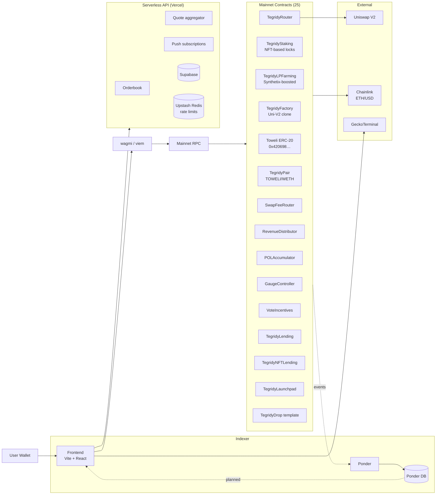
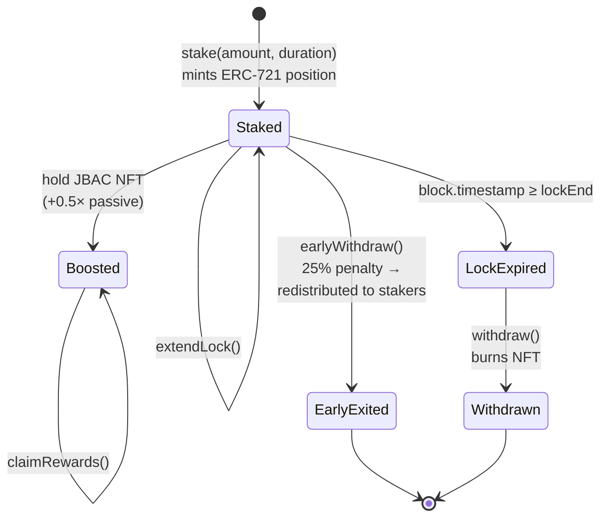
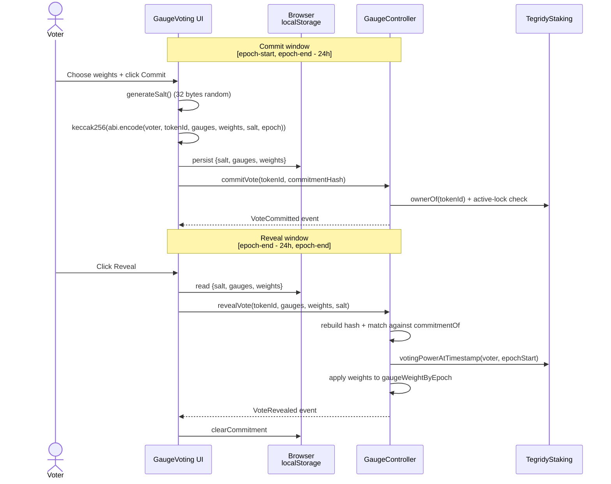
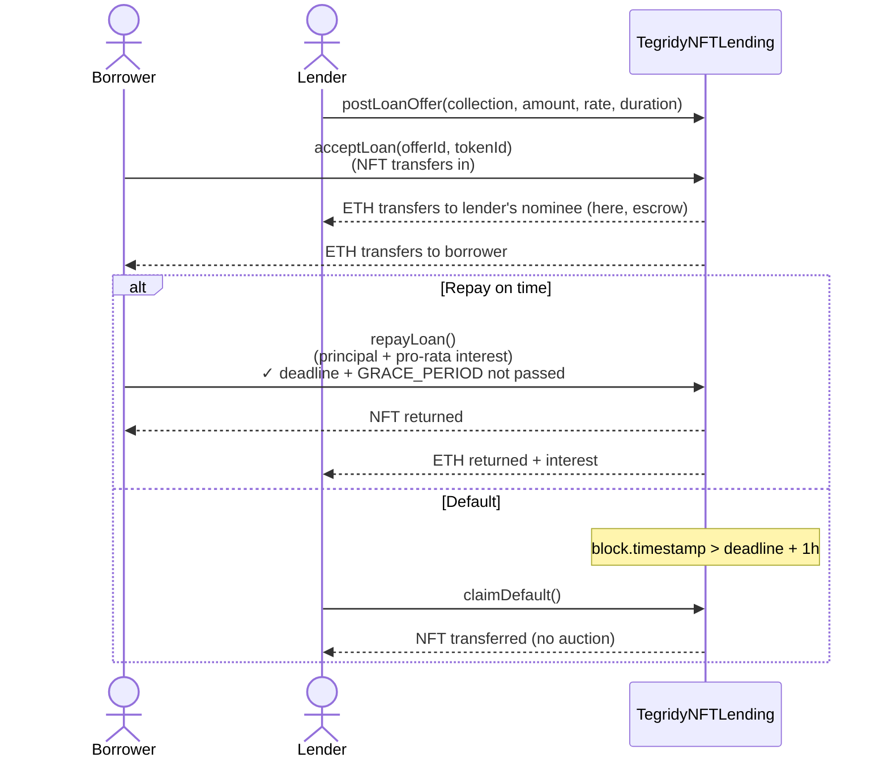
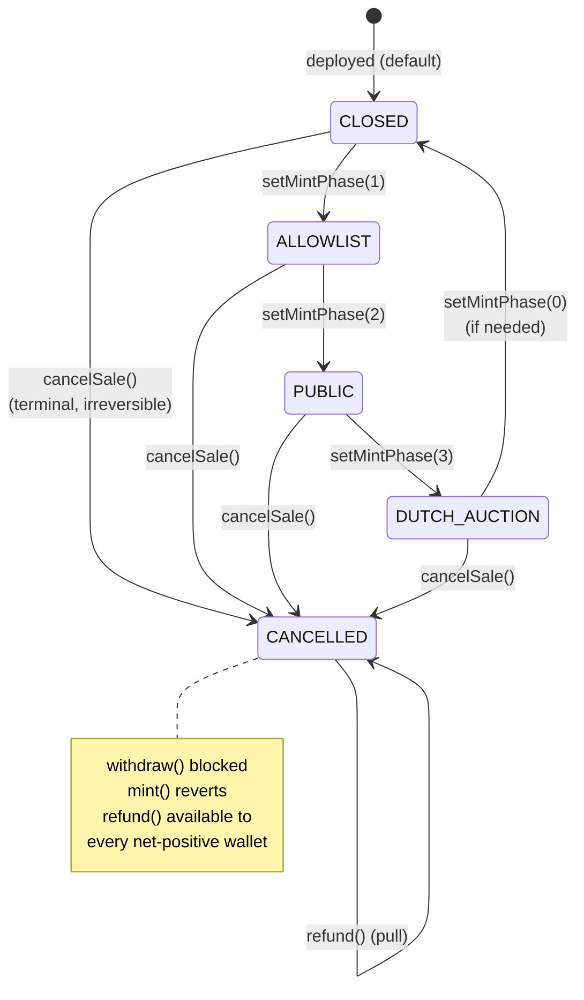
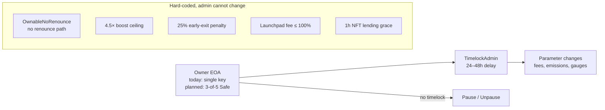

# Tegridy Farms — Architecture

How the protocol is put together. Written for developers, integrators, and auditors who want more than the README overview.

## Contents

- [System overview](#system-overview)
- [Core flows](#core-flows)
  - [Fee flow — swap fees to stakers](#fee-flow)
  - [Staking lifecycle](#staking-lifecycle)
  - [Gauge voting with commit-reveal](#gauge-voting)
  - [LP farming boost](#lp-farming-boost)
  - [NFT lending](#nft-lending)
  - [Launchpad drops](#launchpad-drops)
- [Oracle dependencies](#oracle-dependencies)
- [Trust model & admin surface](#trust-model--admin-surface)
- [Notes & open questions](#notes--open-questions)

---

## System overview



Three runtime surfaces:
1. **Contracts** — the 25 Solidity contracts listed in [README.md § Deployed contracts](../README.md#deployed-contracts-ethereum-mainnet). All settlement happens here.
2. **Frontend** — read via wagmi, write via signed RPC. No custodial backend for on-chain state.
3. **Indexer + API** — off-chain helpers (order book, push notifications, rate limiting, cached quotes). Not a custodian; the API never holds funds.

---

## Core flows

### Fee flow

Currently every basis point of TOWELI/WETH swap fees flows to stakers. The `SwapFeeRouter` is parameterised for a protocol cut — today the treasury split is set to zero. See [REVENUE_ANALYSIS.md](../REVENUE_ANALYSIS.md) for the active calibration discussion.

```mermaid
sequenceDiagram
    actor U as User
    participant FE as Frontend
    participant R as TegridyRouter
    participant P as TegridyPair
    participant SFR as SwapFeeRouter
    participant RD as RevenueDistributor
    participant S as Stakers
    participant T as Treasury (reserved)
    participant POL as POLAccumulator (reserved)

    U->>FE: Initiate swap
    FE->>R: swapExactTokensForTokens
    R->>P: execute swap
    P-->>R: output tokens
    P->>SFR: protocol fee (bps)
    Note over SFR: Today: 100% → RD<br/>Levers for T/POL exist<br/>but are set to 0
    SFR->>RD: ETH reward stream
    RD-->>S: continuous accrual<br/>(claimed on demand)
    SFR-.inactive lever.->T
    SFR-.inactive lever.->POL
    R-->>U: swap output
```

### Staking lifecycle



- **Position is an NFT** — can be used as collateral in `TegridyLending` without unstaking.
- **Boost math:** `boostBps = f(lockDuration)` ∈ [4000, 40000] BPS (0.4×–4.0×), plus +5000 BPS if the wallet holds JBAC at reward-math time. Ceiling clamp at 45000 BPS (4.5×) as defence-in-depth.
- **Voting power snapshot** — `votingPowerAtTimestamp(user, ts)` lets `GaugeController` pin voting power to each epoch's start, closing the bribe-arbitrage window that live reads left open (audit TF-04).

### Gauge voting

Commit-reveal is the default path (Wave 2 closure of audit H-2). Legacy one-step `vote()` is still reachable for emergencies but exposes the voter's chosen gauges in the mempool, which lets bribe markets react before the vote finalises.



**Security properties:**
- Hash binds `voter + tokenId + gauges + weights + salt + epoch`. A third party who sees the commitment cannot replay it in a different epoch or under a different wallet.
- Only the committing address can reveal (bound by `committerOf`). NFT transfers between commit and reveal forfeit the vote.
- The hash check uses rebuild-and-compare — an observer cannot brute-force the salt from the commitment in any practical sense (2^256 space).
- Legacy `vote()` still respects `hasVotedInEpoch`, so a committer can't double-vote via the legacy path after revealing.

### LP farming boost

```mermaid
flowchart LR
    subgraph "TegridyLPFarming (Synthetix StakingRewards)"
        S[stake LP] --> B[effectiveBalance<br/>= rawLP × boostBps/10000]
        B --> R[rewardPerToken<br/>accrual]
        R --> C[claim / exit]
    end

    subgraph "Source of boost"
        TS[TegridyStaking<br/>userTokenId(user)] --> POS[positions.boostBps]
        POS -->|interface call| B
        JBAC[JBAC NFT holding] -. indirect via staking boostBps .-> POS
    end

    NFT[User's staking NFT changes] -.->|refreshBoost()| B
    S -.auto-refresh on stake.-> B
```

If the user's boostBps changes (e.g. they acquire a JBAC NFT mid-epoch), their effective LP-farming balance auto-refreshes on the next `stake()` call or via the explicit `refreshBoost()` method — no forced reset required.

### NFT lending

Peer-to-peer, no oracles, no liquidation auctions. 1-hour grace window after deadline before the lender can claim collateral.



Design trade-off: no oracle means no fair-value liquidation — the lender takes the NFT at par. Borrowers price this in via the offered interest rate.

### Launchpad drops

Factory-deploys clones of `TegridyDrop` template per collection. Clones support merkle-allowlist, public mint, Dutch auction phases, and a **CANCELLED** terminal phase with pull-pattern refunds (audit H10 closure).



---

## Oracle dependencies

| Consumer | Oracle | Use | Staleness handling |
|---|---|---|---|
| `TegridyLending` | Chainlink ETH/USD | Health-factor + liquidation | Reverts if round > N seconds old |
| `TegridyNFTLending` | *(none)* | Peer-to-peer; lender bears valuation risk | N/A |
| Frontend `useToweliPrice` | GeckoTerminal + Chainlink composite | Display only | Caches 30s; falls back to GeckoTerminal if Chainlink stale |
| `TegridyTWAP` | Pair's own cumulative price | On-chain TWAP, deployed but currently unused | Will fold into `useToweliPrice` as third leg |
| `SwapFeeRouter` | *(none)* | No price dependency — fees are bps of swap output | N/A |

**Key point:** the yield-earning, stake-locking, and vote-gating paths of the protocol have **no live price oracle**. Only lending uses Chainlink, and NFT lending doesn't even use that. A Chainlink feed going stale cannot brick the yield protocol.

---

## Trust model & admin surface

See [GOVERNANCE.md](GOVERNANCE.md) for the full admin surface. Summary:



**Worst-case admin compromise** (single-key stolen, attacker waits out timelock):
- Redirect swap fees to attacker address
- Pause staking (users can still `emergencyWithdraw` losing rewards)
- Add malicious collection to NFT lending allowlist

**What a compromised admin cannot do:** mint TOWELI, confiscate deposits, skip the timelock, renounce ownership, exceed the boost ceiling, change the early-exit penalty.

---

## Notes & open questions

- **Frontend ↔ indexer wiring is planned but not live.** Leaderboard and History pages currently read from Etherscan proxy; migrating to the Ponder GraphQL layer is [ROADMAP.md](../ROADMAP.md) item.
- **`TegridyTWAP` oracle contract is deployed but not yet consulted.** Wiring it into `useToweliPrice` as a third resilience leg is tracked in [FIX_STATUS.md](../FIX_STATUS.md).
- **`TegridyFeeHook` (Uniswap V4 hook)** has source in-repo but no deploy script — requires CREATE2 salt-mining for the required address prefix. Tracked as audit item B7.
- **Multisig migration** (see [GOVERNANCE.md](GOVERNANCE.md)) is the single biggest outstanding trust-model improvement.
- **Gauge commit-reveal** is **live in contracts and UI** but toggleable back to legacy one-step voting for emergencies. A future timelocked proposal can close the legacy path permanently once all known integrators migrate.

---

*Last updated: 2026-04-17.*
