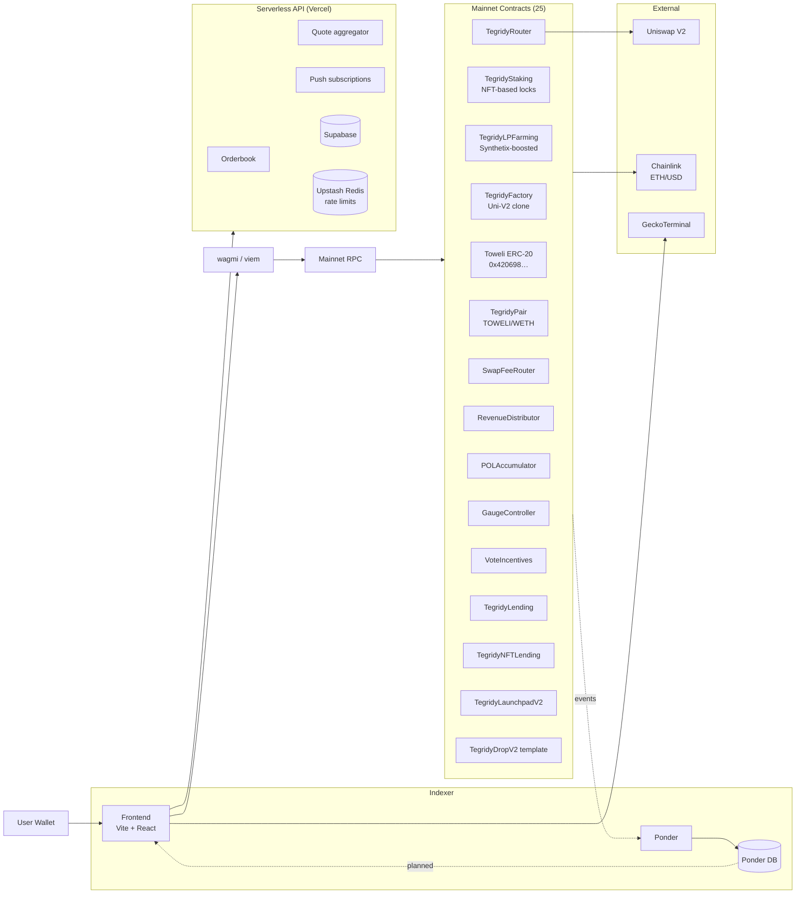
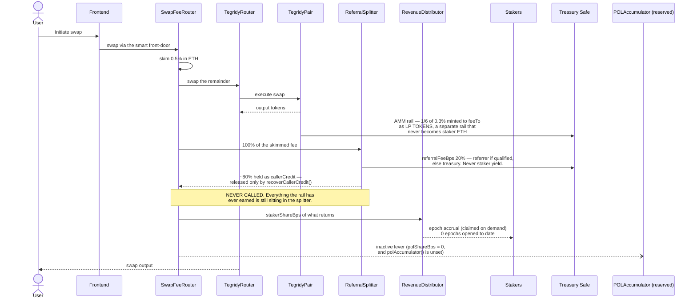
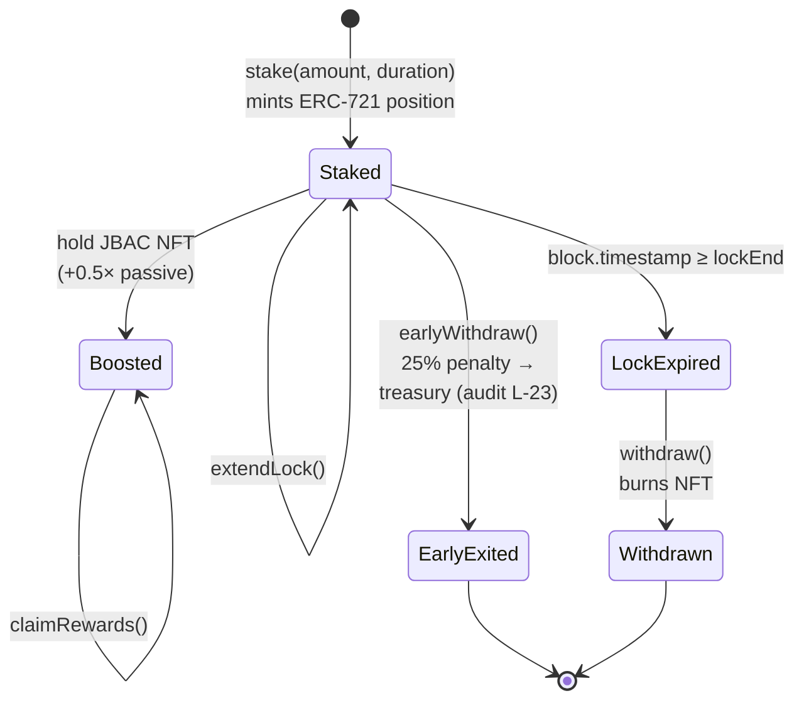
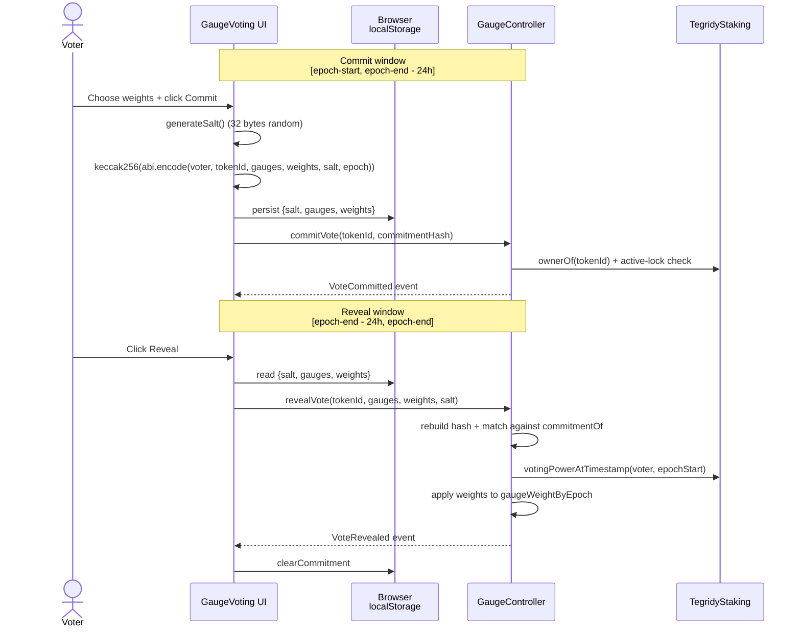
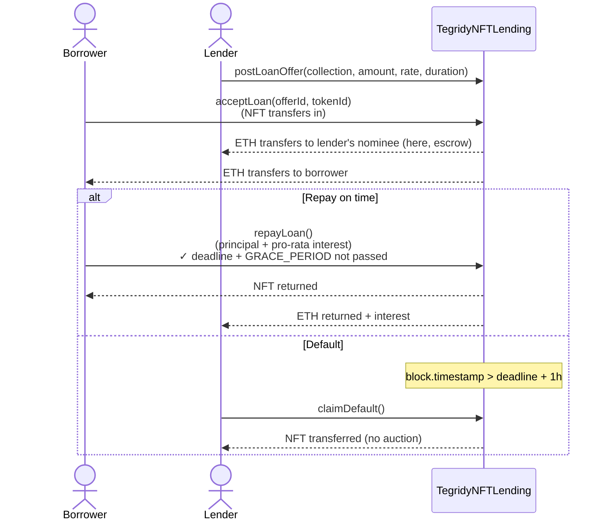
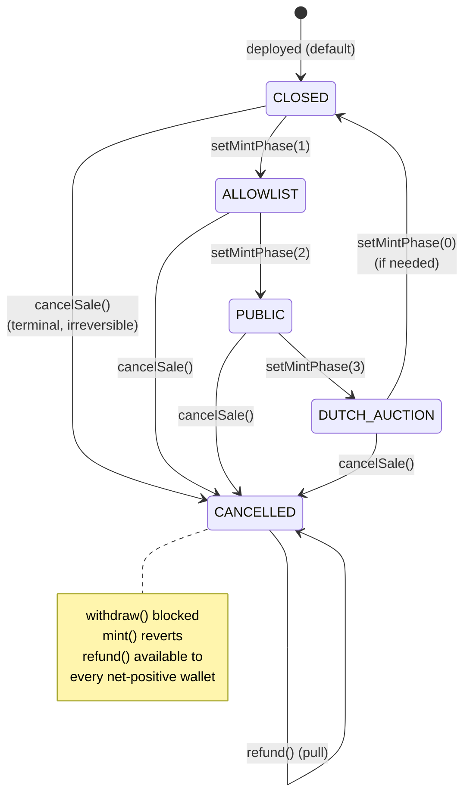
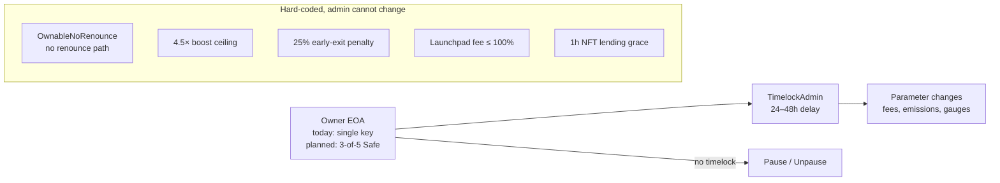

# Tegridy Farms — Architecture

How the protocol is put together. Written for developers, integrators, and auditors who want more than the README overview.

> **Scope note, added 2026-09-04.** This document describes the **Ethereum mainnet** protocol,
> which is where the whole flywheel lives. Three surfaces sit outside it and are deliberately
> *not* part of these flows:
>
> - **Base 8453 and Robinhood 4663** (live 2026-08-25) run the same factory / router / TWAP /
>   fee-router stack, but their fee sink is a **remittance Safe rather than a distributor** —
>   no veTOWELI, no staker leg, no POL. An L2 fee is queued for the bridge. Robinhood also
>   carries a deployed `AttestedSequencerUptimeFeed`, because Chainlink publishes no uptime
>   feed for it and `SequencerCheck` reverts off-mainnet on a zero feed.
> - **The bungalow lighthouses** (`LighthouseLadder` on Ethereum and Base, Streamflow on
>   Solana) are self-contained per-token staking pools. They reuse TOWELI's lock ladder on the
>   EVM side but share no state with the contracts below.
> - **Solana** is a Jupiter-routed swap plus those Streamflow pools. Our own two Solana
>   programs were deployed 2026-08-08 and **closed 2026-08-13**; their ids are spent.
>
> Read `frontend/src/lib/chains/registry.ts` for what each chain is *capable* of — it encodes
> the fee-sink **kind** per chain, so a surface cannot accidentally describe a remittance Safe
> as a staker rail.

## Contents

- [System overview](#system-overview)
- [Core flows](#core-flows)
  - [Fee flow — the two rails, and where the staker leg stops](#fee-flow)
  - [Staking lifecycle](#staking-lifecycle)
  - [Gauge voting with commit-reveal](#gauge-voting)
  - [LP farming boost](#lp-farming-boost)
  - [NFT lending](#nft-lending)
  - [Launchpad drops](#launchpad-drops)
- [Oracle dependencies](#oracle-dependencies)
- [Trust model & admin surface](#trust-model--admin-surface)
- [Notes & open questions](#notes--open-questions)

---

## System overview

```mermaid
flowchart LR
    U[User Wallet] --> FE[Frontend<br/>Vite + React]
    FE --> W[wagmi / viem]
    W --> RPC[Mainnet RPC]

    subgraph MC["Mainnet Contracts (25)"]
        direction TB
        TOW[Toweli ERC-20<br/>0x420698…]
        STK[TegridyStaking<br/>NFT-based locks]
        LPF[TegridyLPFarming<br/>Synthetix-boosted]
        FAC[TegridyFactory<br/>Uni-V2 clone]
        RTR[TegridyRouter]
        PAIR[TegridyPair<br/>TOWELI/WETH]
        SFR[SwapFeeRouter]
        RD[RevenueDistributor]
        POL[POLAccumulator]
        GC[GaugeController]
        VI[VoteIncentives]
        LND[TegridyLending]
        NFTL[TegridyNFTLending]
        LP[TegridyLaunchpadV2]
        DRP[TegridyDropV2 template]
    end

    RPC --> MC

    subgraph IDX[Indexer]
        PONDER[Ponder] --> DB[(Ponder DB)]
        DB -.planned.-> FE
    end

    MC -. events .-> PONDER

    subgraph API["Serverless API (Vercel)"]
        ORD[Orderbook]
        QUO[Quote aggregator]
        PUSH[Push subscriptions]
        SUP[(Supabase)]
        UPS[(Upstash Redis<br/>rate limits)]
    end

    FE --> API
    API --> SUP
    API --> UPS

    subgraph EXT[External]
        UNI[Uniswap V2]
        CL[Chainlink<br/>ETH/USD]
        GT[GeckoTerminal]
    end

    RTR --> UNI
    MC --> CL
    FE --> GT
```

Three runtime surfaces:
1. **Contracts** — the 25 Solidity contracts listed in [README.md § Deployed contracts](../README.md#deployed-contracts-ethereum-mainnet). All settlement happens here.
2. **Frontend** — read via wagmi, write via signed RPC. No custodial backend for on-chain state.
3. **Indexer + API** — off-chain helpers (order book, push notifications, rate limiting, cached quotes). Not a custodian; the API never holds funds.

---

## Core flows

### Fee flow

**There are two protocol-fee rails and they never touch.** The AMM rail is `TegridyPair`'s ⅙-of-0.3%
`feeTo` mint, which lands in the treasury Safe **as LP tokens** and has no path to a staker. The staker
rail is the app's smart front-door: `SwapFeeRouter` takes its own 0.5% in ETH on the way through. The
diagram below used to draw a `TegridyPair → SwapFeeRouter` "protocol fee (bps)" arrow; **that arrow was
never implemented** — the pair does not know the router exists — and it made the two rails look like
one funnel. Both rails are drawn separately now.

The staker rail is also not a straight line. `SwapFeeRouter._recordReferralFee` forwards the **whole**
fee to `ReferralSplitter` at swap time; `referralFeeBps` (2000) is kept for the referrer, or for the
treasury when none qualifies, and the ~80% remainder is credited back as `callerCredit` recoverable
only by a permissionless `recoverCallerCredit()`. That call has never been made, so nothing has
reached `RevenueDistributor`. See [REVENUE_ANALYSIS.md](../REVENUE_ANALYSIS.md) for the calibration
discussion and [CONTRACTS.md](../CONTRACTS.md) for the live reads.

```mermaid
sequenceDiagram
    actor U as User
    participant FE as Frontend
    participant SFR as SwapFeeRouter
    participant R as TegridyRouter
    participant P as TegridyPair
    participant RS as ReferralSplitter
    participant RD as RevenueDistributor
    participant S as Stakers
    participant T as Treasury Safe
    participant POL as POLAccumulator (reserved)

    U->>FE: Initiate swap
    FE->>SFR: swap via the smart front-door
    SFR->>SFR: skim 0.5% in ETH
    SFR->>R: swap the remainder
    R->>P: execute swap
    P-->>R: output tokens
    P->>T: AMM rail — 1/6 of 0.3% minted to feeTo<br/>as LP TOKENS, a separate rail that<br/>never becomes staker ETH
    SFR->>RS: 100% of the skimmed fee
    RS->>T: referralFeeBps 20% — referrer if qualified,<br/>else treasury. Never staker yield.
    RS-->>SFR: ~80% held as callerCredit —<br/>released only by recoverCallerCredit()
    Note over RS,SFR: NEVER CALLED. Everything the rail has<br/>ever earned is still sitting in the splitter.
    SFR->>RD: stakerShareBps of what returns
    RD-->>S: epoch accrual (claimed on demand)<br/>0 epochs opened to date
    SFR--)POL: inactive lever (polShareBps = 0,<br/>and polAccumulator() is unset)
    R-->>U: swap output
```

> **This diagram did not render before 2026-08-12.** It used flowchart edge syntax
> (`SFR-.inactive lever.->T`) inside a `sequenceDiagram`, so mermaid failed to parse it and
> GitHub showed an error box where the picture should be — which is part of why the phantom
> `TegridyPair → SwapFeeRouter` arrow went unchallenged for so long. If you edit it, render it:
> `npx @mermaid-js/mermaid-cli -i <block>.mmd -o /dev/null`.

### Staking lifecycle

```mermaid
stateDiagram-v2
    [*] --> Staked : stake(amount, duration)<br/>mints ERC-721 position
    Staked --> Boosted : hold JBAC NFT<br/>(+0.5× passive)
    Staked --> LockExpired : block.timestamp ≥ lockEnd
    Staked --> EarlyExited : earlyWithdraw()<br/>25% penalty →<br/>treasury (audit L-23)
    LockExpired --> Withdrawn : withdraw()<br/>burns NFT
    EarlyExited --> [*]
    Withdrawn --> [*]

    Staked --> Staked : claimRewards()
    Staked --> Staked : extendLock()
    Boosted --> Boosted : claimRewards()
```

- **Position is an NFT** — can be used as collateral in `TegridyLending` without unstaking.
- **Boost math:** `boostBps = f(lockDuration)` ∈ [4000, 40000] BPS (0.4×–4.0×), plus +5000 BPS if the wallet holds JBAC at reward-math time. Ceiling clamp at 45000 BPS (4.5×) as defence-in-depth.
- **Voting power snapshot** — `votingPowerAtTimestamp(user, ts)` lets `GaugeController` pin voting power to each epoch's start, closing the bribe-arbitrage window that live reads left open (audit TF-04).

### Gauge voting

Commit-reveal is the default path (Wave 2 closure of audit H-2). Legacy one-step `vote()` is still reachable for emergencies but exposes the voter's chosen gauges in the mempool, which lets bribe markets react before the vote finalises.

```mermaid
sequenceDiagram
    actor A as Voter
    participant FE as GaugeVoting UI
    participant LS as Browser<br/>localStorage
    participant GC as GaugeController
    participant TS as TegridyStaking

    Note over FE,GC: Commit window<br/>[epoch-start, epoch-end - 24h]
    A->>FE: Choose weights + click Commit
    FE->>FE: generateSalt() (32 bytes random)
    FE->>FE: keccak256(abi.encode(voter, tokenId, gauges, weights, salt, epoch))
    FE->>LS: persist {salt, gauges, weights}
    FE->>GC: commitVote(tokenId, commitmentHash)
    GC->>TS: ownerOf(tokenId) + active-lock check
    GC-->>FE: VoteCommitted event

    Note over FE,GC: Reveal window<br/>[epoch-end - 24h, epoch-end]
    A->>FE: Click Reveal
    FE->>LS: read {salt, gauges, weights}
    FE->>GC: revealVote(tokenId, gauges, weights, salt)
    GC->>GC: rebuild hash + match against commitmentOf
    GC->>TS: votingPowerAtTimestamp(voter, epochStart)
    GC->>GC: apply weights to gaugeWeightByEpoch
    GC-->>FE: VoteRevealed event
    FE->>LS: clearCommitment
```

**Security properties:**
- Hash binds `voter + tokenId + gauges + weights + salt + epoch`. A third party who sees the commitment cannot replay it in a different epoch or under a different wallet.
- Only the committing address can reveal (bound by `committerOf`). NFT transfers between commit and reveal forfeit the vote.
- The hash check uses rebuild-and-compare — an observer cannot brute-force the salt from the commitment in any practical sense (2^256 space).
- Legacy `vote()` still respects `hasVotedInEpoch`, so a committer can't double-vote via the legacy path after revealing.

### LP farming boost

```mermaid
flowchart LR
    subgraph "TegridyLPFarming (Synthetix StakingRewards)"
        S[stake LP] --> B[effectiveBalance<br/>= rawLP × boostBps/10000]
        B --> R[rewardPerToken<br/>accrual]
        R --> C[claim / exit]
    end

    subgraph "Source of boost"
        TS[TegridyStaking<br/>userTokenId(user)] --> POS[positions.boostBps]
        POS -->|interface call| B
        JBAC[JBAC NFT holding] -. indirect via staking boostBps .-> POS
    end

    NFT[User's staking NFT changes] -.->|refreshBoost()| B
    S -.auto-refresh on stake.-> B
```

If the user's boostBps changes (e.g. they acquire a JBAC NFT mid-epoch), their effective LP-farming balance auto-refreshes on the next `stake()` call or via the explicit `refreshBoost()` method — no forced reset required.

### NFT lending

Peer-to-peer, no oracles, no liquidation auctions. 1-hour grace window after deadline before the lender can claim collateral.

```mermaid
sequenceDiagram
    actor B as Borrower
    actor L as Lender
    participant NFTL as TegridyNFTLending

    L->>NFTL: postLoanOffer(collection, amount, rate, duration)
    B->>NFTL: acceptLoan(offerId, tokenId)<br/>(NFT transfers in)
    NFTL-->>L: ETH transfers to lender's nominee (here, escrow)
    NFTL-->>B: ETH transfers to borrower

    alt Repay on time
        B->>NFTL: repayLoan()<br/>(principal + pro-rata interest)<br/>✓ deadline + GRACE_PERIOD not passed
        NFTL-->>B: NFT returned
        NFTL-->>L: ETH returned + interest
    else Default
        Note over NFTL: block.timestamp > deadline + 1h
        L->>NFTL: claimDefault()
        NFTL-->>L: NFT transferred (no auction)
    end
```

Design trade-off: no oracle means no fair-value liquidation — the lender takes the NFT at par. Borrowers price this in via the offered interest rate.

### Launchpad drops

Factory-deploys clones of `TegridyDropV2` template per collection. Clones support merkle-allowlist, public mint, Dutch auction phases, and a **CANCELLED** terminal phase with pull-pattern refunds (audit H10 closure). V1 source was deleted 2026-04-19; V1 clones on mainnet remain live.

```mermaid
stateDiagram-v2
    [*] --> CLOSED : deployed (default)
    CLOSED --> ALLOWLIST : setMintPhase(1)
    ALLOWLIST --> PUBLIC : setMintPhase(2)
    PUBLIC --> DUTCH_AUCTION : setMintPhase(3)
    DUTCH_AUCTION --> CLOSED : setMintPhase(0)<br/>(if needed)
    CLOSED --> CANCELLED : cancelSale()<br/>(terminal, irreversible)
    ALLOWLIST --> CANCELLED : cancelSale()
    PUBLIC --> CANCELLED : cancelSale()
    DUTCH_AUCTION --> CANCELLED : cancelSale()

    CANCELLED --> CANCELLED : refund() (pull)

    note right of CANCELLED
      withdraw() blocked
      mint() reverts
      refund() available to
      every net-positive wallet
    end note
```

---

## Oracle dependencies

| Consumer | Oracle | Use | Staleness handling |
|---|---|---|---|
| `TegridyLending` | Chainlink ETH/USD | Health-factor + liquidation | Reverts if round > N seconds old |
| `TegridyNFTLending` | *(none)* | Peer-to-peer; lender bears valuation risk | N/A |
| Frontend `useToweliPrice` | GeckoTerminal + Chainlink composite | Display only | Caches 30s; falls back to GeckoTerminal if Chainlink stale |
| `TegridyTWAP` | Pair's own cumulative price | On-chain TWAP, deployed but currently unused | Will fold into `useToweliPrice` as third leg |
| `SwapFeeRouter` | *(none)* | No price dependency — fees are bps of swap output | N/A |

**Key point:** the yield-earning, stake-locking, and vote-gating paths of the protocol have **no live price oracle**. Only lending uses Chainlink, and NFT lending doesn't even use that. A Chainlink feed going stale cannot brick the yield protocol.

---

## Trust model & admin surface

See [GOVERNANCE.md](GOVERNANCE.md) for the full admin surface. Summary:

```mermaid
flowchart LR
    OWN[Owner EOA<br/>today: single key<br/>planned: 3-of-5 Safe] --> TL[TimelockAdmin<br/>24–48h delay]
    TL --> PARAM[Parameter changes<br/>fees, emissions, gauges]
    OWN -->|no timelock| PAUSE[Pause / Unpause]
    subgraph Immutable["Hard-coded, admin cannot change"]
        ONR[OwnableNoRenounce<br/>no renounce path]
        BOOST[4.5× boost ceiling]
        PEN[25% early-exit penalty]
        FEE[Launchpad fee ≤ 100%]
        GRACE[1h NFT lending grace]
    end
```

**Worst-case admin compromise** (single-key stolen, attacker waits out timelock):
- Redirect swap fees to attacker address
- Pause staking (users can still `emergencyWithdraw` losing rewards)
- Add malicious collection to NFT lending allowlist

**What a compromised admin cannot do:** mint TOWELI, confiscate deposits, skip the timelock, renounce ownership, exceed the boost ceiling, change the early-exit penalty.

---

## Notes & open questions

- **Frontend ↔ indexer wiring is planned but not live.** Leaderboard and History pages currently read from Etherscan proxy; migrating to the Ponder GraphQL layer is [ROADMAP.md](../ROADMAP.md) item.
- **`TegridyTWAP` oracle contract is deployed but not yet consulted.** Wiring it into `useToweliPrice` as a third resilience leg is tracked in [FIX_STATUS.md](../FIX_STATUS.md).
- **`TegridyFeeHook` (Uniswap V4 hook)** has source in-repo but no deploy script — requires CREATE2 salt-mining for the required address prefix. Tracked as audit item B7.
- **Multisig migration** (see [GOVERNANCE.md](GOVERNANCE.md)) is the single biggest outstanding trust-model improvement.
- **Gauge commit-reveal** is **live in contracts and UI** but toggleable back to legacy one-step voting for emergencies. A future timelocked proposal can close the legacy path permanently once all known integrators migrate.

---

*Last updated: 2026-04-17.*
